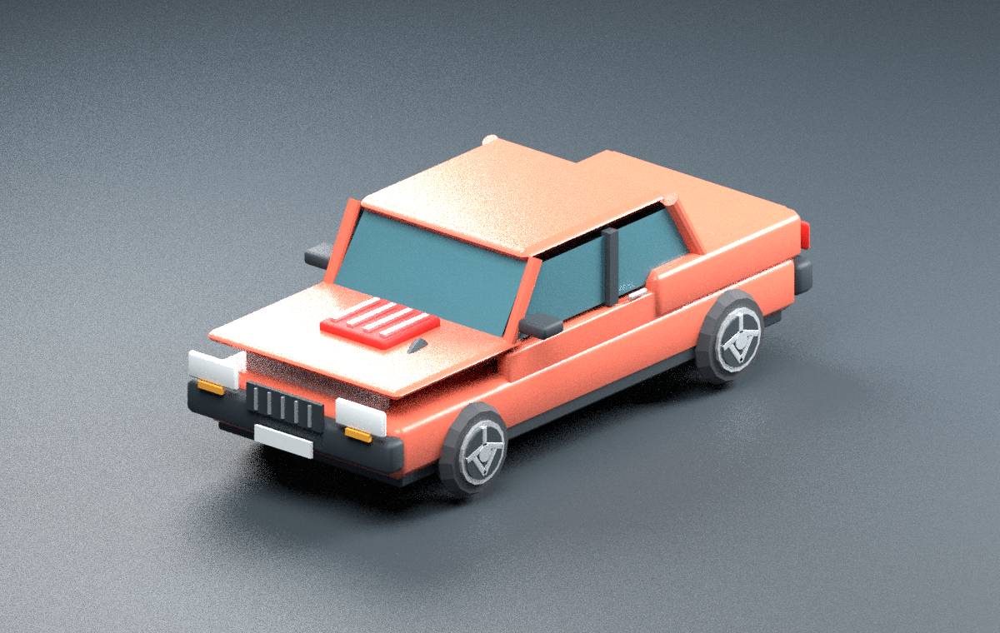

# AutoPropulsion Age

Modular cars for **Minecraft Java Edition 1.21.1**, built on **NeoForge 21.1.249** and **Java 21**.

> **Development alpha, not the completed modular-car specification.** This branch contains the first vehicle implementation, original procedural assets, a standalone simulation, and executable test harnesses. Use a disposable world. Save compatibility is not promised. Read [test evidence](docs/test-report-2026-09-07.md) and [feature status](docs/roadmap.md) before treating an implementation as verified.



## What is in this foundation

One H1 hatchback with two passenger positions, server-controlled driving, five forward gears and reverse, clutch and braking, a garage diagnostics screen, boost adjustment, fuel consumption, cooling, engine condition, persistence, ownership checks and replaceable starter components.

The runtime catalogue contains **140 component definitions and exported item models**. **16 definitions are installable in this alpha**; the other 124 are explicitly catalogue-only. A model or creative-tab entry does not mean the corresponding mechanical system has been implemented. The [parts guide](docs/parts-and-addons.md) explains the distinction.

The independent `sim/` library supplies engine curves, longitudinal drivetrain simulation, steering rate, fuel/thermal/damage state and tested assembly utilities. The in-game adapter currently uses a flat seven-slot assembly and raycast surface grip. It does **not** yet implement full per-wheel suspension, per-cylinder internals, rotary operation, ECU map flashing or a measured roller dyno.

## Separate modular Blender art kit

The richer **Spark Motors modular sedan kit** added independently to `main` is preserved unchanged alongside this runtime foundation. It is an authoring/interchange kit, **not the H1 mesh currently loaded by the mod**. Its 471 named part/assembly roots include repeated and grouped components; they are not 471 unique designs or additional implemented gameplay parts.

| Resource | Purpose |
| --- | --- |
| [Modular kit guide](assets/modular_car_kit/README.md) | Scene controls, authoring conventions, variants, limitations and rebuild instructions |
| [Complete model gallery](assets/modular_car_kit/GALLERY.md) | Individually previewed kit parts and assemblies |
| [Blender source](assets/modular_car_kit/sparkmotors_modular.blend) / [stock GLB](assets/modular_car_kit/stock_car.glb) | Editable sedan kit and interchange export |
| [Complete art-kit ZIP](downloads/modular-car-kit.zip) | Source, previews, scripts, manifests and the kit's supplied fit/rebuild reports |
| [Original requirements](docs/modular-car-requirements.md) | The intended full mod, not a list of finished features |
| [Early studies](assets/early_studies) | Preserved earlier Blender work |

The [archived asset-only README and embedded gallery](ART_GALLERY_2026-09-07.md) preserve the exact concurrent `main` document and all its relative image links. Its statement that no mod is implemented describes that earlier asset-only snapshot, not this branch. [ADR 0003](docs/decisions/0003-preserve-concurrent-art.md) records the integration boundary. The kit's supplied fit results are not reclassified as tests performed by this mod's CI.

## Requirements

| Component | Target |
| --- | --- |
| Minecraft | **1.21.1 exactly** |
| Loader | **NeoForge 21.1.249**, pinned development baseline |
| Java | **64-bit Java 21**; a JDK is required for development |
| Gradle | **9.2.1**, supplied by the checked-in wrapper with SHA-256 verification |
| ModDevGradle | **2.0.146** |
| Mappings | Mojmap plus Parchment **2024.11.17** for 1.21.1 |
| Distribution | Install the same mod JAR on the client and dedicated server |

This is not a Fabric, legacy Forge, Bedrock or Minecraft 26.x build. NeoForge metadata admits later 21.1.x patches, but that is not a claim that each patch was tested. Blender is an authoring dependency only; players and ordinary Java builds do not need it. There is no required Electrical Age, Create or Valkyrien Skies dependency.

## Build and launch

```bash
git clone https://github.com/CesarPetrescu/AutoPropulsion-Age.git
cd AutoPropulsion-Age
git switch feat/neoforge-1.21.1-vehicle-foundation
./gradlew build
./gradlew :mod:runClient
```

On Windows use `gradlew.bat`. First-time Gradle and Minecraft dependency downloads require network access. Install the non-`sources` JAR from `mod/build/libs/` in a NeoForge 1.21.1 instance. Do not install `sim` or `tools` JARs separately: the mod bundles the simulation classes.

For dedicated-server development and the explicit Minecraft EULA step, see [Development](docs/development.md). CI artifacts are test outputs, not automatically published releases.

## First drive

Create a disposable Creative world and find the **AutoPropulsion Age** creative tab. Use the **vehicle blueprint** on the top of a solid block, with roughly five blocks of clear length and three blocks of width. The placed car starts with seven components and 45 L of fuel.

Right-click with an empty hand to board. Press **I** for ignition, **R** to select first gear, and **W** to accelerate. **S** brakes, **A/D** steer, **C** disengages the clutch, **Space** applies the handbrake, and **Z** shifts down through neutral to reverse. Sneak dismounts. Key bindings can be changed in Controls.

Press **G** while driving, or use the mechanic wrench on an owned parked car, to open the garage. Stop the engine before changing boost or right-clicking the car with an installable component. Survival installation consumes one replacement and returns the old component. A filled jerry can adds 10 L only while the engine is off and the tank has enough room. These recipes and starting fuel are development balance, not a realistic fuel-production economy.

The garage's **Engine dyno** tab is an analytical engine estimate, not a measured wheel-power pull. Garage lift, parts bench and dyno blocks currently open the same garage interface near an owned vehicle.

## Test commands

```bash
# Java-only; no Gradle download, Minecraft or external test framework required
bash scripts/test-sim.sh

# Catalogue, JSON, recipes and generated-file presence
python3 scripts/validate-content.py --assets

# Build, then inspect the packaged JAR
./gradlew build
python3 scripts/check-jar.py
```

[Testing and evidence](docs/testing.md) documents server GameTests, actual graphical client smoke runs, exact assertions, configurations and limitations. A successful build alone is not a client/server test. [The dated report](docs/test-report-2026-09-07.md) records 37 local/CI simulation checks, eight dedicated-server GameTests, two graphical profiles, exact artifacts and remaining unverified environments.

## Project map

```text
sim/                  Minecraft-independent Java simulation and regression suites
mod/                  NeoForge registry, entity, packets, persistence, UI and rendering
tools/                Analytical dyno CLI and preserved art-kit packaging helpers
assets/catalog.json   Runtime component catalogue and stable model indices
assets/blender/       Runtime H1 authoring/export pipeline
assets/source/        Runtime H1/component .blend scenes, GLB and audio source
assets/modular_car_kit/ Separate modular sedan authoring kit; not yet runtime-integrated
scripts/              Content generation, validation, packaging and runtime tests
docs/                 Requirements, architecture, decisions, evidence and remaining work
```

Start with [Development](docs/development.md), [Architecture](docs/architecture.md), [Assets](docs/assets.md), [Parts and addons](docs/parts-and-addons.md), and [Roadmap](docs/roadmap.md). Contributor expectations are in [CONTRIBUTING.md](CONTRIBUTING.md); implementation agents should also read [AGENTS.md](AGENTS.md).

## Licensing and attribution

The mod metadata currently says **All Rights Reserved**. This work does not silently replace that with an open-source licence. The repository owner must choose a distribution licence before a public release. The procedural meshes and synthetic engine loop were created for this repository; category-level geometry is reused and some models are proxies. The separate kit retains its supplied documentation and provenance. Minecraft, NeoForge and Blender retain their respective ownership and licences. This project is not affiliated with Mojang or Microsoft.
