<p align="center">
  
</p>

<h1 align="center">AutoPropulsion Age</h1>

<p align="center"><strong>Build it. Drive it. Diagnose it. Repair it.</strong><br>A modular car and mechanic workshop for Minecraft Java.</p>

<p align="center">
  
  
  
  <a href="https://github.com/CesarPetrescu/AutoPropulsion-Age/actions/workflows/ci.yml?query=branch%3Amain"></a>
</p>

<p align="center">
  <strong><a href="https://github.com/CesarPetrescu/AutoPropulsion-Age/releases/latest/download/autopropulsion-age-latest.jar">Download the latest tested JAR</a></strong>
  · <a href="https://github.com/CesarPetrescu/AutoPropulsion-Age/releases/latest">Release notes &amp; checksums</a>
  · <a href="docs/PLAYING.md">Player guide</a>
  · <a href="DEVELOPMENT.md">Windows development</a>
</p>

**Playable alpha · 0.7.1 source.** Build a sedan around seven engine families, 42 engine hardware choices and independently serviceable parts. Change its power, grip, sound and appearance; investigate the cause when something goes wrong.

> **Tested downloads.** The download points to the latest successful CI build of `main`. A new commit can be visible here while its tests are still running; failed builds leave the previous tested JAR available.

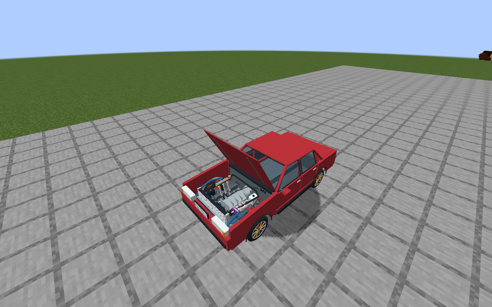

## Connected powertrain components

0.7.0 connects the rendered drivetrain to individual serviceable parts. FWD has a front final drive and CV shafts, RWD has its rear drive path, and AWD includes both. Electric AWD has independent front and rear motors, inverters and reduction gears sharing one vehicle power budget. A broken CV, failed inverter or missing motor affects its actual axle.

0.7.1 fixes client heading and position targets being lost between movement packets, which could leave the visible car facing a different direction from the server. Required native regressions now cover partial packets, eight reset headings, and Fabulous startup plus normal graphics-menu transitions. See the [AutoPropulsion audit follow-up](docs/qa/2026-09-08-follow-up.md).

Piston engines have individual piston/ring/bearing/valve assemblies; rotary engines have rotor housings, seals, bearings and an eccentric shaft. Their condition changes compression, starting, torque and mechanical noise. Removing and refitting an internal kit carries its child parts, including missing mounts and worn state.

Regen follows the electrical drive path and wheel contact independently of brake pads. Motor/inverter heat belongs to the removable part and feeds the cooling circuit. The HV harness and contactor gate READY and charging. These remain calibrated component simulations; hybrids use a series generator layout.

| Combustion AWD | Electric AWD | Series hybrid AWD |
|---|---|---|
| 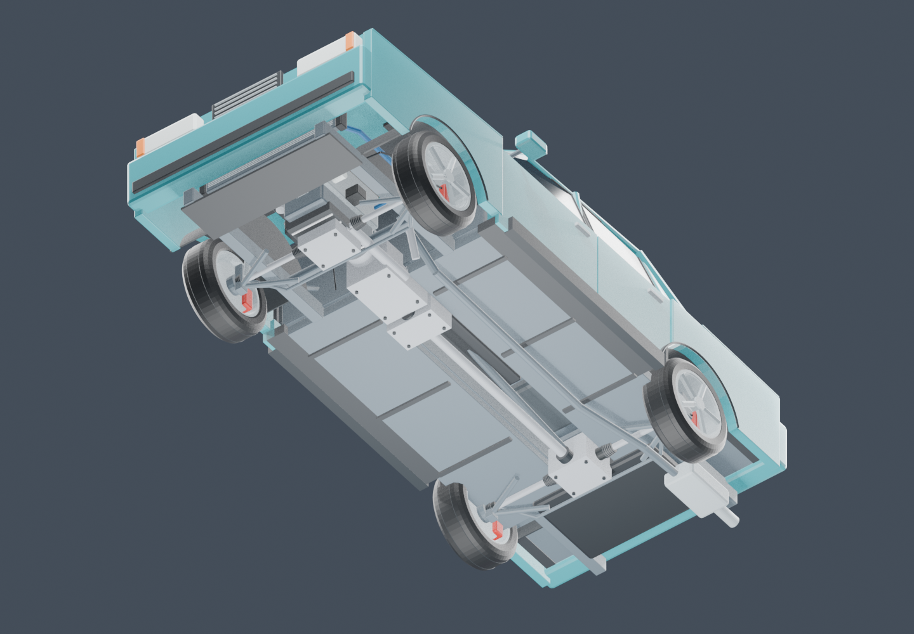 | 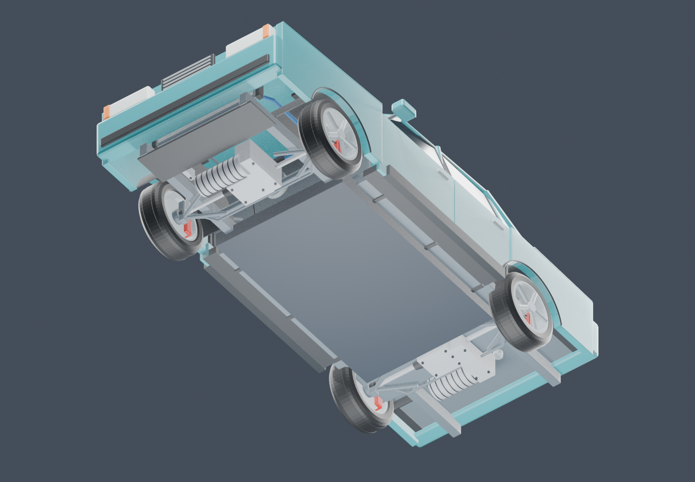 | 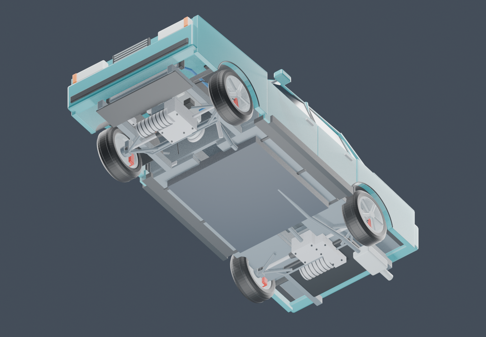 |

[All nine drivetrain renders, service instructions and migration details](docs/CONFIGURED_POWERTRAINS.md).

## Body fit and collision update

0.6.1 closes the lamp/floor/door gaps, reshapes the rear doors and rockers around the tires, adds wheel-well liners and improves the tire geometry. Calipers, pads, hubs and suspension joints now follow their actual wheel mounts. The resting body height matches the authored model, and shell roll stays within the available tire clearance.

Walls now collide with a set of oriented shapes fitted to the car's body, cabin, mirrors and wheels. Empty corners of the old enclosing rectangle no longer stop angled cars. Continuous movement checks stop thin-wall tunnelling; contact impulses preserve sliding motion and localize damage. Native tests cover drift → stop → forward relaunch in all three driveline layouts, plus a real wall impact and recovery.

| Refitted stock body | Wheel wells and underbody |
|---|---|
|  |  |

[All eight body renders, source files and verification scope](docs/BODY_AND_COLLISION.md). These are Blender renders of the exported game mesh; native Minecraft captures remain in the CI evidence.

## Electric and hybrid cars

Version 0.6.0 integrates **400 V and 800 V EVs**, a **series hybrid** and a **plug-in series hybrid** with the same individual tire, brake, suspension and RWD/FWD/AWD systems as combustion cars. Each traction motor has its own torque/power rating, constant-torque and constant-power regions, thermal limits and regenerative braking. Seven combustion families use separate explicit torque maps, with installed hardware and component condition applied afterward.

In Creative, use `electric_400_crate`, `electric_800_crate`, `hybrid_crate` or `plug_in_hybrid_crate` from the mod tab. Press **R** for READY, **W** to drive and **S** for service brakes/regen. **G → Electric** opens motor curves, battery measurements, generator RPM, charge targets and pack replacement. EVs and series hybrids use fixed reduction and have no driver-operated clutch.

Survival packs start empty. External survival charging requires the optional ElectricalAge companion; a non-plug-in hybrid can charge from its fuel-powered generator. Creative chargers have an explicitly labelled test supply. [Vehicles, charging, hybrid modes and limitations →](docs/ELECTRIFICATION.md)

| Electric motor, inverter and charging cable | Separate electric diagnostics |
|---|---|
| 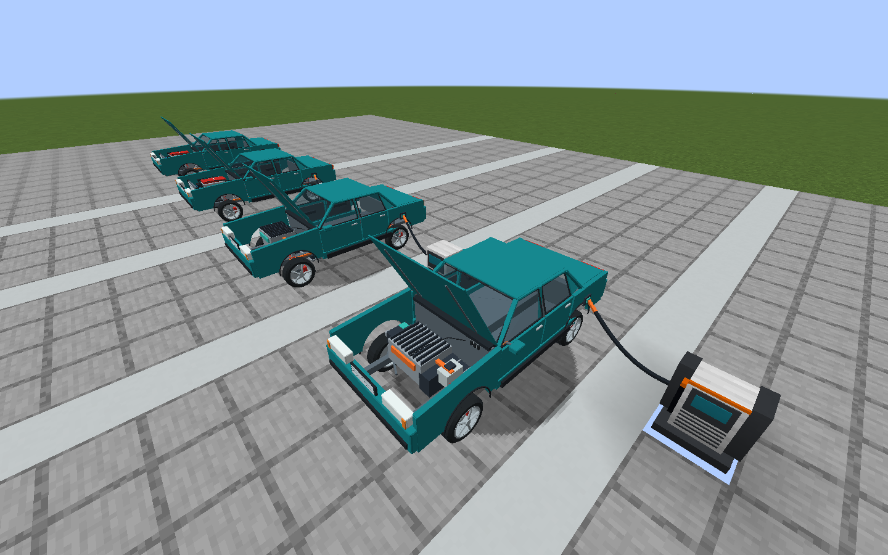 | 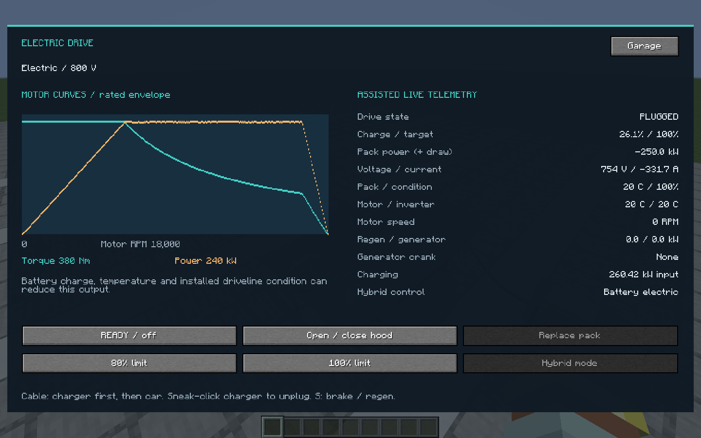 |

## Get in and drive

1. Use **Minecraft Java 1.21.1**, **NeoForge 21.1.249** and **Java 21**.
2. Download the JAR above into your instance's `mods` folder. Replace any older AutoPropulsion JAR; clients and servers need the same version. Back up existing worlds before updating.
3. In Creative, take a **Sedan Crate** from the **AutoPropulsion Age** tab and place it on open, flat ground. With cheats: `/give @s sparkmotors:sedan_crate`.
4. Right-click with an empty hand, press **R**, wait for the starter, then hold **W**. A new car includes stock parts and fuel.

The base mod runs with its own JAR. ElectricalAge and Kotlin for Forge are optional dependencies for survival grid charging. Blender, Python and the separate simulation library are development tools.

| Controls | Action |
|---|---|
| **W / S** | Accelerate / service brake |
| **A / D** | Steer |
| **Space** | Rear handbrake |
| **R / Z** | Start or stop / select reverse while stopped |
| **C / C + W** | Disengage clutch / free-rev |
| **G** | Garage: car, engine, service, drive and tuning |
| **H / B / O** | Lamps / horn / opening panels while stopped |
| **V / F5 / Left Shift** | Performance instruments / camera / exit |

Rebind keys in Minecraft Controls. From outside, **Shift + right-click** or the **Garage Wrench** opens the workshop. [Full controls, installation and repair walkthrough →](docs/PLAYING.md)

Workshop pages fit the available screen without changing Minecraft's GUI setting. Previews, tooltips and mouse input use the same scale; the driving HUD stays compact.

| Component workshop at 1024 × 600 / Auto GUI | Live engine and clutch readings |
|---|---|
| 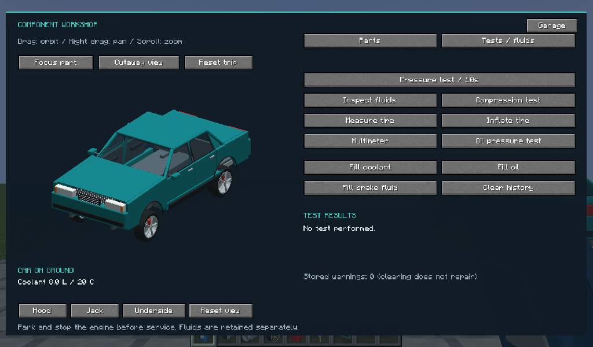 | 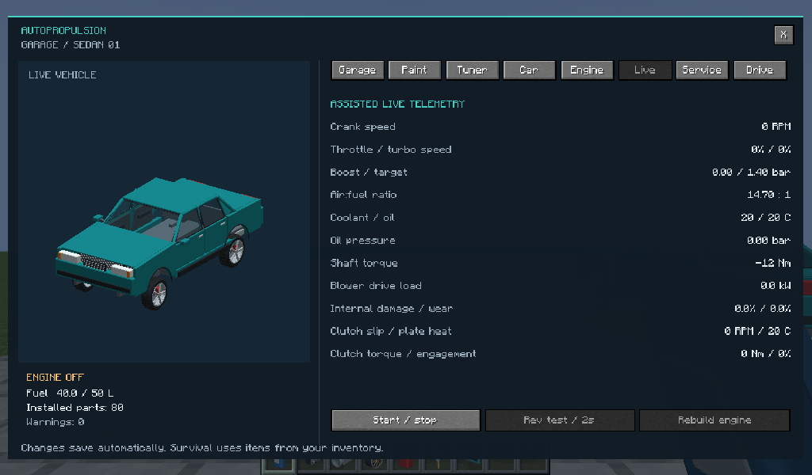 |

## Choose how it drives

**A turns left, D turns right.** A backward slide keeps the selected drive direction and forward ratio; only **Z while stopped** selects reverse. Sideways momentum, independent tire forces and suspension allow the car to slide, lose grip and leave the ground. Engine torque, tire pressure, wear, surface and individual brake faults affect the result. **S** operates the service brakes; **Space** pulls the rear handbrake.

| RWD | FWD | AWD |
|---|---|---|
| Rear drive, limited-slip differential | Front drive, open differential | 40% front / 60% rear, limited slip |
| Power can break rear traction | Front tires share steering and propulsion grip | Extra traction; still capable of sliding |
| 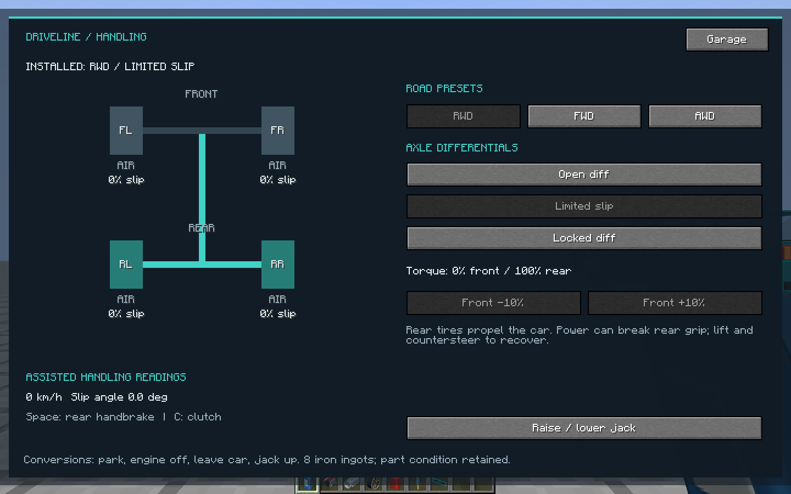 | 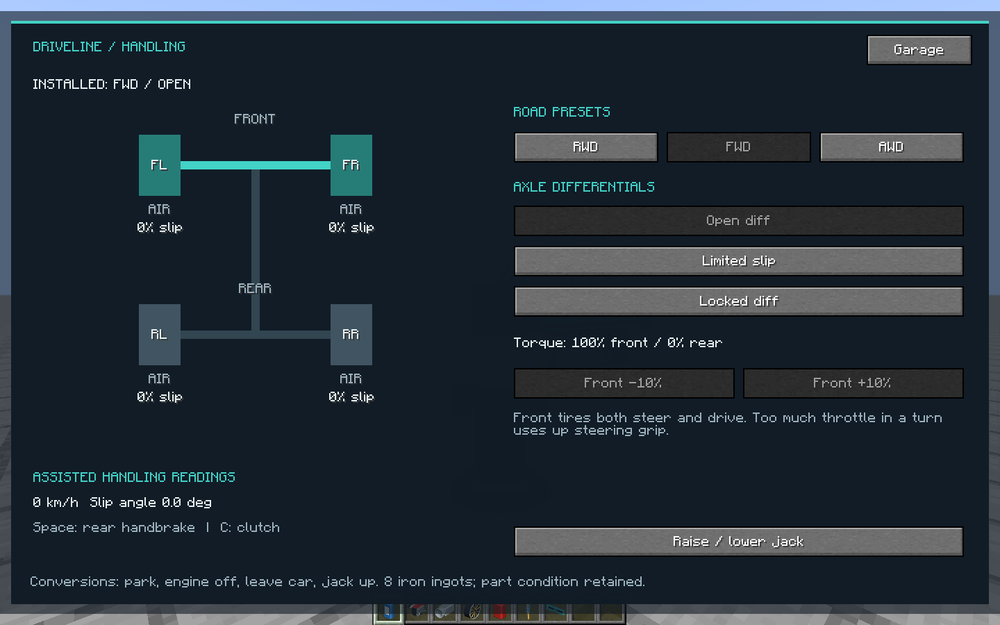 | 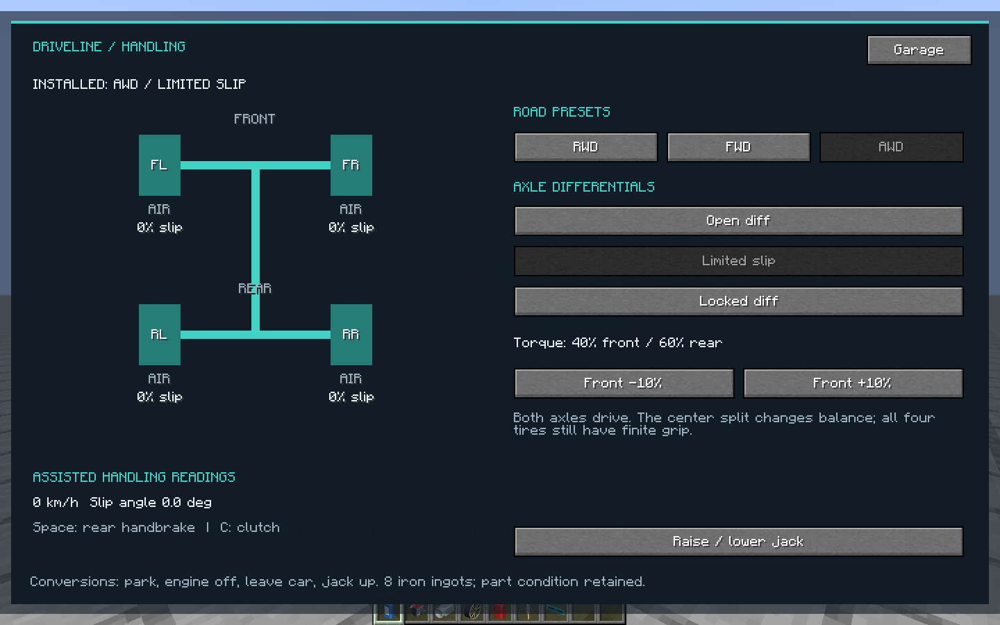 |

Open **G → Drive**. Stop, switch off, exit and raise the car on a **Service Jack** before a conversion. In Survival it costs **eight iron ingots plus the components for new mounts**. Hover a preset to see its parts list. Removed components return to inventory; shared components keep their condition. Open, limited-slip and locked axle differentials are available; AWD front torque adjusts from 20–80%.

For a first slide, briefly pull **Space** while turning, release it and countersteer. Holding the handbrake can spin the car. [Drive layouts, drifting and limits →](docs/PLAYING.md#drive-layouts-and-drifting)

## Build an engine. Repair its actual parts.

| Build and tune | Diagnose and service |
|---|---|
| **I4, V6, flat-four and one to four rotors.** Natural aspiration, street/large/twin turbos, centrifugal, Roots and twin-screw blowers give 49 engine layouts. | **81 stable component mounts**, including individual wheel corners. A removed used part keeps its identity, wear, damage and faults through storage, trading and reinstallation. |
| **42 hardware choices across ten slots.** Intake, fuel, ignition, cooling, internals, induction, exhaust, flywheel, cams/ports and oil hardware affect geometry and simulation. | **Cooling, oil, electrical, braking and driveline state** produce useful symptoms. Instruments read their senders; inspection and tools help identify the cause. |
| **G → Engine** opens the hood and fits compatible parts. The tuner adjusts limiter, final drive and boost; Live provides assisted telemetry and a parked rev test. | **G → Service** exposes parts, orbit/zoom/focus, tests, fluids and jack access. Survival consumes the replacement and returns the actual removed part. |
| 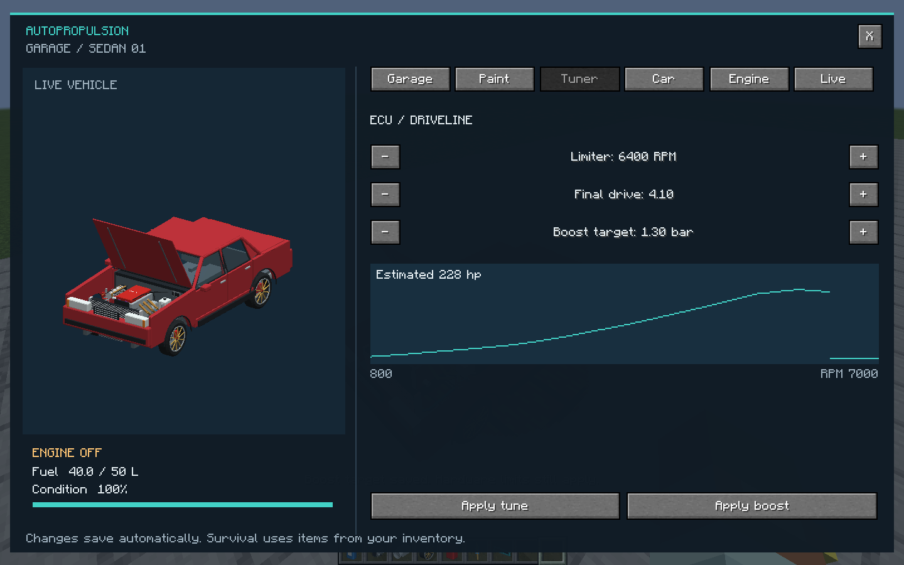 | 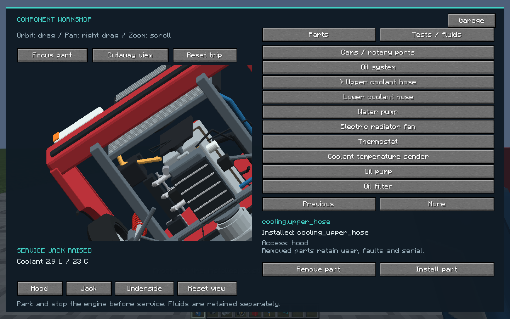 |

A damaged coolant hose leaks. A timed pressure test shows the loss. Replacing the hose stops that leak; **refilling the circuit and repairing overheating damage are separate operations**. Repeat the test and verify temperature under load.

[Engine compatibility and workshop guide →](docs/ENGINE-WORKSHOP.md) · [Complete coolant-leak repair →](docs/PLAYING.md#complete-a-coolant-leak-repair)

The clutch transmits limited torque when worn or overheated. Slip raises RPM relative to the input shaft, generates plate heat and reduces acceleration; **C** fully disengages it. **G → Live** shows measured slip RPM, torque, engagement and plate temperature. Replacing the actual clutch is separate from engine rebuilding.

Opening doors, hood and trunk, eight paint colors, configurable assemblies and working cockpit needles make the build visible. Layered engine, exhaust, induction, road and fault audio follows the installed components and simulation. The sounds are original synthesis; subjective listening review remains pending.

<details>
<summary><strong>More in-game views: cockpit, paint, panels and live diagnostics</strong></summary>

| Cockpit instruments | Paint customization |
|---|---|
| 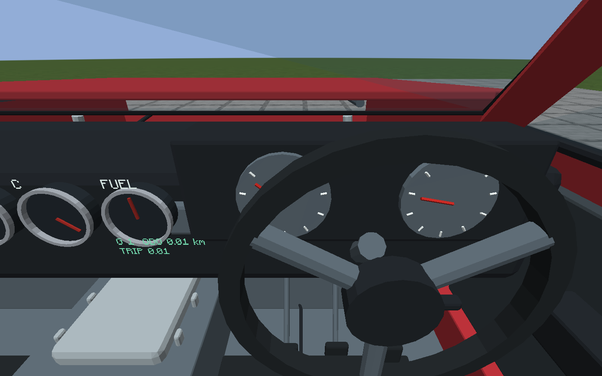 | 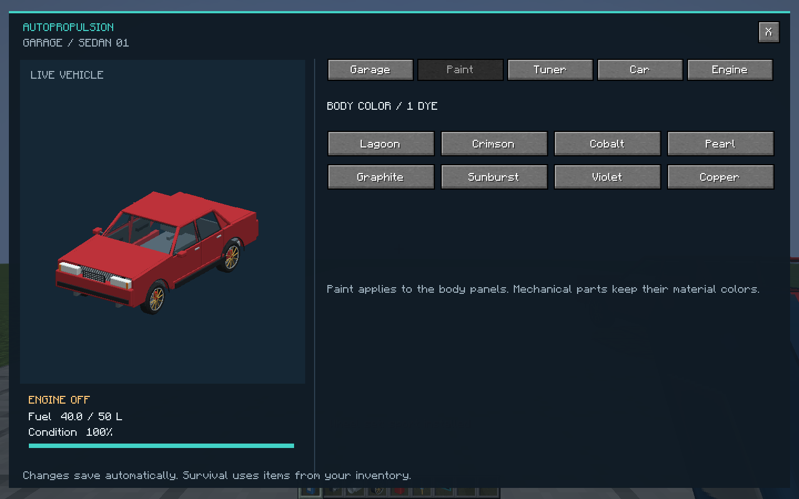 |

| Opening panels | Live engine diagnostics |
|---|---|
| 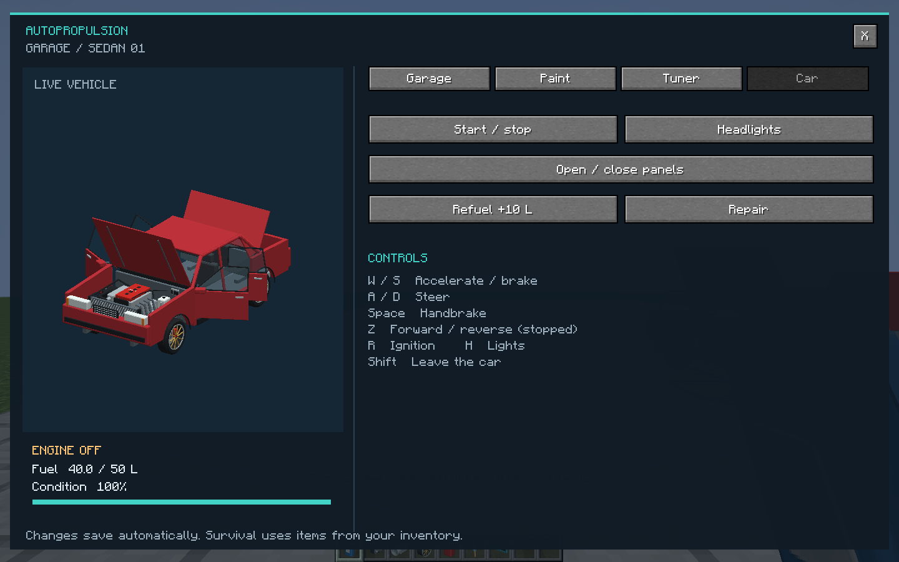 | 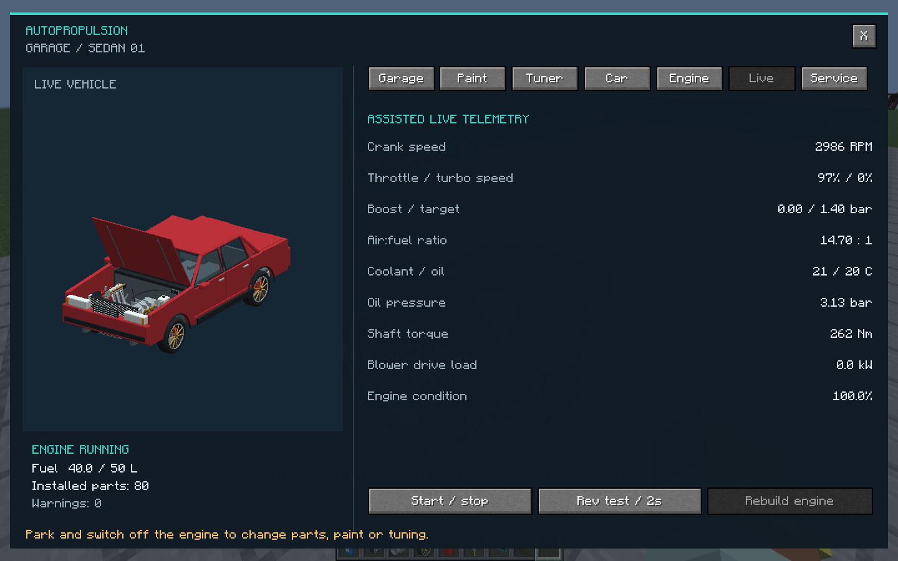 |

</details>

## Develop and contribute

The [Windows development guide](DEVELOPMENT.md) covers Java and Minecraft setup, debugging, Blender MCP without desktop input, background exports, audio, tests and releases.

```powershell
git clone https://github.com/CesarPetrescu/AutoPropulsion-Age.git
Set-Location AutoPropulsion-Age
.\gradlew.bat build
.\gradlew.bat runClient
```

Use a **Java 21 JDK**. The installable output is `build/libs/autopropulsion-age-0.6.1-alpha.jar`. Normal Java builds use the committed assets and do not require Blender.

| What you need | Where to find it |
|---|---|
| Installation, controls, diagnosis and repairs | [Player guide](docs/PLAYING.md) |
| Parts, engine compatibility and tuning | [Engine workshop](docs/ENGINE-WORKSHOP.md) |
| Windows tools, Blender/MCP, development client and tests | [Development guide](DEVELOPMENT.md) |
| Build gates, evidence, release branch and publishing | [CI and release policy](docs/CI.md) |
| Mechanical scope and unfinished acceptance scenarios | [Milestone record](docs/mechanical-milestones.md) |
| Logo asset, JAR registration and generation record | [Branding](docs/BRANDING.md) |
| Bug reports and feature requests | [GitHub issues](https://github.com/CesarPetrescu/AutoPropulsion-Age/issues) — include mod version, reproduction steps and `logs/latest.log` |

CI runs simulation tests, dedicated GameTests with **294 engine/drivetrain driving combinations**, native client garage/handling/mechanics checks, **156 workshop page/scale combinations**, two-client trading, resource/audio validation and Blender geometry checks. A release is published **only after all required jobs pass**. Each release includes its source commit, SHA-256 checksums and fresh evidence. A failed run leaves the previous tested JAR available.

This remains an alpha: handling includes lateral/yaw motion and vertical suspension, without full rollovers or soft-body crashes. Deeper engine internals, Expert fasteners, engine-stand procedures, complete glass/latch service, projected headlights and large-fleet optimization remain future work. Other modpacks, separate-machine latency and long-duration worlds need further testing.

## Model galleries

The images below include **all 471 source-kit parts and assemblies**, **49 engine layouts** and **42 engine hardware previews**. Source-kit objects include repeated components and workshop assets beyond the playable subset; model count is not the number of independent gameplay features.


<details>
<summary><strong>View all 49 engine layouts</strong></summary>

<!-- ENGINE-GALLERY-START -->
## Engine configuration gallery

Native game previews. Click an engine to see it installed under the open hood. [Full workshop instructions](docs/ENGINE-WORKSHOP.md).

| Engine | Natural | Turbo | Supercharger |
|---|---|---|---|
| Inline-4 | [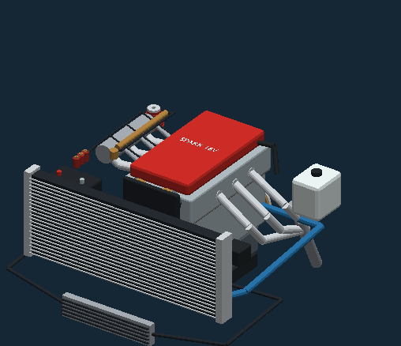](docs/screenshots/hood-i4-natural.png) | [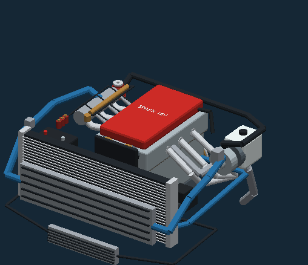](docs/screenshots/hood-i4-turbo.png) | [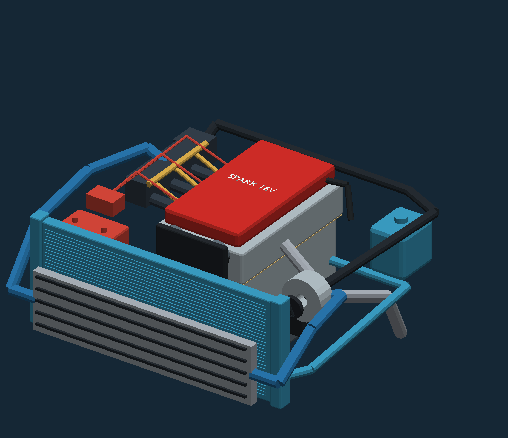](docs/screenshots/hood-i4-supercharger.png) |
| V6 | [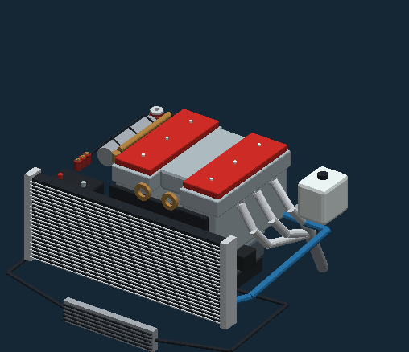](docs/screenshots/hood-v6-natural.png) | [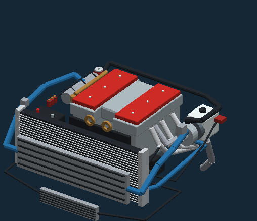](docs/screenshots/hood-v6-turbo.png) | [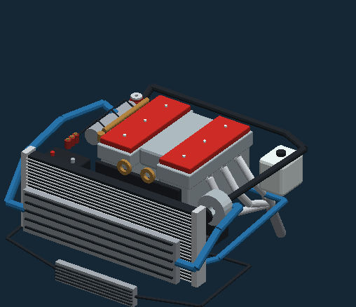](docs/screenshots/hood-v6-supercharger.png) |
| Flat-four | [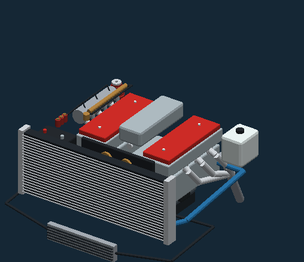](docs/screenshots/hood-flat4-natural.png) | [](docs/screenshots/hood-flat4-turbo.png) | [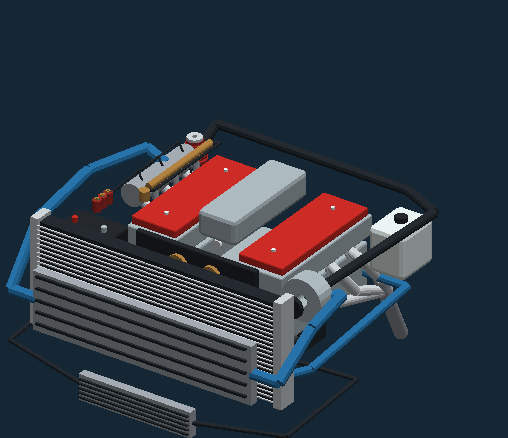](docs/screenshots/hood-flat4-supercharger.png) |
| 1 rotor | [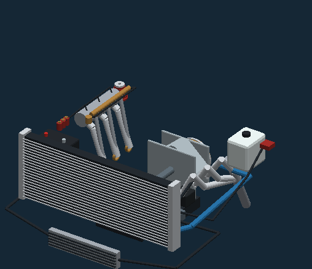](docs/screenshots/hood-rotor1-natural.png) | [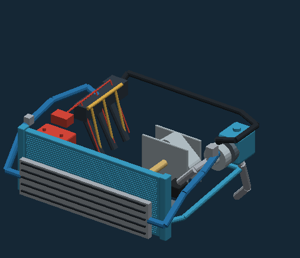](docs/screenshots/hood-rotor1-turbo.png) | [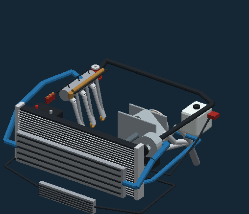](docs/screenshots/hood-rotor1-supercharger.png) |
| 2 rotors | [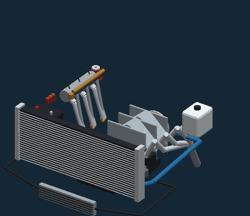](docs/screenshots/hood-rotor2-natural.png) | [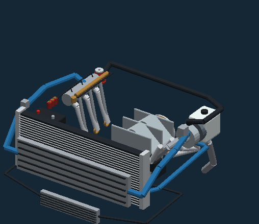](docs/screenshots/hood-rotor2-turbo.png) | [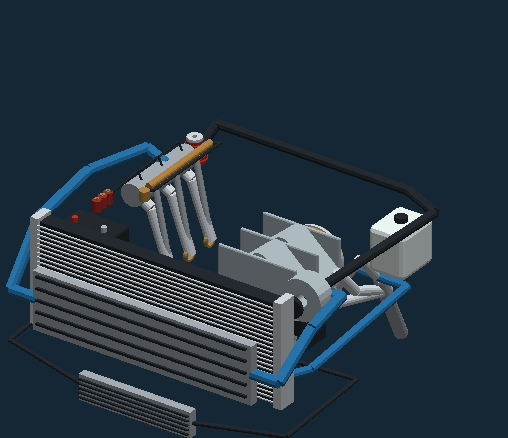](docs/screenshots/hood-rotor2-supercharger.png) |
| 3 rotors | [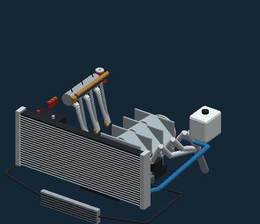](docs/screenshots/hood-rotor3-natural.png) | [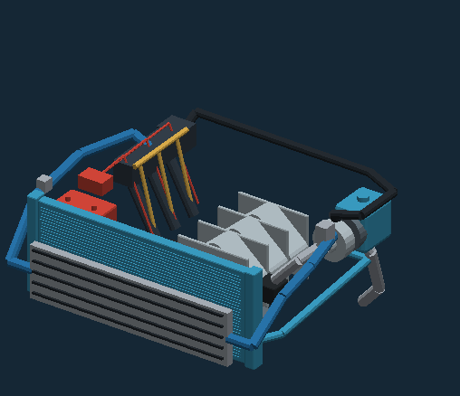](docs/screenshots/hood-rotor3-turbo.png) | [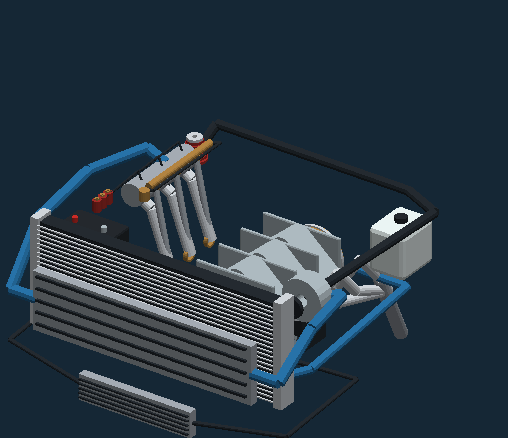](docs/screenshots/hood-rotor3-supercharger.png) |
| 4 rotors | [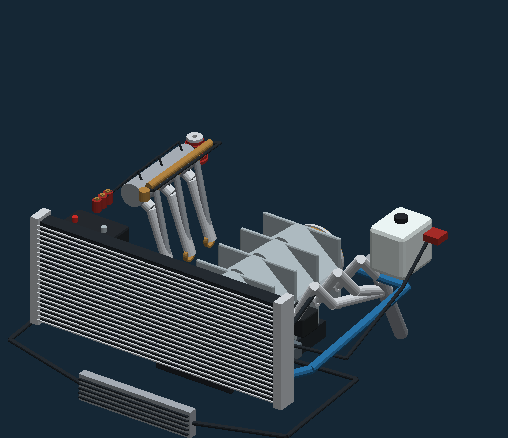](docs/screenshots/hood-rotor4-natural.png) | [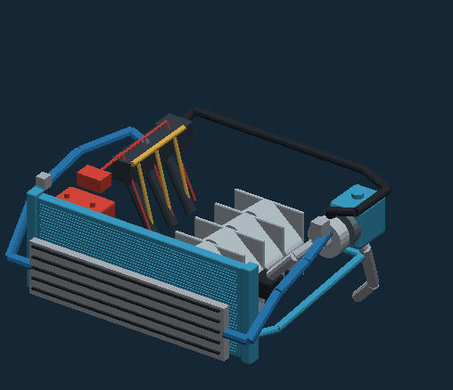](docs/screenshots/hood-rotor4-turbo.png) | [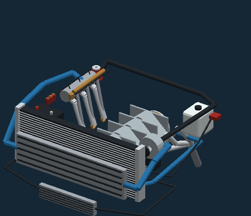](docs/screenshots/hood-rotor4-supercharger.png) |

| Engine | Large Turbo | Twin Turbo | Roots | Twin Screw |
|---|---|---|---|---|
| Inline-4 | [](docs/screenshots/hood-i4-large-turbo.png) | [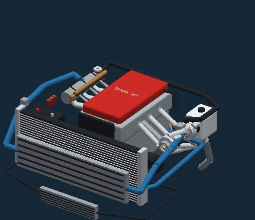](docs/screenshots/hood-i4-twin-turbo.png) | [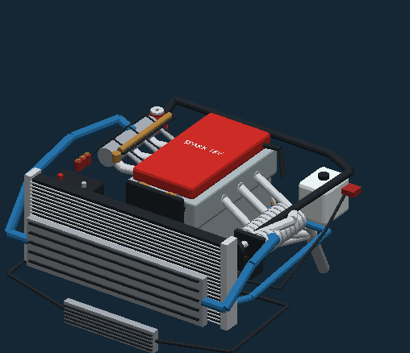](docs/screenshots/hood-i4-roots.png) | [](docs/screenshots/hood-i4-twin-screw.png) |
| V6 | [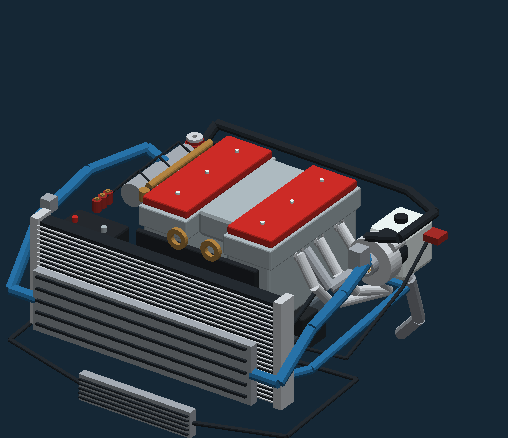](docs/screenshots/hood-v6-large-turbo.png) | [](docs/screenshots/hood-v6-twin-turbo.png) | [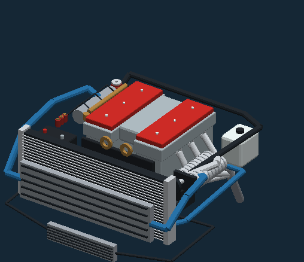](docs/screenshots/hood-v6-roots.png) | [](docs/screenshots/hood-v6-twin-screw.png) |
| Flat-four | [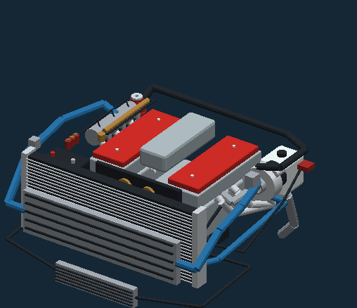](docs/screenshots/hood-flat4-large-turbo.png) | [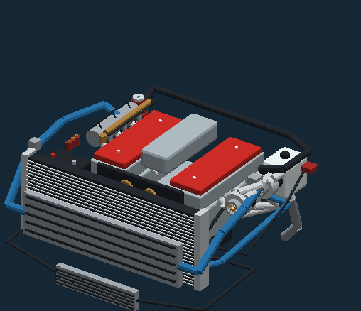](docs/screenshots/hood-flat4-twin-turbo.png) | [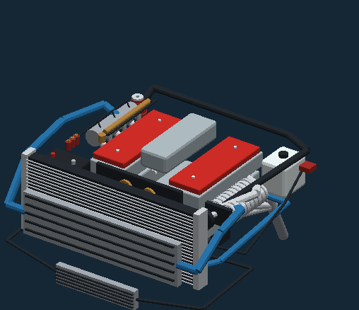](docs/screenshots/hood-flat4-roots.png) | [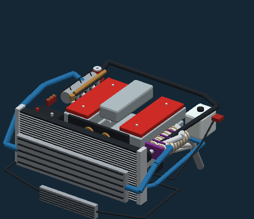](docs/screenshots/hood-flat4-twin-screw.png) |
| 1 rotor | [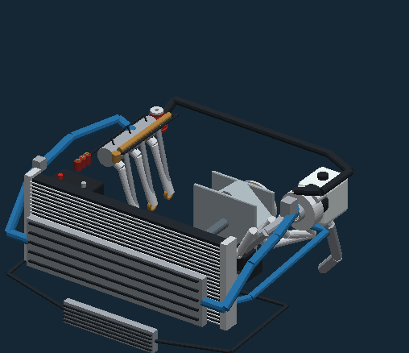](docs/screenshots/hood-rotor1-large-turbo.png) | [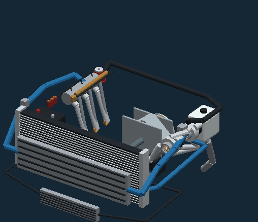](docs/screenshots/hood-rotor1-twin-turbo.png) | [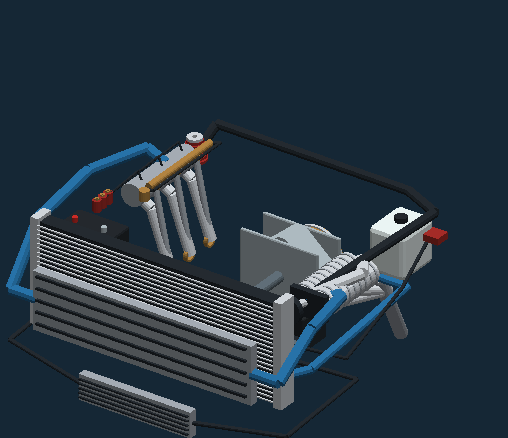](docs/screenshots/hood-rotor1-roots.png) | [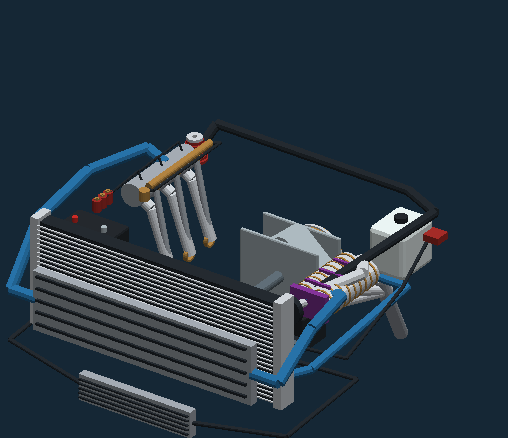](docs/screenshots/hood-rotor1-twin-screw.png) |
| 2 rotors | [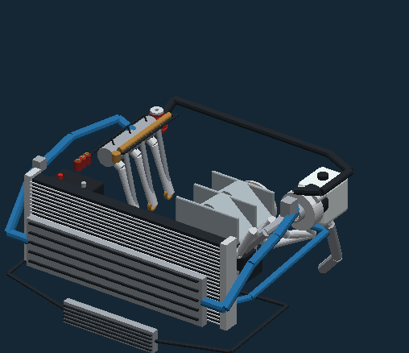](docs/screenshots/hood-rotor2-large-turbo.png) | [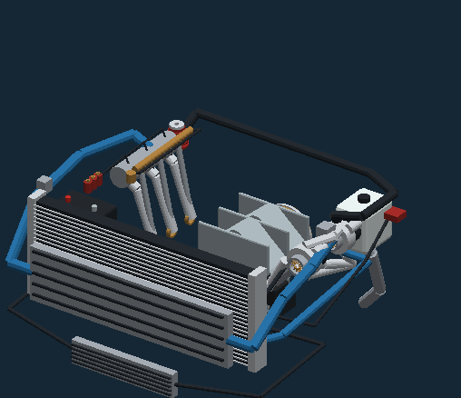](docs/screenshots/hood-rotor2-twin-turbo.png) | [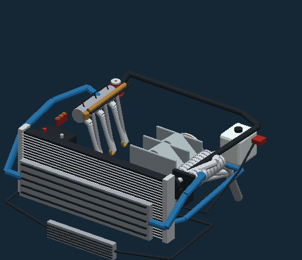](docs/screenshots/hood-rotor2-roots.png) | [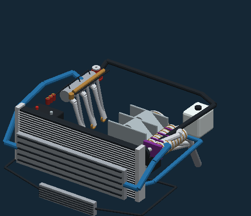](docs/screenshots/hood-rotor2-twin-screw.png) |
| 3 rotors | [](docs/screenshots/hood-rotor3-large-turbo.png) | [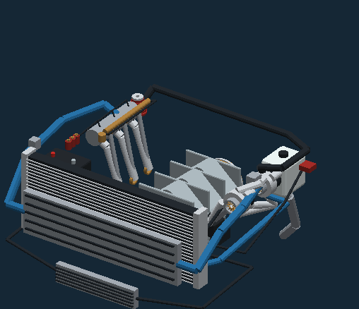](docs/screenshots/hood-rotor3-twin-turbo.png) | [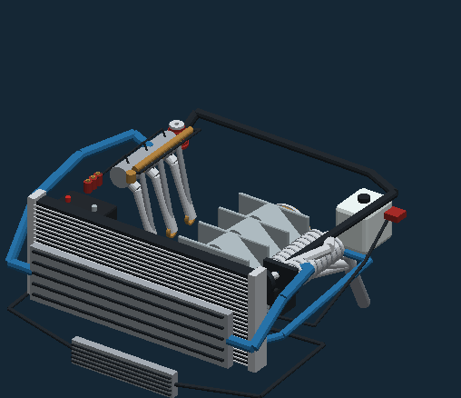](docs/screenshots/hood-rotor3-roots.png) | [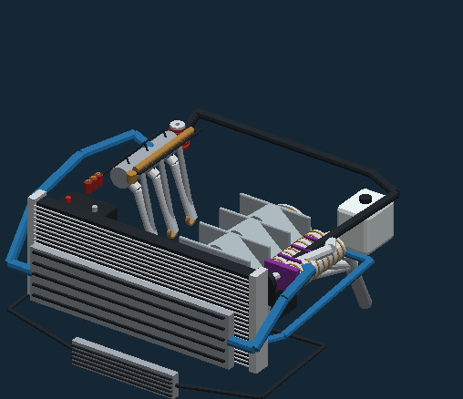](docs/screenshots/hood-rotor3-twin-screw.png) |
| 4 rotors | [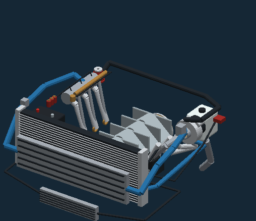](docs/screenshots/hood-rotor4-large-turbo.png) | [](docs/screenshots/hood-rotor4-twin-turbo.png) | [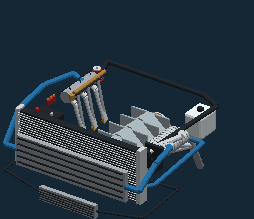](docs/screenshots/hood-rotor4-roots.png) | [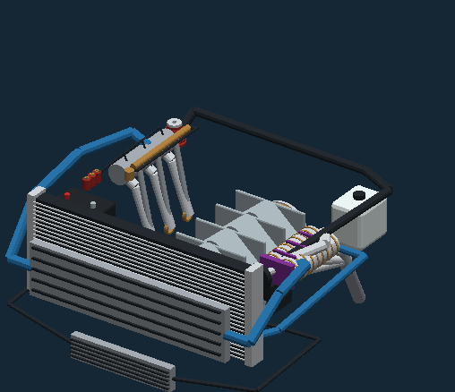](docs/screenshots/hood-rotor4-twin-screw.png) |


<!-- ENGINE-GALLERY-END -->

</details>


<details>
<summary><strong>View all 42 engine hardware models</strong></summary>

<!-- HARDWARE-GALLERY-START -->
## Every new engine hardware model

42 selectable items, with distinct geometry. These are Blender renders of the exact game meshes; click any image to inspect it. Parts are framed independently. The Engine tab adapts mounts and ports for all seven families.

### Intake

<table>
<tr>
<td align="center"><a href="docs/hardware-gallery/stock_intake.png">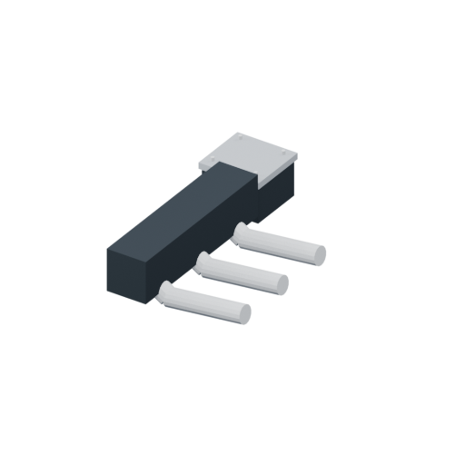</a><br>Airbox</td>
<td align="center"><a href="docs/hardware-gallery/performance_intake.png">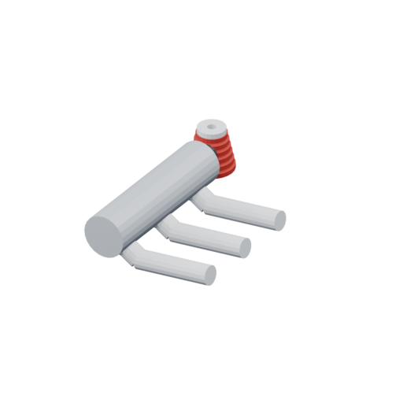</a><br>Cold-air</td>
<td align="center"><a href="docs/hardware-gallery/intake_3.png">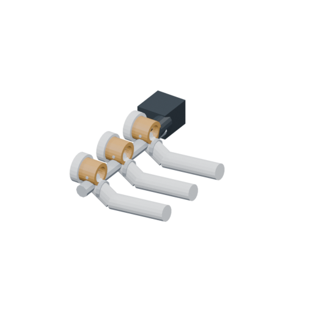</a><br>Individual throttles</td>
<td align="center"><a href="docs/hardware-gallery/intake_4.png">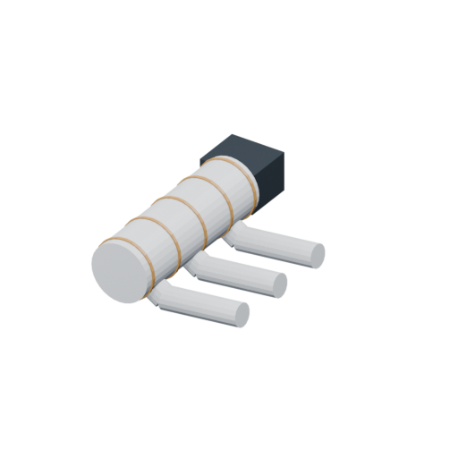</a><br>Ram plenum</td>
</tr>
</table>

### Fuel system

<table>
<tr>
<td align="center"><a href="docs/hardware-gallery/stock_fuel_system.png">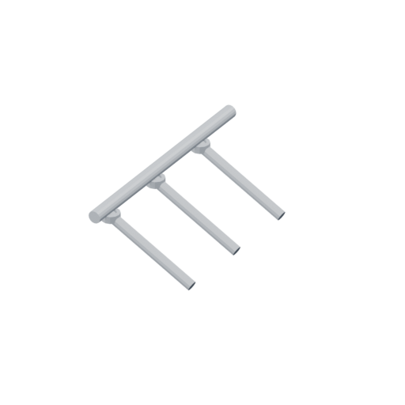</a><br>Port injection</td>
<td align="center"><a href="docs/hardware-gallery/performance_fuel_system.png">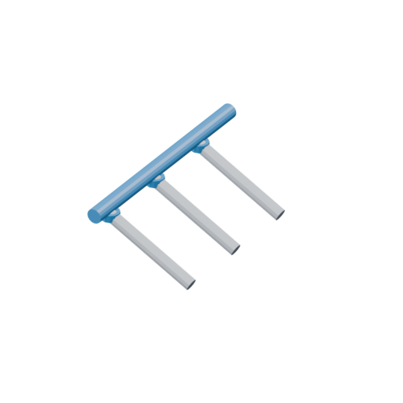</a><br>High-flow rail</td>
<td align="center"><a href="docs/hardware-gallery/fuel_system_3.png">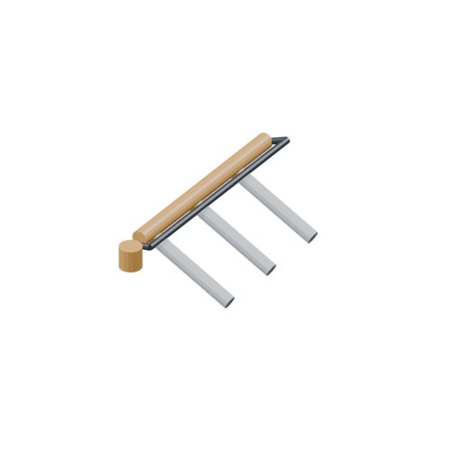</a><br>Return fuel rail</td>
<td align="center"><a href="docs/hardware-gallery/fuel_system_4.png">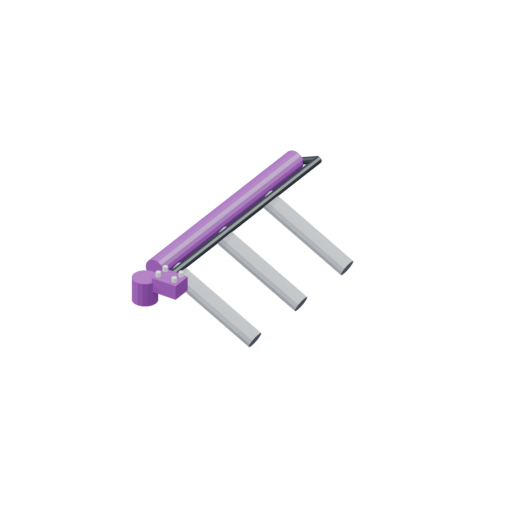</a><br>Race injection</td>
</tr>
</table>

### Ignition

<table>
<tr>
<td align="center"><a href="docs/hardware-gallery/stock_ignition.png">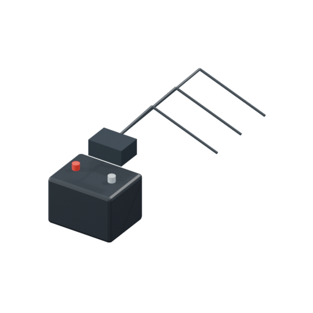</a><br>Coil pack</td>
<td align="center"><a href="docs/hardware-gallery/performance_ignition.png">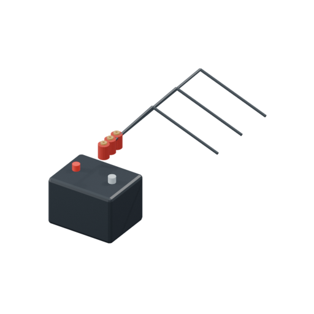</a><br>Performance coils</td>
<td align="center"><a href="docs/hardware-gallery/ignition_3.png">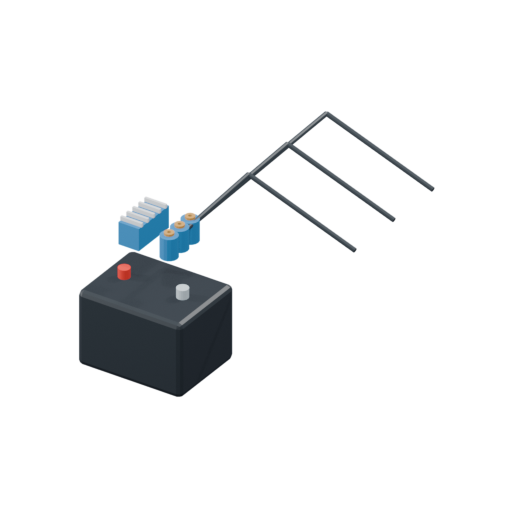</a><br>CDI ignition</td>
<td align="center"><a href="docs/hardware-gallery/ignition_4.png">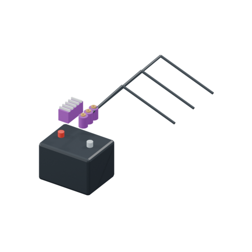</a><br>Multi-spark</td>
</tr>
</table>

### Cooling

<table>
<tr>
<td align="center"><a href="docs/hardware-gallery/stock_cooling.png">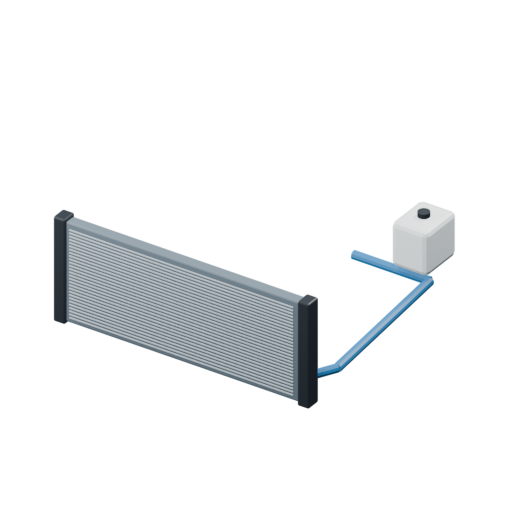</a><br>OEM radiator</td>
<td align="center"><a href="docs/hardware-gallery/performance_cooling.png">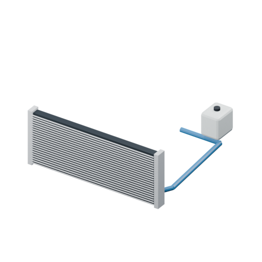</a><br>Aluminium radiator</td>
<td align="center"><a href="docs/hardware-gallery/cooling_3.png"></a><br>Dual electric fans</td>
<td align="center"><a href="docs/hardware-gallery/cooling_4.png">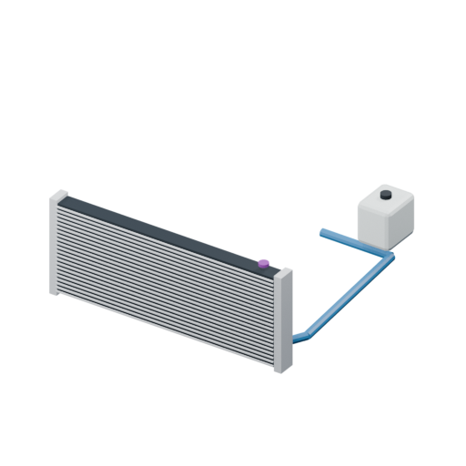</a><br>Race radiator</td>
</tr>
</table>

### Rotating assembly

<table>
<tr>
<td align="center"><a href="docs/hardware-gallery/stock_internals.png">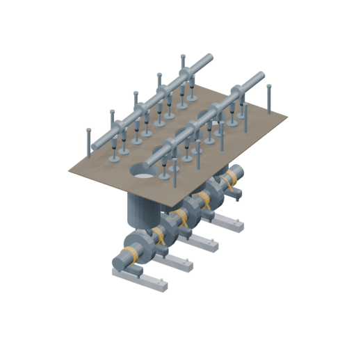</a><br>Cast assembly</td>
<td align="center"><a href="docs/hardware-gallery/performance_internals.png">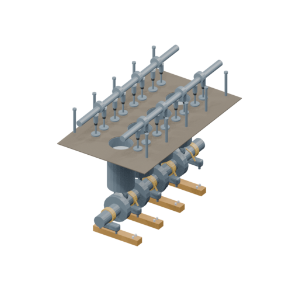</a><br>Forged assembly</td>
<td align="center"><a href="docs/hardware-gallery/internals_3.png">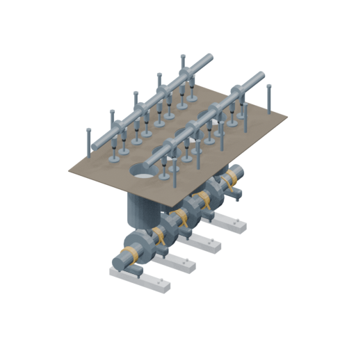</a><br>High compression</td>
<td align="center"><a href="docs/hardware-gallery/internals_4.png">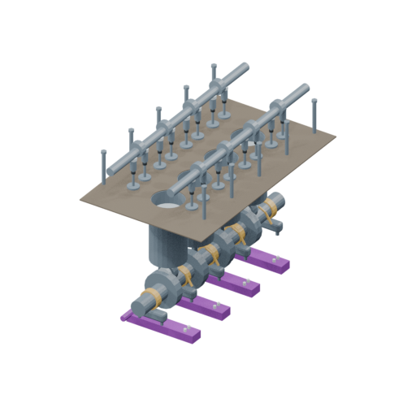</a><br>Billet assembly</td>
</tr>
</table>

### Forced induction

<table>
<tr>
<td align="center"><a href="docs/hardware-gallery/turbo_kit.png"></a><br>Street turbo</td>
<td align="center"><a href="docs/hardware-gallery/supercharger_kit.png">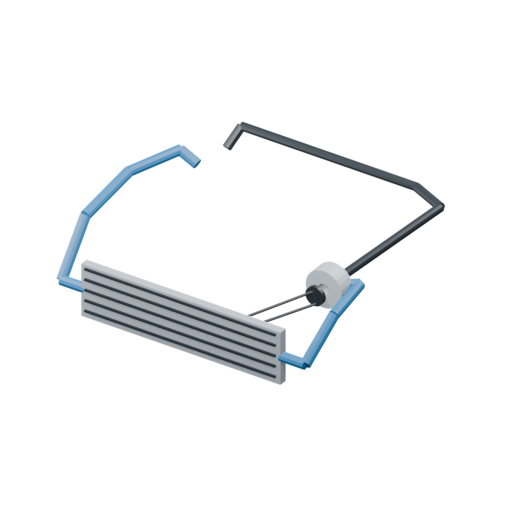</a><br>Centrifugal blower</td>
<td align="center"><a href="docs/hardware-gallery/large_turbo_kit.png">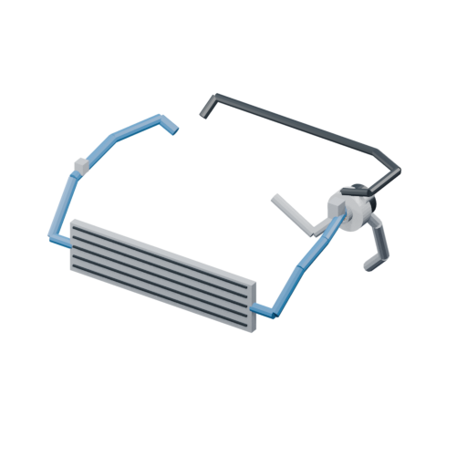</a><br>Large turbo</td>
<td align="center"><a href="docs/hardware-gallery/twin_turbo_kit.png">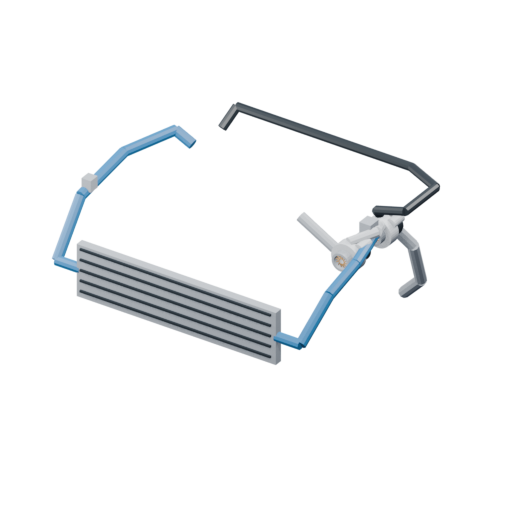</a><br>Twin turbos</td>
</tr>
<tr>
<td align="center"><a href="docs/hardware-gallery/roots_blower_kit.png">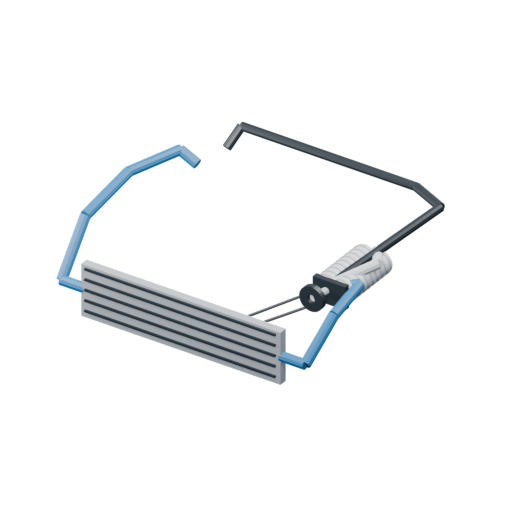</a><br>Roots blower</td>
<td align="center"><a href="docs/hardware-gallery/twin_screw_kit.png">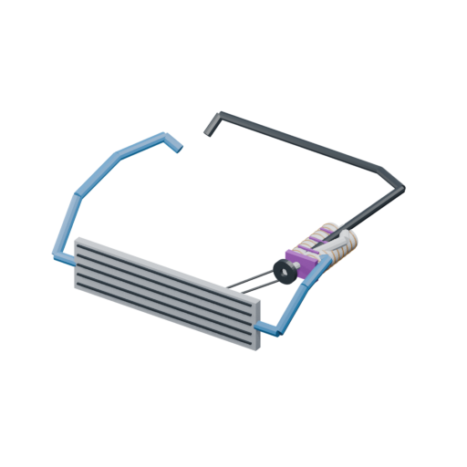</a><br>Twin-screw blower</td>
</tr>
</table>

### Exhaust

<table>
<tr>
<td align="center"><a href="docs/hardware-gallery/stock_exhaust.png">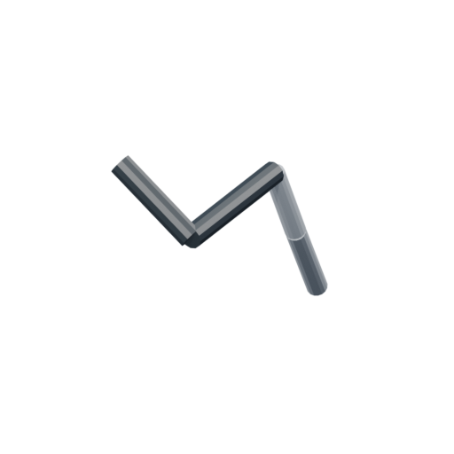</a><br>Cast manifold</td>
<td align="center"><a href="docs/hardware-gallery/performance_exhaust.png">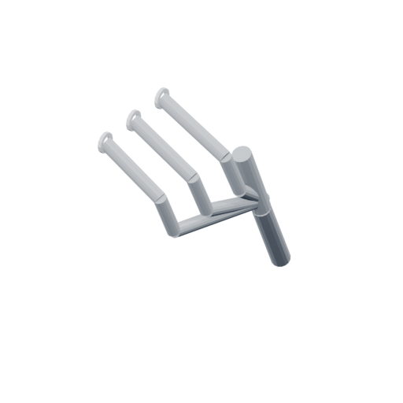</a><br>4-2-1 headers</td>
<td align="center"><a href="docs/hardware-gallery/exhaust_3.png">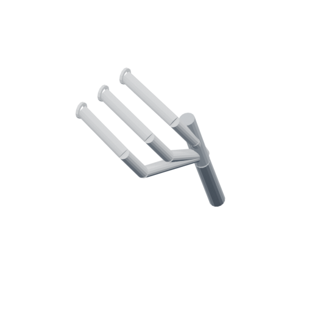</a><br>Equal-length tubes</td>
<td align="center"><a href="docs/hardware-gallery/exhaust_4.png">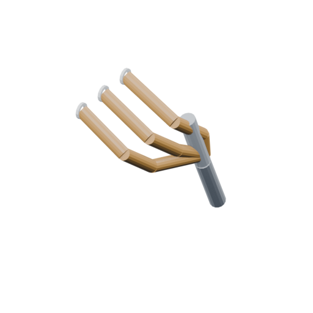</a><br>Race collector</td>
</tr>
</table>

### Flywheel

<table>
<tr>
<td align="center"><a href="docs/hardware-gallery/stock_flywheel.png">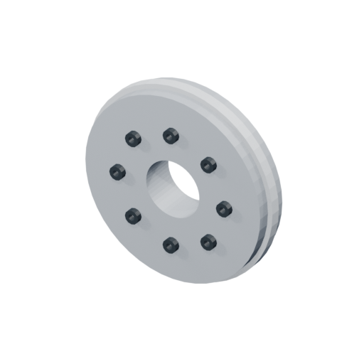</a><br>OEM flywheel</td>
<td align="center"><a href="docs/hardware-gallery/performance_flywheel.png">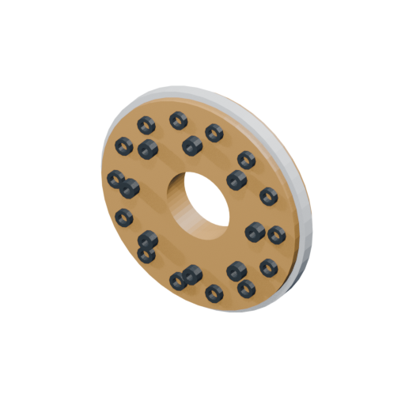</a><br>Light steel</td>
<td align="center"><a href="docs/hardware-gallery/flywheel_3.png">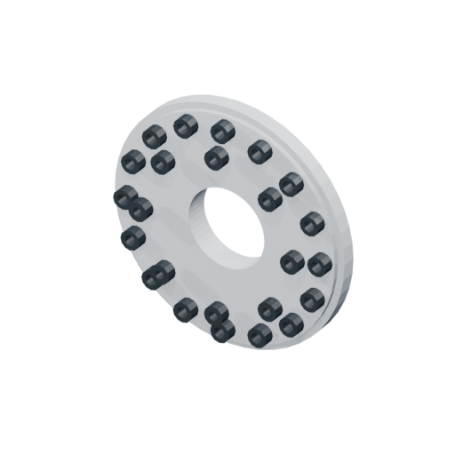</a><br>Aluminium flywheel</td>
<td align="center"><a href="docs/hardware-gallery/flywheel_4.png">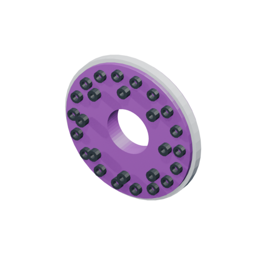</a><br>Billet flywheel</td>
</tr>
</table>

### Cams / rotary ports

<table>
<tr>
<td align="center"><a href="docs/hardware-gallery/stock_headwork.png">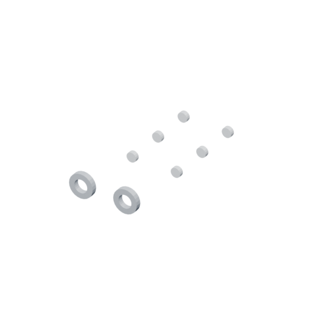</a><br>OEM cams / side ports</td>
<td align="center"><a href="docs/hardware-gallery/performance_headwork.png">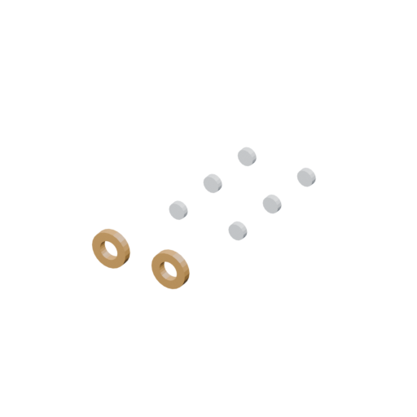</a><br>Street cams / ports</td>
<td align="center"><a href="docs/hardware-gallery/headwork_3.png">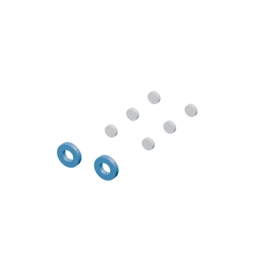</a><br>Race cams / bridge</td>
<td align="center"><a href="docs/hardware-gallery/headwork_4.png">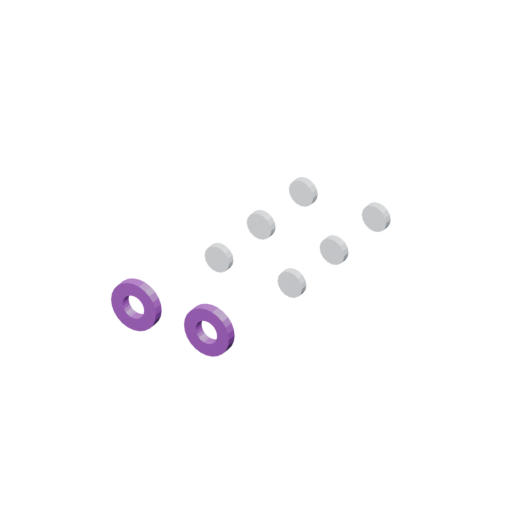</a><br>High-lift / peripheral</td>
</tr>
</table>

### Oil system

<table>
<tr>
<td align="center"><a href="docs/hardware-gallery/stock_oil_system.png">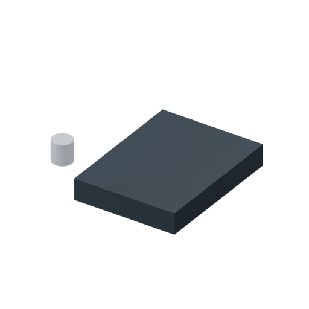</a><br>Wet sump</td>
<td align="center"><a href="docs/hardware-gallery/performance_oil_system.png">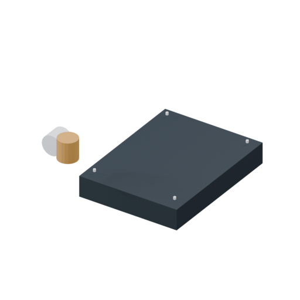</a><br>Baffled sump</td>
<td align="center"><a href="docs/hardware-gallery/oil_system_3.png">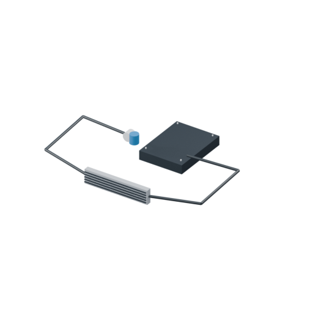</a><br>Oil cooler</td>
<td align="center"><a href="docs/hardware-gallery/oil_system_4.png">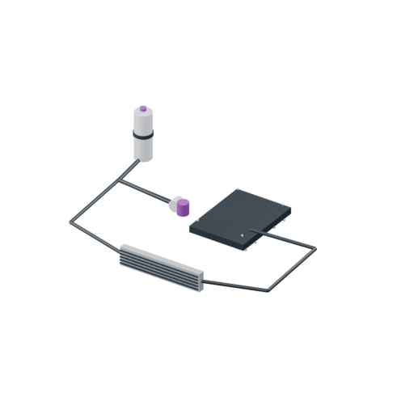</a><br>Dry sump</td>
</tr>
</table>

<!-- HARDWARE-GALLERY-END -->

</details>

## Editable model kit

The complete Blender kit remains available, including **471 named parts and assemblies across 43 categories**. These include repeated components and workshop/upgrade assets beyond the playable alpha's implemented subset. Every model preview is in the expandable gallery below.

| File | Contents |
|---|---|
| [Latest tested mod JAR](https://github.com/CesarPetrescu/AutoPropulsion-Age/releases/latest/download/autopropulsion-age-latest.jar) | Install this in Minecraft with NeoForge. |
| [Complete model kit ZIP](downloads/modular-car-kit.zip) | Blender source, GLB, previews, scripts, manifests, fit report and portable gallery. |
| [Engine workshop Blender file](assets/engine_workshop.blend) | Editable derived runtime snapshots: 49 open-hood layouts plus 42 isolated hardware scenes. |
| [Blender project](assets/modular_car_kit/sparkmotors_modular.blend) | Editable stock car, engine, upgrade catalog, workshop and service scenes. |
| [Stock car GLB](assets/modular_car_kit/stock_car.glb) | Interchange geometry, hierarchy, materials and six opening-panel animation channels. |
| [Authoring and rebuild guide](assets/modular_car_kit/README.md) | Scene controls, measurements and rebuild commands. |
| [Parts manifest](assets/modular_car_kit/parts_manifest.json) / [gallery index](assets/modular_car_kit/gallery_index.json) | IDs, previews, bounds and mounting metadata. |
| [Original requirements](docs/modular-car-requirements.md) | Full design and longer-term architecture. |
| [Early studies](assets/early_studies) | Original square and simple car Blender files and first render. |

<details>
<summary><strong>Blender renders: assembled car, cutaway, engine, upgrades and workshop</strong></summary>

### Assembled car

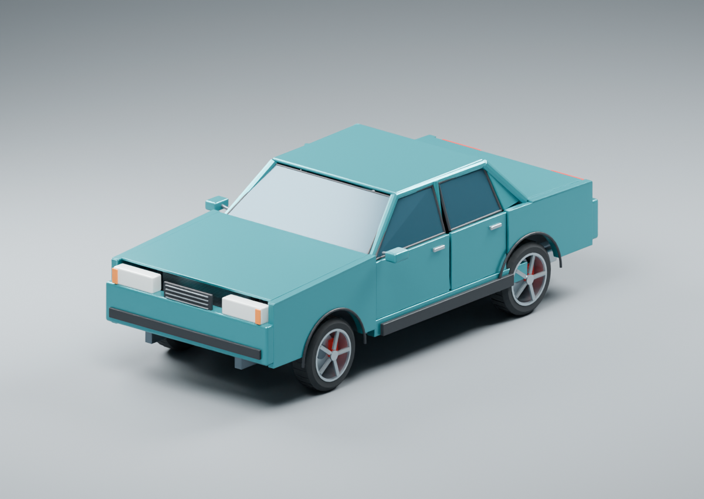

### Service cutaway

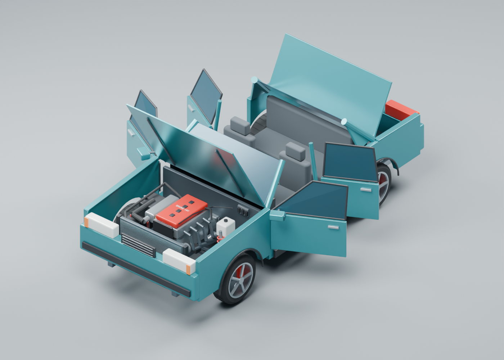

### Exploded engine

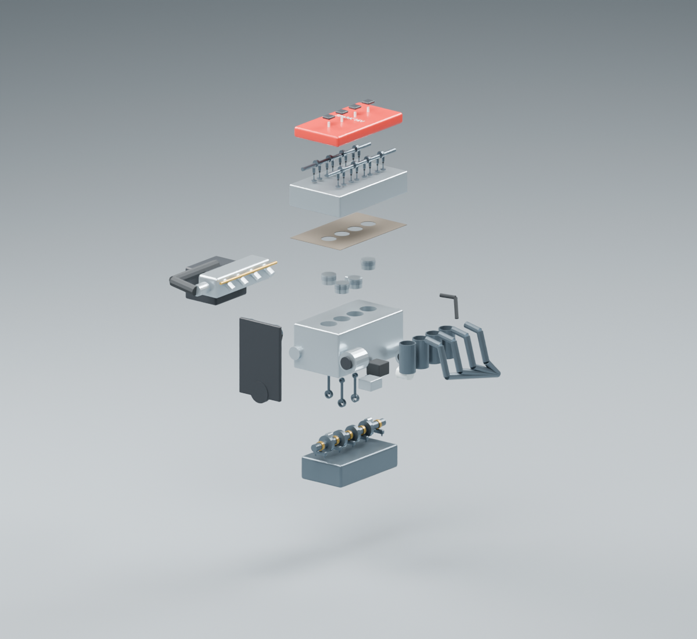

### Upgrade catalog

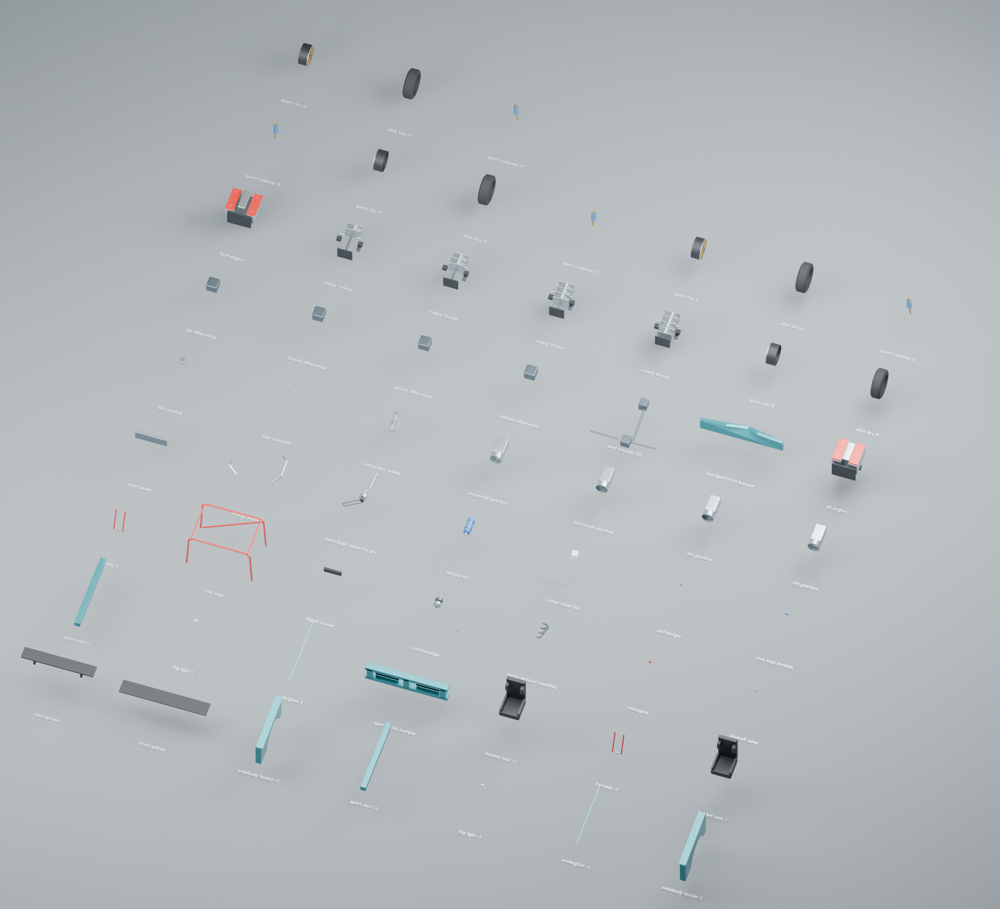

### Workshop equipment

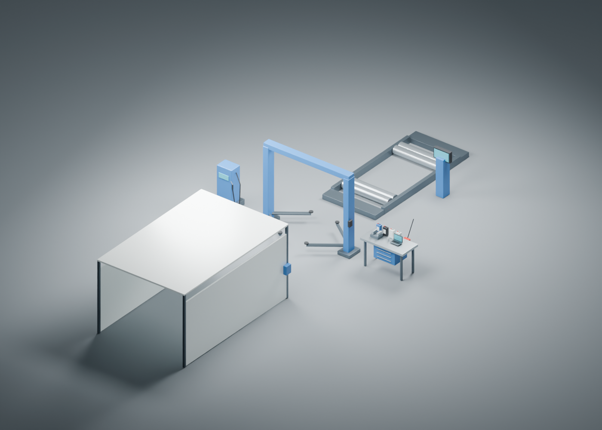

</details>

The original asset delivery passed **22 selected geometric checks** and a fresh Blender rebuild. The car is 4.5 m long, 1.9 m wide excluding mirrors, with a 2.65 m wheelbase. Authoring axes are +X right, -Y front, +Z up. Fit checks cover selected relationships, not every possible combination. See the [fit report](assets/modular_car_kit/fit_report.json) and [runtime conversion report](docs/runtime-assets.json).

The working asset and registry namespace is `sparkmotors`. No affiliation with Mojang or Microsoft.

## Every model

**471 named parts and assemblies across 43 categories.** Expand a category to see every model, then click an image for its full 512 px preview. Repeated cylinder and wheel components are included; these are not 471 unique designs.

Previews are scaled independently. Assembly previews include their same-state child parts; glass is opaque in these shape previews. The manifest and gallery index retain exact IDs, mounting positions, hierarchy and dimensions.

| Category | Models | Category | Models |
|---|---:|---|---:|
| [01 · Chassis](#category-01) | 1 | [02 · Opening panels](#category-02) | 6 |
| [03 · Exterior panels](#category-03) | 8 | [04 · Glass](#category-04) | 6 |
| [05 · Exterior fittings](#category-05) | 7 | [06 · Lighting](#category-06) | 8 |
| [07 · Body upgrades](#category-07) | 7 | [08 · Seats](#category-08) | 5 |
| [09 · Dashboard](#category-09) | 5 | [10 · Driver controls](#category-10) | 6 |
| [11 · Interior trim](#category-11) | 7 | [12 · Safety upgrades](#category-12) | 3 |
| [13 · Wheels](#category-13) | 16 | [14 · Wheel mounting](#category-14) | 8 |
| [15 · Brakes](#category-15) | 17 | [16 · Suspension](#category-16) | 14 |
| [17 · Steering mechanism](#category-17) | 1 | [18 · Engine blocks](#category-18) | 10 |
| [19 · Engine top](#category-19) | 10 | [20 · Rotating internals](#category-20) | 27 |
| [21 · Bearings and small internals](#category-21) | 40 | [22 · Valvetrain](#category-22) | 71 |
| [23 · Gaskets](#category-23) | 1 | [24 · Timing system](#category-24) | 3 |
| [25 · Air intake](#category-25) | 4 | [26 · Fuel delivery](#category-26) | 8 |
| [27 · Ignition and electrical](#category-27) | 12 | [28 · Lubrication](#category-28) | 4 |
| [29 · Cooling](#category-29) | 6 | [30 · Exhaust](#category-30) | 4 |
| [31 · Turbo system](#category-31) | 6 | [32 · Supercharger](#category-32) | 1 |
| [33 · Nitrous](#category-33) | 1 | [34 · Water-meth](#category-34) | 1 |
| [35 · Clutch and flywheel](#category-35) | 3 | [36 · Transmission](#category-36) | 11 |
| [37 · Driveline](#category-37) | 10 | [38 · Rotary engines](#category-38) | 94 |
| [39 · ECU and tuning](#category-39) | 5 | [40 · Garage equipment](#category-40) | 4 |
| [41 · Testing and servicing](#category-41) | 5 | [42 · Fluid containers](#category-42) | 4 |
| [43 · Damage variant](#category-43) | 1 |  |  |

<a id="category-01"></a>
<details>
<summary><strong>01 · Chassis — 1 models</strong></summary>

<table>
<tr>
<td align="center" width="33%"><a href="assets/modular_car_kit/previews/chassis_shell.png">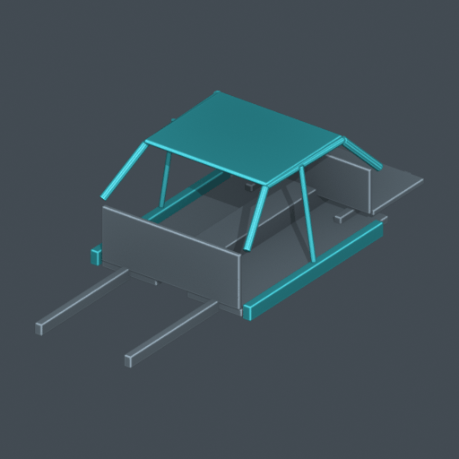</a><br><strong>Chassis Shell</strong><br><sub>stock · 23 mesh components</sub></td>
</tr>
</table>

</details>

<a id="category-02"></a>
<details>
<summary><strong>02 · Opening panels — 6 models</strong></summary>

<table>
<tr>
<td align="center" width="33%"><a href="assets/modular_car_kit/previews/door_front_left.png">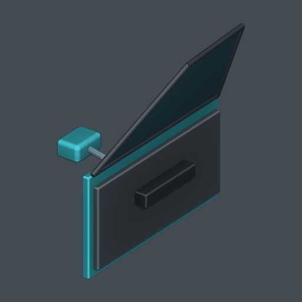</a><br><strong>Door Front Left</strong><br><sub>stock · 12 mesh components</sub></td>
<td align="center" width="33%"><a href="assets/modular_car_kit/previews/door_rear_left.png">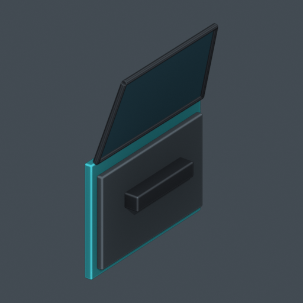</a><br><strong>Door Rear Left</strong><br><sub>stock · 9 mesh components</sub></td>
<td align="center" width="33%"><a href="assets/modular_car_kit/previews/door_front_right.png">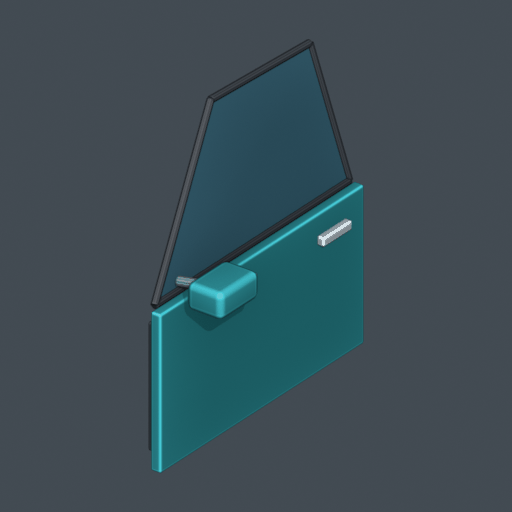</a><br><strong>Door Front Right</strong><br><sub>stock · 12 mesh components</sub></td>
</tr>
<tr>
<td align="center" width="33%"><a href="assets/modular_car_kit/previews/door_rear_right.png">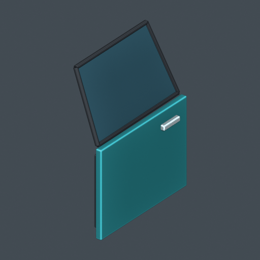</a><br><strong>Door Rear Right</strong><br><sub>stock · 9 mesh components</sub></td>
<td align="center" width="33%"><a href="assets/modular_car_kit/previews/hood.png">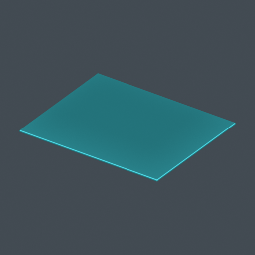</a><br><strong>Hood</strong><br><sub>stock · 3 mesh components</sub></td>
<td align="center" width="33%"><a href="assets/modular_car_kit/previews/trunk_lid.png">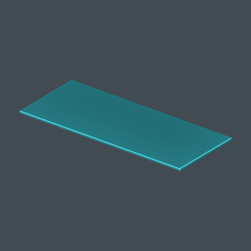</a><br><strong>Trunk Lid</strong><br><sub>stock · 1 mesh components</sub></td>
</tr>
</table>

</details>

<a id="category-03"></a>
<details>
<summary><strong>03 · Exterior panels — 8 models</strong></summary>

<table>
<tr>
<td align="center" width="33%"><a href="assets/modular_car_kit/previews/front_fender_-1.png"></a><br><strong>Front Fender -1</strong><br><sub>stock · 22 mesh components</sub></td>
<td align="center" width="33%"><a href="assets/modular_car_kit/previews/rear_fender_-1.png">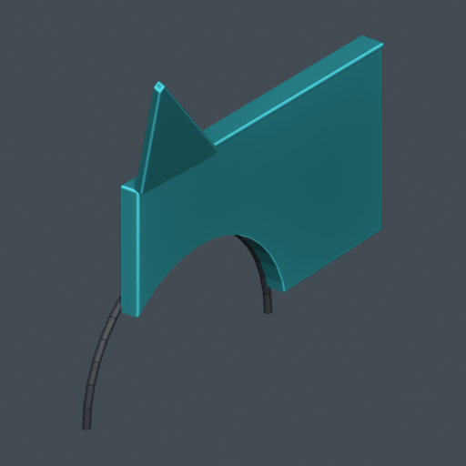</a><br><strong>Rear Fender -1</strong><br><sub>stock · 23 mesh components</sub></td>
<td align="center" width="33%"><a href="assets/modular_car_kit/previews/side_skirt_-1.png"></a><br><strong>Side Skirt -1</strong><br><sub>stock · 1 mesh components</sub></td>
</tr>
<tr>
<td align="center" width="33%"><a href="assets/modular_car_kit/previews/front_fender_1.png">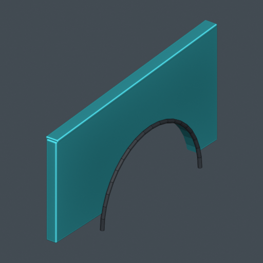</a><br><strong>Front Fender 1</strong><br><sub>stock · 22 mesh components</sub></td>
<td align="center" width="33%"><a href="assets/modular_car_kit/previews/rear_fender_1.png">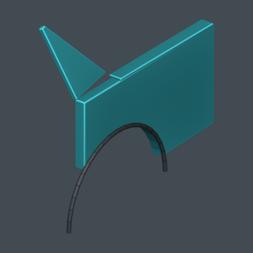</a><br><strong>Rear Fender 1</strong><br><sub>stock · 23 mesh components</sub></td>
<td align="center" width="33%"><a href="assets/modular_car_kit/previews/side_skirt_1.png">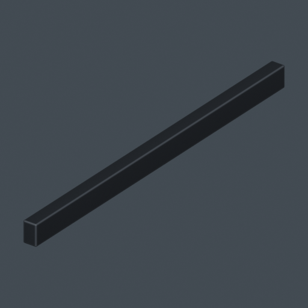</a><br><strong>Side Skirt 1</strong><br><sub>stock · 1 mesh components</sub></td>
</tr>
<tr>
<td align="center" width="33%"><a href="assets/modular_car_kit/previews/front_bumper.png">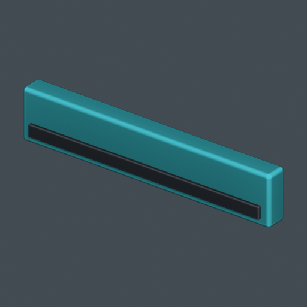</a><br><strong>Front Bumper</strong><br><sub>stock · 2 mesh components</sub></td>
<td align="center" width="33%"><a href="assets/modular_car_kit/previews/rear_bumper.png">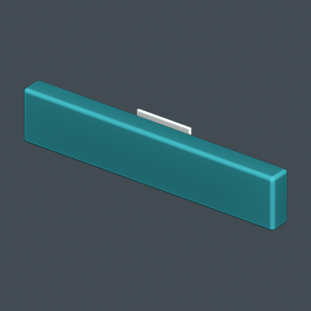</a><br><strong>Rear Bumper</strong><br><sub>stock · 3 mesh components</sub></td>
</tr>
</table>

</details>

<a id="category-04"></a>
<details>
<summary><strong>04 · Glass — 6 models</strong></summary>

<table>
<tr>
<td align="center" width="33%"><a href="assets/modular_car_kit/previews/window_front_left.png"></a><br><strong>Window Front Left</strong><br><sub>stock · 1 mesh components</sub></td>
<td align="center" width="33%"><a href="assets/modular_car_kit/previews/window_rear_left.png">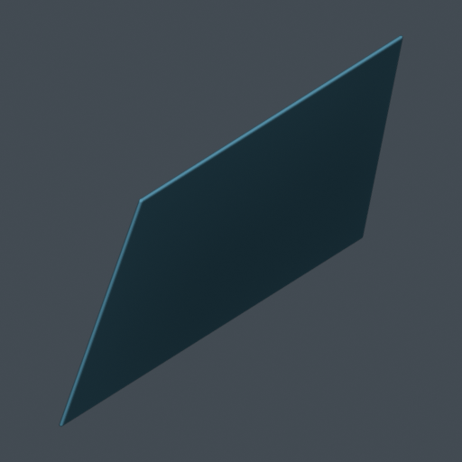</a><br><strong>Window Rear Left</strong><br><sub>stock · 1 mesh components</sub></td>
<td align="center" width="33%"><a href="assets/modular_car_kit/previews/window_front_right.png">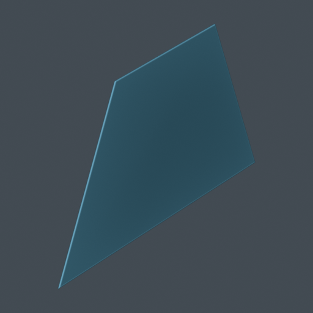</a><br><strong>Window Front Right</strong><br><sub>stock · 1 mesh components</sub></td>
</tr>
<tr>
<td align="center" width="33%"><a href="assets/modular_car_kit/previews/window_rear_right.png">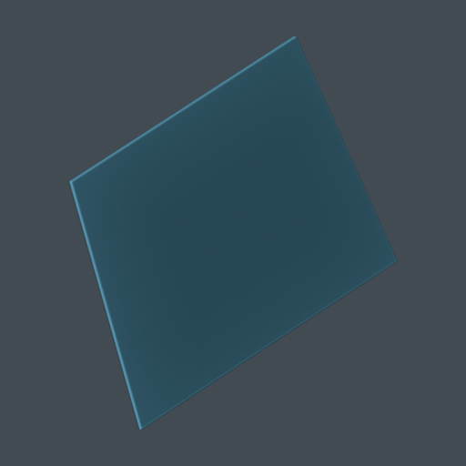</a><br><strong>Window Rear Right</strong><br><sub>stock · 1 mesh components</sub></td>
<td align="center" width="33%"><a href="assets/modular_car_kit/previews/windshield.png">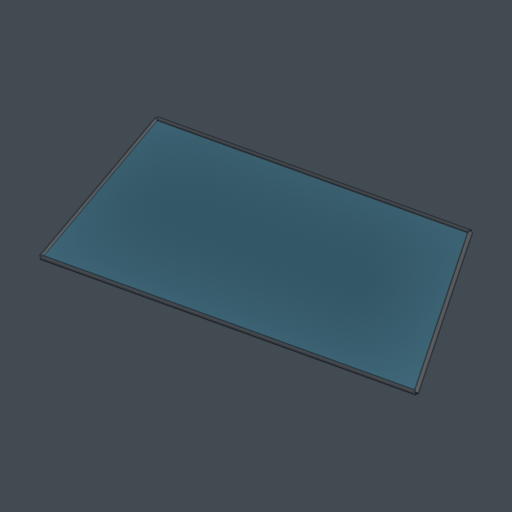</a><br><strong>Windshield</strong><br><sub>stock · 5 mesh components</sub></td>
<td align="center" width="33%"><a href="assets/modular_car_kit/previews/rear_glass.png"></a><br><strong>Rear Glass</strong><br><sub>stock · 5 mesh components</sub></td>
</tr>
</table>

</details>

<a id="category-05"></a>
<details>
<summary><strong>05 · Exterior fittings — 7 models</strong></summary>

<table>
<tr>
<td align="center" width="33%"><a href="assets/modular_car_kit/previews/handle_front_left.png">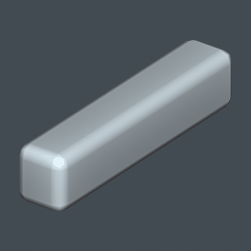</a><br><strong>Handle Front Left</strong><br><sub>stock · 1 mesh components</sub></td>
<td align="center" width="33%"><a href="assets/modular_car_kit/previews/handle_rear_left.png"></a><br><strong>Handle Rear Left</strong><br><sub>stock · 1 mesh components</sub></td>
<td align="center" width="33%"><a href="assets/modular_car_kit/previews/handle_front_right.png">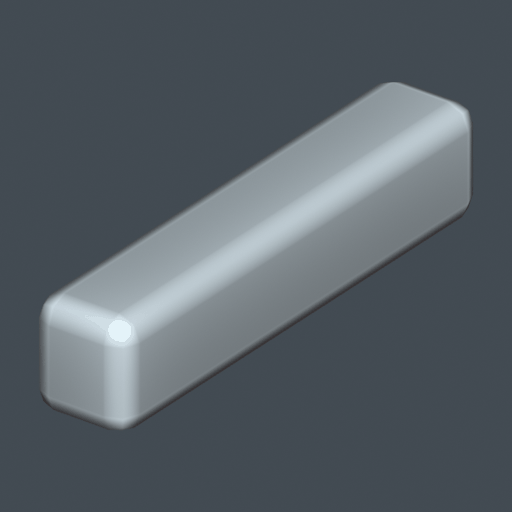</a><br><strong>Handle Front Right</strong><br><sub>stock · 1 mesh components</sub></td>
</tr>
<tr>
<td align="center" width="33%"><a href="assets/modular_car_kit/previews/handle_rear_right.png"></a><br><strong>Handle Rear Right</strong><br><sub>stock · 1 mesh components</sub></td>
<td align="center" width="33%"><a href="assets/modular_car_kit/previews/grille.png">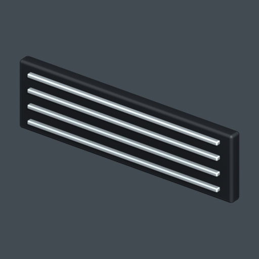</a><br><strong>Grille</strong><br><sub>stock · 5 mesh components</sub></td>
<td align="center" width="33%"><a href="assets/modular_car_kit/previews/mirror_-1.png">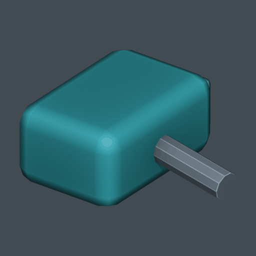</a><br><strong>Mirror -1</strong><br><sub>stock · 3 mesh components</sub></td>
</tr>
<tr>
<td align="center" width="33%"><a href="assets/modular_car_kit/previews/mirror_1.png">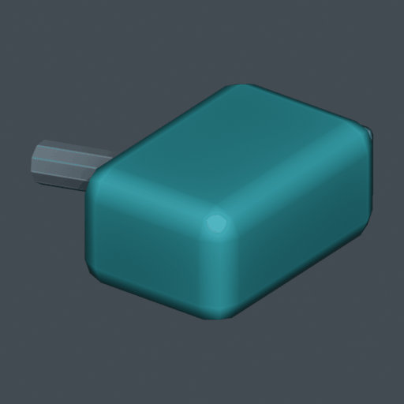</a><br><strong>Mirror 1</strong><br><sub>stock · 3 mesh components</sub></td>
</tr>
</table>

</details>

<a id="category-06"></a>
<details>
<summary><strong>06 · Lighting — 8 models</strong></summary>

<table>
<tr>
<td align="center" width="33%"><a href="assets/modular_car_kit/previews/front_light_-1.png">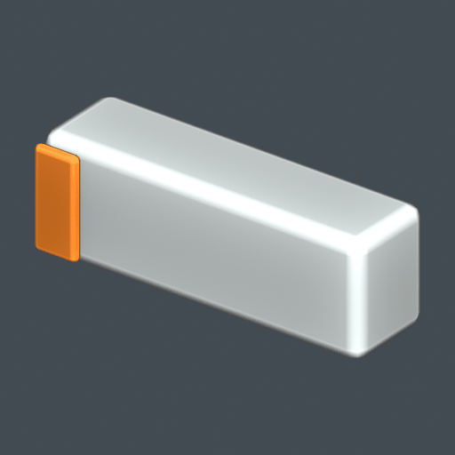</a><br><strong>Front Light -1</strong><br><sub>stock · 2 mesh components</sub></td>
<td align="center" width="33%"><a href="assets/modular_car_kit/previews/front_light_1.png">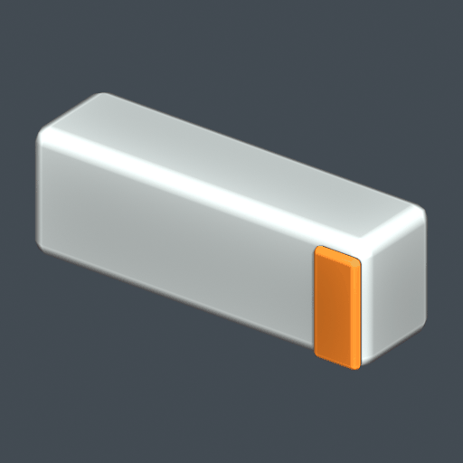</a><br><strong>Front Light 1</strong><br><sub>stock · 2 mesh components</sub></td>
<td align="center" width="33%"><a href="assets/modular_car_kit/previews/rear_light_-1.png">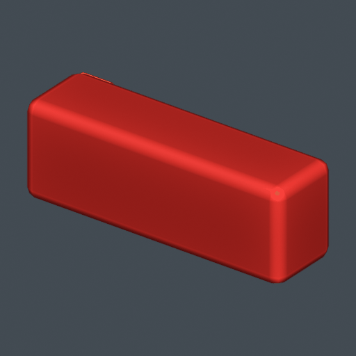</a><br><strong>Rear Light -1</strong><br><sub>stock · 2 mesh components</sub></td>
</tr>
<tr>
<td align="center" width="33%"><a href="assets/modular_car_kit/previews/rear_light_1.png">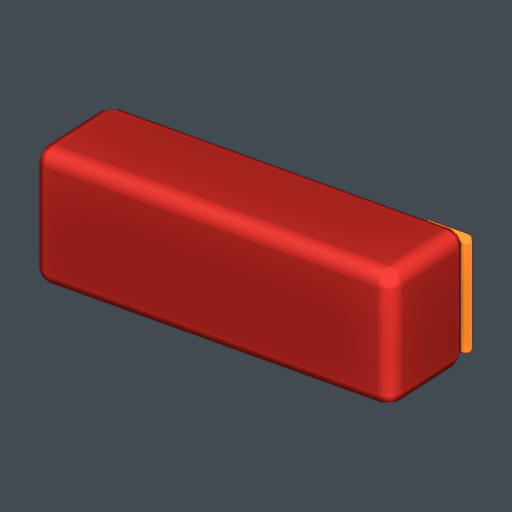</a><br><strong>Rear Light 1</strong><br><sub>stock · 2 mesh components</sub></td>
<td align="center" width="33%"><a href="assets/modular_car_kit/previews/fog_light_-1.png">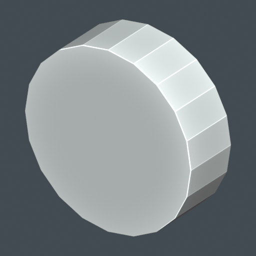</a><br><strong>Fog Light -1</strong><br><sub>upgrade · 1 mesh components</sub></td>
<td align="center" width="33%"><a href="assets/modular_car_kit/previews/underglow_-1.png"></a><br><strong>Underglow -1</strong><br><sub>upgrade · 1 mesh components</sub></td>
</tr>
<tr>
<td align="center" width="33%"><a href="assets/modular_car_kit/previews/fog_light_1.png"></a><br><strong>Fog Light 1</strong><br><sub>upgrade · 1 mesh components</sub></td>
<td align="center" width="33%"><a href="assets/modular_car_kit/previews/underglow_1.png"></a><br><strong>Underglow 1</strong><br><sub>upgrade · 1 mesh components</sub></td>
</tr>
</table>

</details>

<a id="category-07"></a>
<details>
<summary><strong>07 · Body upgrades — 7 models</strong></summary>

<table>
<tr>
<td align="center" width="33%"><a href="assets/modular_car_kit/previews/rear_spoiler.png">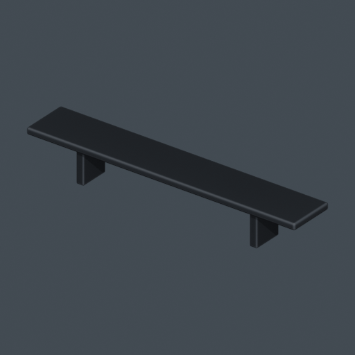</a><br><strong>Rear Spoiler</strong><br><sub>upgrade · 3 mesh components</sub></td>
<td align="center" width="33%"><a href="assets/modular_car_kit/previews/front_splitter.png">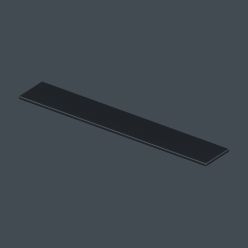</a><br><strong>Front Splitter</strong><br><sub>upgrade · 1 mesh components</sub></td>
<td align="center" width="33%"><a href="assets/modular_car_kit/previews/widebody_fender_-1.png">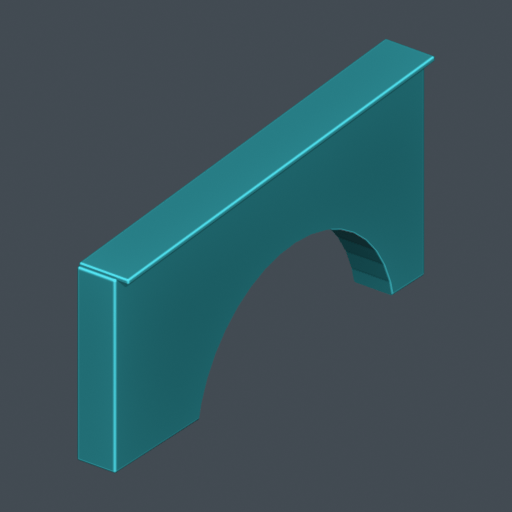</a><br><strong>Widebody Fender -1</strong><br><sub>upgrade · 2 mesh components</sub></td>
</tr>
<tr>
<td align="center" width="33%"><a href="assets/modular_car_kit/previews/sport_skirt_-1.png">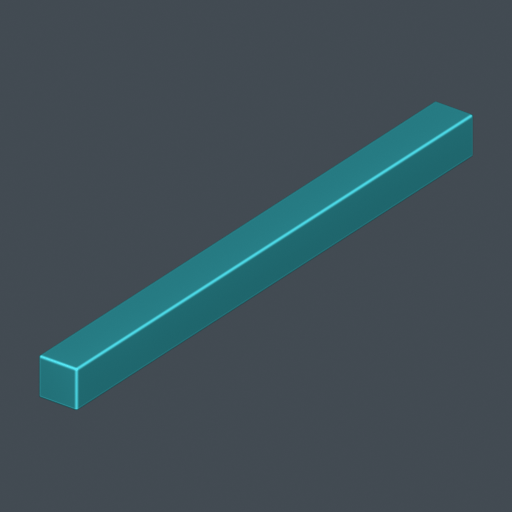</a><br><strong>Sport Skirt -1</strong><br><sub>upgrade · 1 mesh components</sub></td>
<td align="center" width="33%"><a href="assets/modular_car_kit/previews/widebody_fender_1.png">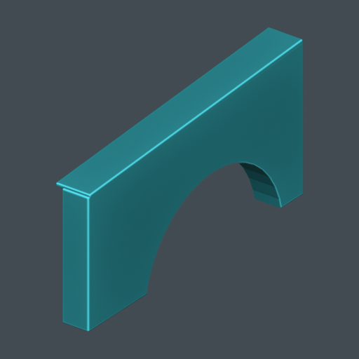</a><br><strong>Widebody Fender 1</strong><br><sub>upgrade · 2 mesh components</sub></td>
<td align="center" width="33%"><a href="assets/modular_car_kit/previews/sport_skirt_1.png"></a><br><strong>Sport Skirt 1</strong><br><sub>upgrade · 1 mesh components</sub></td>
</tr>
<tr>
<td align="center" width="33%"><a href="assets/modular_car_kit/previews/sport_front_bumper.png">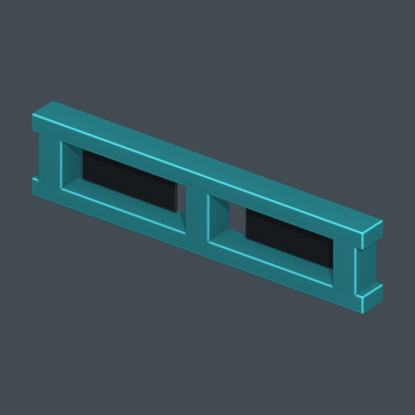</a><br><strong>Sport Front Bumper</strong><br><sub>upgrade · 7 mesh components</sub></td>
</tr>
</table>

</details>

<a id="category-08"></a>
<details>
<summary><strong>08 · Seats — 5 models</strong></summary>

<table>
<tr>
<td align="center" width="33%"><a href="assets/modular_car_kit/previews/front_seat_-1.png">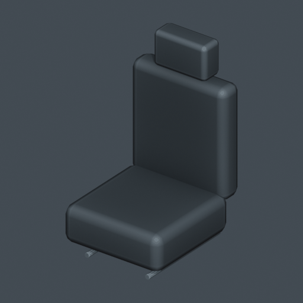</a><br><strong>Front Seat -1</strong><br><sub>stock · 5 mesh components</sub></td>
<td align="center" width="33%"><a href="assets/modular_car_kit/previews/front_seat_1.png"></a><br><strong>Front Seat 1</strong><br><sub>stock · 5 mesh components</sub></td>
<td align="center" width="33%"><a href="assets/modular_car_kit/previews/rear_bench.png">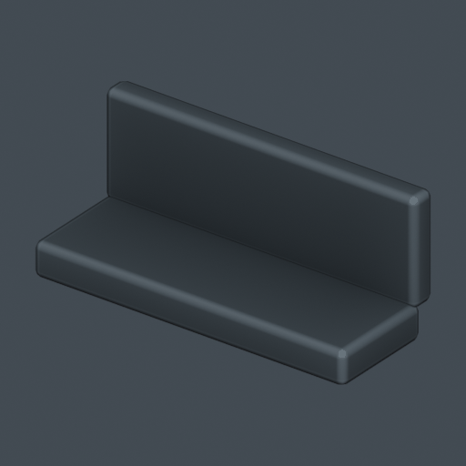</a><br><strong>Rear Bench</strong><br><sub>stock · 2 mesh components</sub></td>
</tr>
<tr>
<td align="center" width="33%"><a href="assets/modular_car_kit/previews/bucket_seat_-1.png"></a><br><strong>Bucket Seat -1</strong><br><sub>upgrade · 6 mesh components</sub></td>
<td align="center" width="33%"><a href="assets/modular_car_kit/previews/bucket_seat_1.png">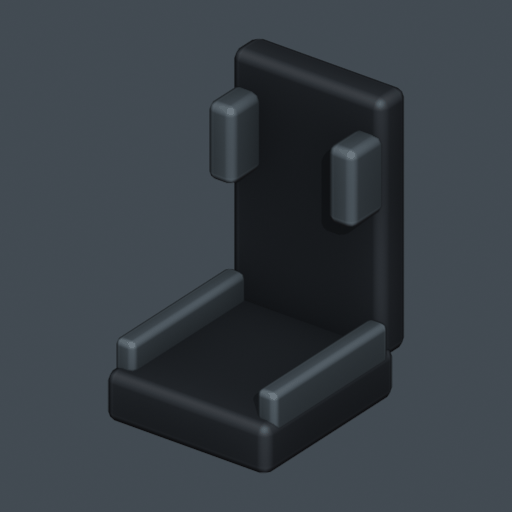</a><br><strong>Bucket Seat 1</strong><br><sub>upgrade · 6 mesh components</sub></td>
</tr>
</table>

</details>

<a id="category-09"></a>
<details>
<summary><strong>09 · Dashboard — 5 models</strong></summary>

<table>
<tr>
<td align="center" width="33%"><a href="assets/modular_car_kit/previews/dashboard.png">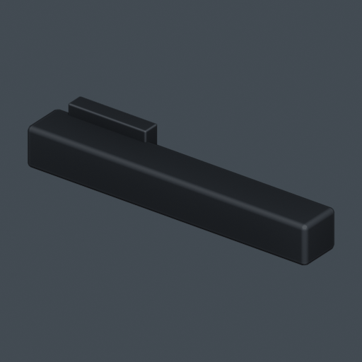</a><br><strong>Dashboard</strong><br><sub>stock · 40 mesh components</sub></td>
<td align="center" width="33%"><a href="assets/modular_car_kit/previews/instrument_cluster.png">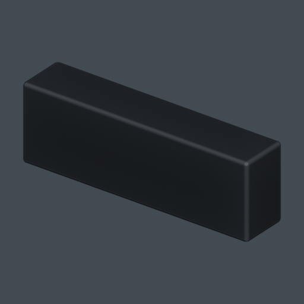</a><br><strong>Instrument Cluster</strong><br><sub>stock · 23 mesh components</sub></td>
<td align="center" width="33%"><a href="assets/modular_car_kit/previews/needle_-0.57.png"></a><br><strong>Needle -0.57</strong><br><sub>stock · 1 mesh components</sub></td>
</tr>
<tr>
<td align="center" width="33%"><a href="assets/modular_car_kit/previews/needle_-0.38.png"></a><br><strong>Needle -0.38</strong><br><sub>stock · 1 mesh components</sub></td>
<td align="center" width="33%"><a href="assets/modular_car_kit/previews/digital_cluster.png">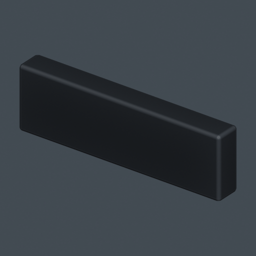</a><br><strong>Digital Cluster</strong><br><sub>upgrade · 2 mesh components</sub></td>
</tr>
</table>

</details>

<a id="category-10"></a>
<details>
<summary><strong>10 · Driver controls — 6 models</strong></summary>

<table>
<tr>
<td align="center" width="33%"><a href="assets/modular_car_kit/previews/steering_wheel.png">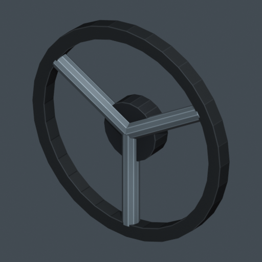</a><br><strong>Steering Wheel</strong><br><sub>stock · 5 mesh components</sub></td>
<td align="center" width="33%"><a href="assets/modular_car_kit/previews/shifter.png">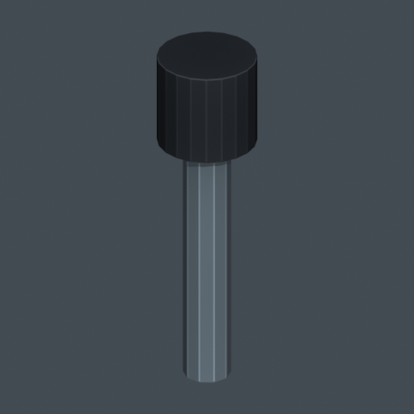</a><br><strong>Shifter</strong><br><sub>stock · 2 mesh components</sub></td>
<td align="center" width="33%"><a href="assets/modular_car_kit/previews/handbrake.png">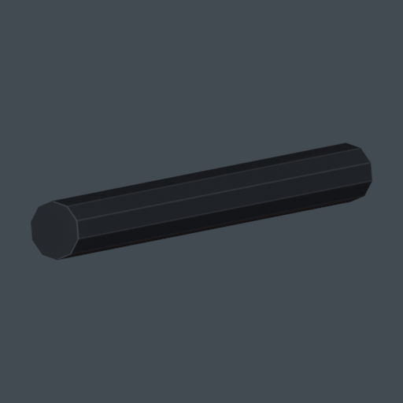</a><br><strong>Handbrake</strong><br><sub>stock · 1 mesh components</sub></td>
</tr>
<tr>
<td align="center" width="33%"><a href="assets/modular_car_kit/previews/clutch_pedal.png">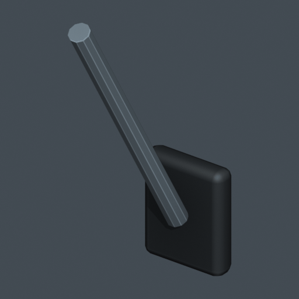</a><br><strong>Clutch Pedal</strong><br><sub>stock · 2 mesh components</sub></td>
<td align="center" width="33%"><a href="assets/modular_car_kit/previews/brake_pedal.png"></a><br><strong>Brake Pedal</strong><br><sub>stock · 2 mesh components</sub></td>
<td align="center" width="33%"><a href="assets/modular_car_kit/previews/throttle_pedal.png"></a><br><strong>Throttle Pedal</strong><br><sub>stock · 2 mesh components</sub></td>
</tr>
</table>

</details>

<a id="category-11"></a>
<details>
<summary><strong>11 · Interior trim — 7 models</strong></summary>

<table>
<tr>
<td align="center" width="33%"><a href="assets/modular_car_kit/previews/door_card_front_left.png">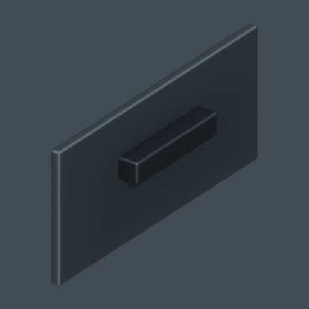</a><br><strong>Door Card Front Left</strong><br><sub>stock · 2 mesh components</sub></td>
<td align="center" width="33%"><a href="assets/modular_car_kit/previews/door_card_rear_left.png">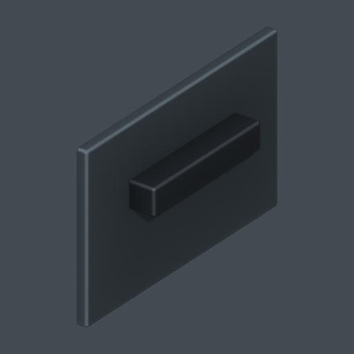</a><br><strong>Door Card Rear Left</strong><br><sub>stock · 2 mesh components</sub></td>
<td align="center" width="33%"><a href="assets/modular_car_kit/previews/door_card_front_right.png">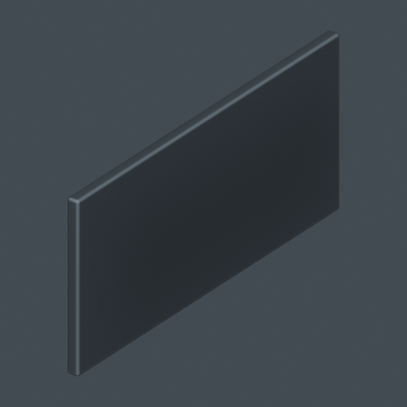</a><br><strong>Door Card Front Right</strong><br><sub>stock · 2 mesh components</sub></td>
</tr>
<tr>
<td align="center" width="33%"><a href="assets/modular_car_kit/previews/door_card_rear_right.png">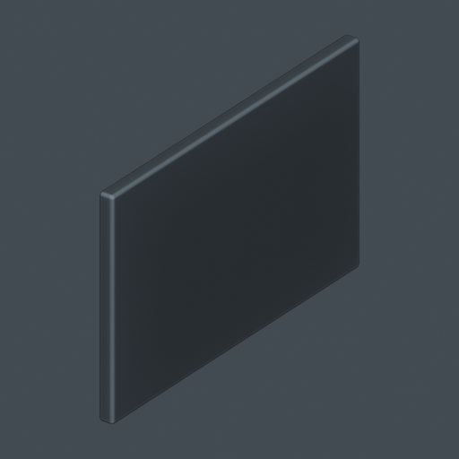</a><br><strong>Door Card Rear Right</strong><br><sub>stock · 2 mesh components</sub></td>
<td align="center" width="33%"><a href="assets/modular_car_kit/previews/console.png">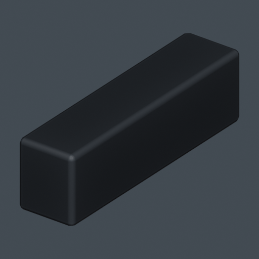</a><br><strong>Console</strong><br><sub>stock · 1 mesh components</sub></td>
<td align="center" width="33%"><a href="assets/modular_car_kit/previews/floor_mat_-1.png">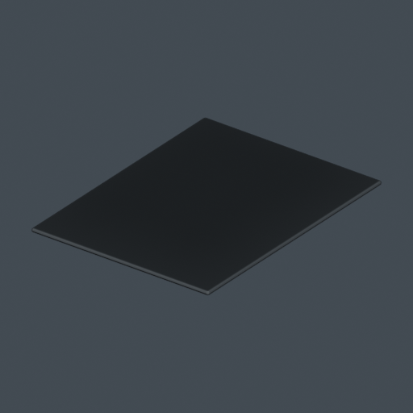</a><br><strong>Floor Mat -1</strong><br><sub>stock · 1 mesh components</sub></td>
</tr>
<tr>
<td align="center" width="33%"><a href="assets/modular_car_kit/previews/floor_mat_1.png"></a><br><strong>Floor Mat 1</strong><br><sub>stock · 1 mesh components</sub></td>
</tr>
</table>

</details>

<a id="category-12"></a>
<details>
<summary><strong>12 · Safety upgrades — 3 models</strong></summary>

<table>
<tr>
<td align="center" width="33%"><a href="assets/modular_car_kit/previews/harness_-1.png">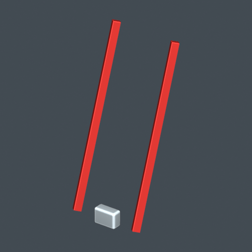</a><br><strong>Harness -1</strong><br><sub>upgrade · 3 mesh components</sub></td>
<td align="center" width="33%"><a href="assets/modular_car_kit/previews/harness_1.png">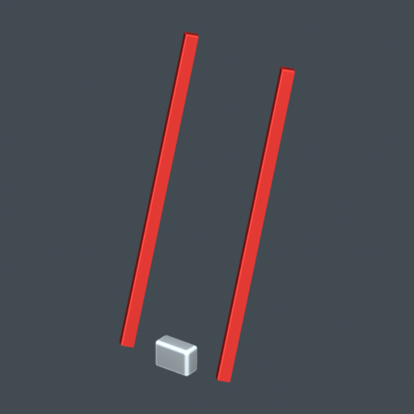</a><br><strong>Harness 1</strong><br><sub>upgrade · 3 mesh components</sub></td>
<td align="center" width="33%"><a href="assets/modular_car_kit/previews/roll_cage.png">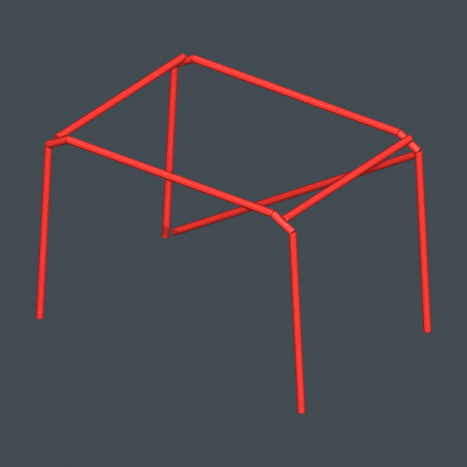</a><br><strong>Roll Cage</strong><br><sub>upgrade · 13 mesh components</sub></td>
</tr>
</table>

</details>

<a id="category-13"></a>
<details>
<summary><strong>13 · Wheels — 16 models</strong></summary>

<table>
<tr>
<td align="center" width="33%"><a href="assets/modular_car_kit/previews/tire_fl.png"></a><br><strong>Tire Fl</strong><br><sub>stock · 29 mesh components</sub></td>
<td align="center" width="33%"><a href="assets/modular_car_kit/previews/rim_fl.png"></a><br><strong>Rim Fl</strong><br><sub>stock · 8 mesh components</sub></td>
<td align="center" width="33%"><a href="assets/modular_car_kit/previews/tire_rl.png"></a><br><strong>Tire Rl</strong><br><sub>stock · 29 mesh components</sub></td>
</tr>
<tr>
<td align="center" width="33%"><a href="assets/modular_car_kit/previews/rim_rl.png">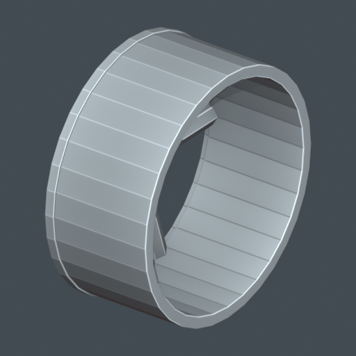</a><br><strong>Rim Rl</strong><br><sub>stock · 8 mesh components</sub></td>
<td align="center" width="33%"><a href="assets/modular_car_kit/previews/tire_fr.png">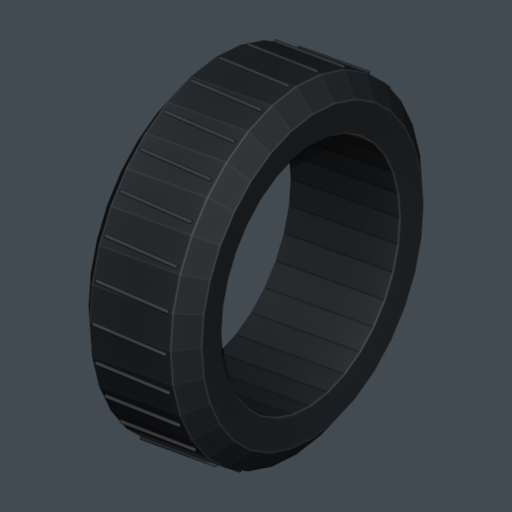</a><br><strong>Tire Fr</strong><br><sub>stock · 29 mesh components</sub></td>
<td align="center" width="33%"><a href="assets/modular_car_kit/previews/rim_fr.png"></a><br><strong>Rim Fr</strong><br><sub>stock · 8 mesh components</sub></td>
</tr>
<tr>
<td align="center" width="33%"><a href="assets/modular_car_kit/previews/tire_rr.png"></a><br><strong>Tire Rr</strong><br><sub>stock · 29 mesh components</sub></td>
<td align="center" width="33%"><a href="assets/modular_car_kit/previews/rim_rr.png">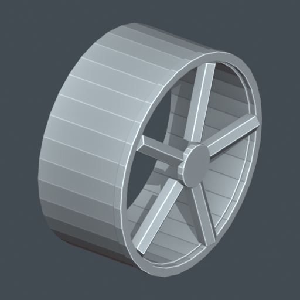</a><br><strong>Rim Rr</strong><br><sub>stock · 8 mesh components</sub></td>
<td align="center" width="33%"><a href="assets/modular_car_kit/previews/sport_rim_fl.png"></a><br><strong>Sport Rim Fl</strong><br><sub>upgrade · 12 mesh components</sub></td>
</tr>
<tr>
<td align="center" width="33%"><a href="assets/modular_car_kit/previews/slick_tire_fl.png"></a><br><strong>Slick Tire Fl</strong><br><sub>upgrade · 1 mesh components</sub></td>
<td align="center" width="33%"><a href="assets/modular_car_kit/previews/sport_rim_rl.png">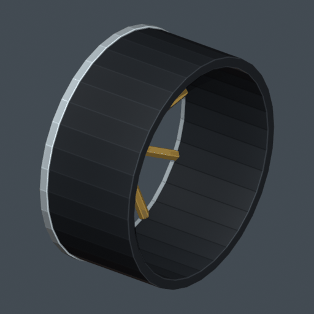</a><br><strong>Sport Rim Rl</strong><br><sub>upgrade · 12 mesh components</sub></td>
<td align="center" width="33%"><a href="assets/modular_car_kit/previews/slick_tire_rl.png">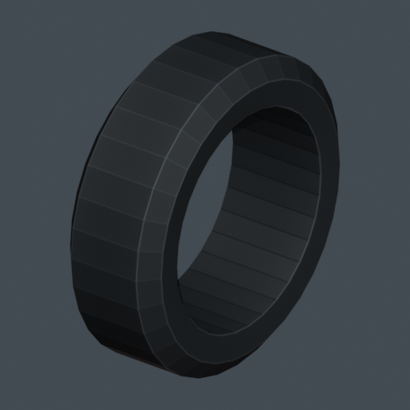</a><br><strong>Slick Tire Rl</strong><br><sub>upgrade · 1 mesh components</sub></td>
</tr>
<tr>
<td align="center" width="33%"><a href="assets/modular_car_kit/previews/sport_rim_fr.png"></a><br><strong>Sport Rim Fr</strong><br><sub>upgrade · 12 mesh components</sub></td>
<td align="center" width="33%"><a href="assets/modular_car_kit/previews/slick_tire_fr.png"></a><br><strong>Slick Tire Fr</strong><br><sub>upgrade · 1 mesh components</sub></td>
<td align="center" width="33%"><a href="assets/modular_car_kit/previews/sport_rim_rr.png">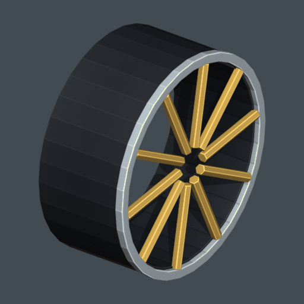</a><br><strong>Sport Rim Rr</strong><br><sub>upgrade · 12 mesh components</sub></td>
</tr>
<tr>
<td align="center" width="33%"><a href="assets/modular_car_kit/previews/slick_tire_rr.png"></a><br><strong>Slick Tire Rr</strong><br><sub>upgrade · 1 mesh components</sub></td>
</tr>
</table>

</details>

<a id="category-14"></a>
<details>
<summary><strong>14 · Wheel mounting — 8 models</strong></summary>

<table>
<tr>
<td align="center" width="33%"><a href="assets/modular_car_kit/previews/hub_fl.png">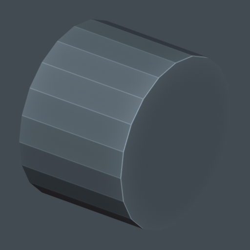</a><br><strong>Hub Fl</strong><br><sub>stock · 1 mesh components</sub></td>
<td align="center" width="33%"><a href="assets/modular_car_kit/previews/knuckle_fl.png"></a><br><strong>Knuckle Fl</strong><br><sub>stock · 1 mesh components</sub></td>
<td align="center" width="33%"><a href="assets/modular_car_kit/previews/hub_rl.png"></a><br><strong>Hub Rl</strong><br><sub>stock · 1 mesh components</sub></td>
</tr>
<tr>
<td align="center" width="33%"><a href="assets/modular_car_kit/previews/knuckle_rl.png">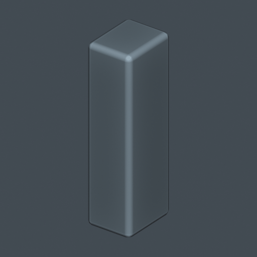</a><br><strong>Knuckle Rl</strong><br><sub>stock · 1 mesh components</sub></td>
<td align="center" width="33%"><a href="assets/modular_car_kit/previews/hub_fr.png"></a><br><strong>Hub Fr</strong><br><sub>stock · 1 mesh components</sub></td>
<td align="center" width="33%"><a href="assets/modular_car_kit/previews/knuckle_fr.png"></a><br><strong>Knuckle Fr</strong><br><sub>stock · 1 mesh components</sub></td>
</tr>
<tr>
<td align="center" width="33%"><a href="assets/modular_car_kit/previews/hub_rr.png"></a><br><strong>Hub Rr</strong><br><sub>stock · 1 mesh components</sub></td>
<td align="center" width="33%"><a href="assets/modular_car_kit/previews/knuckle_rr.png"></a><br><strong>Knuckle Rr</strong><br><sub>stock · 1 mesh components</sub></td>
</tr>
</table>

</details>

<a id="category-15"></a>
<details>
<summary><strong>15 · Brakes — 17 models</strong></summary>

<table>
<tr>
<td align="center" width="33%"><a href="assets/modular_car_kit/previews/brake_disc_fl.png"></a><br><strong>Brake Disc Fl</strong><br><sub>stock · 1 mesh components</sub></td>
<td align="center" width="33%"><a href="assets/modular_car_kit/previews/brake_caliper_fl.png"></a><br><strong>Brake Caliper Fl</strong><br><sub>stock · 3 mesh components</sub></td>
<td align="center" width="33%"><a href="assets/modular_car_kit/previews/brake_pad_fl_-1.png"></a><br><strong>Brake Pad Fl -1</strong><br><sub>stock · 1 mesh components</sub></td>
</tr>
<tr>
<td align="center" width="33%"><a href="assets/modular_car_kit/previews/brake_pad_fl_1.png"></a><br><strong>Brake Pad Fl 1</strong><br><sub>stock · 1 mesh components</sub></td>
<td align="center" width="33%"><a href="assets/modular_car_kit/previews/brake_disc_rl.png">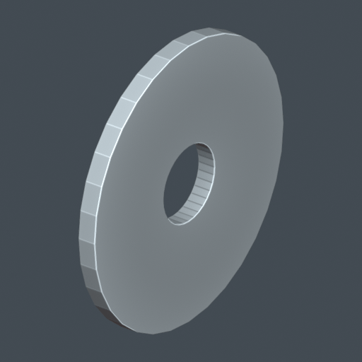</a><br><strong>Brake Disc Rl</strong><br><sub>stock · 1 mesh components</sub></td>
<td align="center" width="33%"><a href="assets/modular_car_kit/previews/brake_caliper_rl.png"></a><br><strong>Brake Caliper Rl</strong><br><sub>stock · 3 mesh components</sub></td>
</tr>
<tr>
<td align="center" width="33%"><a href="assets/modular_car_kit/previews/brake_pad_rl_-1.png"></a><br><strong>Brake Pad Rl -1</strong><br><sub>stock · 1 mesh components</sub></td>
<td align="center" width="33%"><a href="assets/modular_car_kit/previews/brake_pad_rl_1.png"></a><br><strong>Brake Pad Rl 1</strong><br><sub>stock · 1 mesh components</sub></td>
<td align="center" width="33%"><a href="assets/modular_car_kit/previews/brake_disc_fr.png"></a><br><strong>Brake Disc Fr</strong><br><sub>stock · 1 mesh components</sub></td>
</tr>
<tr>
<td align="center" width="33%"><a href="assets/modular_car_kit/previews/brake_caliper_fr.png"></a><br><strong>Brake Caliper Fr</strong><br><sub>stock · 3 mesh components</sub></td>
<td align="center" width="33%"><a href="assets/modular_car_kit/previews/brake_pad_fr_-1.png"></a><br><strong>Brake Pad Fr -1</strong><br><sub>stock · 1 mesh components</sub></td>
<td align="center" width="33%"><a href="assets/modular_car_kit/previews/brake_pad_fr_1.png"></a><br><strong>Brake Pad Fr 1</strong><br><sub>stock · 1 mesh components</sub></td>
</tr>
<tr>
<td align="center" width="33%"><a href="assets/modular_car_kit/previews/brake_disc_rr.png"></a><br><strong>Brake Disc Rr</strong><br><sub>stock · 1 mesh components</sub></td>
<td align="center" width="33%"><a href="assets/modular_car_kit/previews/brake_caliper_rr.png">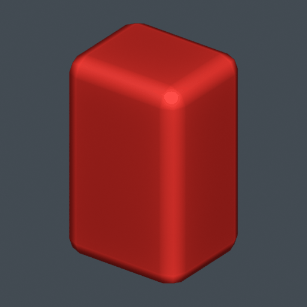</a><br><strong>Brake Caliper Rr</strong><br><sub>stock · 3 mesh components</sub></td>
<td align="center" width="33%"><a href="assets/modular_car_kit/previews/brake_pad_rr_-1.png">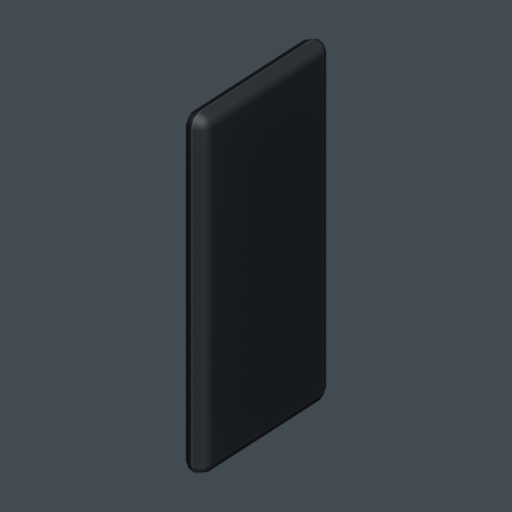</a><br><strong>Brake Pad Rr -1</strong><br><sub>stock · 1 mesh components</sub></td>
</tr>
<tr>
<td align="center" width="33%"><a href="assets/modular_car_kit/previews/brake_pad_rr_1.png"></a><br><strong>Brake Pad Rr 1</strong><br><sub>stock · 1 mesh components</sub></td>
<td align="center" width="33%"><a href="assets/modular_car_kit/previews/abs_module.png">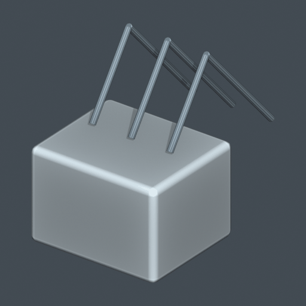</a><br><strong>Abs Module</strong><br><sub>upgrade · 7 mesh components</sub></td>
</tr>
</table>

</details>

<a id="category-16"></a>
<details>
<summary><strong>16 · Suspension — 14 models</strong></summary>

<table>
<tr>
<td align="center" width="33%"><a href="assets/modular_car_kit/previews/coilover_fl.png">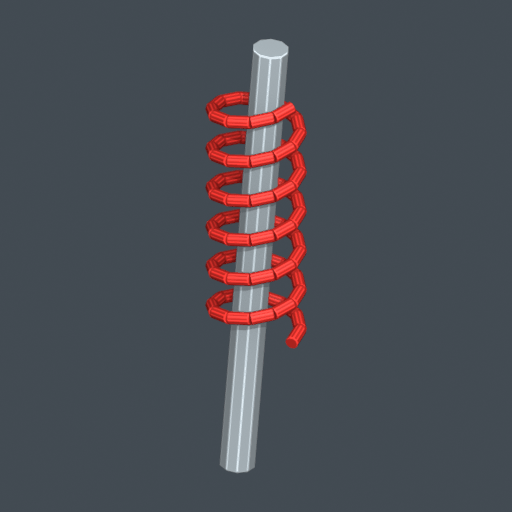</a><br><strong>Coilover Fl</strong><br><sub>stock · 73 mesh components</sub></td>
<td align="center" width="33%"><a href="assets/modular_car_kit/previews/control_arm_fl.png">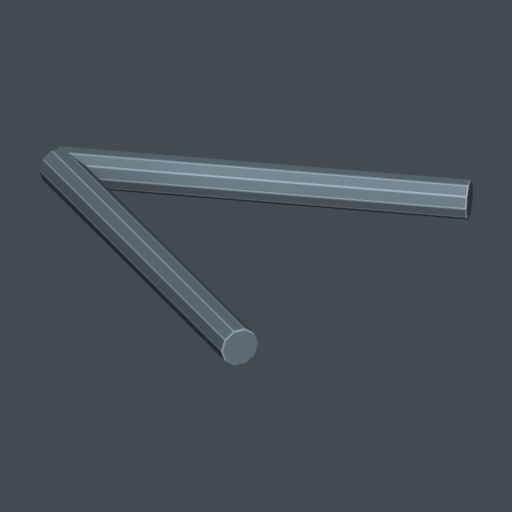</a><br><strong>Control Arm Fl</strong><br><sub>stock · 2 mesh components</sub></td>
<td align="center" width="33%"><a href="assets/modular_car_kit/previews/coilover_rl.png"></a><br><strong>Coilover Rl</strong><br><sub>stock · 73 mesh components</sub></td>
</tr>
<tr>
<td align="center" width="33%"><a href="assets/modular_car_kit/previews/control_arm_rl.png">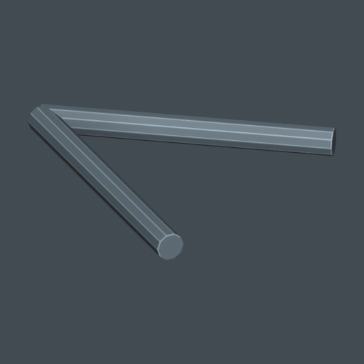</a><br><strong>Control Arm Rl</strong><br><sub>stock · 2 mesh components</sub></td>
<td align="center" width="33%"><a href="assets/modular_car_kit/previews/coilover_fr.png">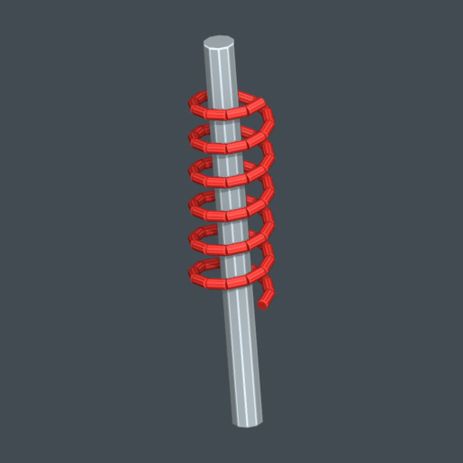</a><br><strong>Coilover Fr</strong><br><sub>stock · 73 mesh components</sub></td>
<td align="center" width="33%"><a href="assets/modular_car_kit/previews/control_arm_fr.png"></a><br><strong>Control Arm Fr</strong><br><sub>stock · 2 mesh components</sub></td>
</tr>
<tr>
<td align="center" width="33%"><a href="assets/modular_car_kit/previews/coilover_rr.png"></a><br><strong>Coilover Rr</strong><br><sub>stock · 73 mesh components</sub></td>
<td align="center" width="33%"><a href="assets/modular_car_kit/previews/control_arm_rr.png">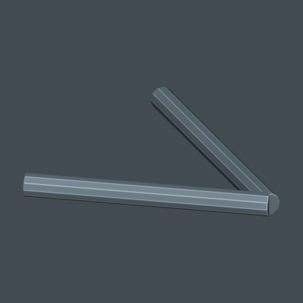</a><br><strong>Control Arm Rr</strong><br><sub>stock · 2 mesh components</sub></td>
<td align="center" width="33%"><a href="assets/modular_car_kit/previews/antiroll_-1.35.png">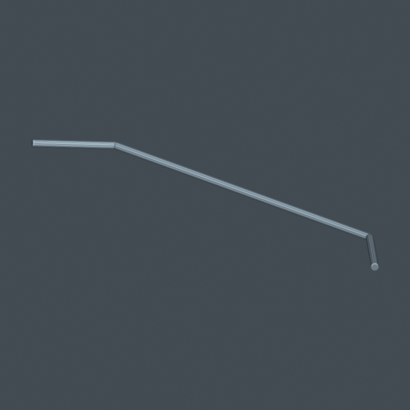</a><br><strong>Antiroll -1.35</strong><br><sub>stock · 3 mesh components</sub></td>
</tr>
<tr>
<td align="center" width="33%"><a href="assets/modular_car_kit/previews/antiroll_1.3.png"></a><br><strong>Antiroll 1.3</strong><br><sub>stock · 3 mesh components</sub></td>
<td align="center" width="33%"><a href="assets/modular_car_kit/previews/sport_coilover_fl.png">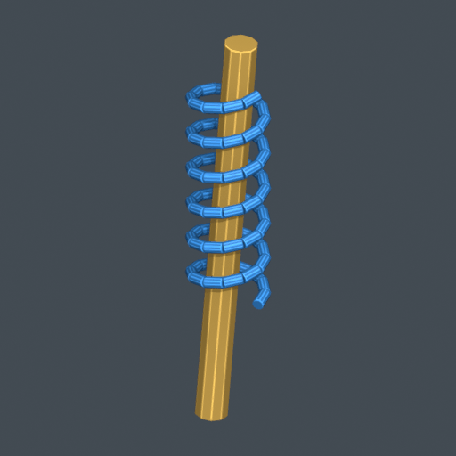</a><br><strong>Sport Coilover Fl</strong><br><sub>upgrade · 73 mesh components</sub></td>
<td align="center" width="33%"><a href="assets/modular_car_kit/previews/sport_coilover_rl.png"></a><br><strong>Sport Coilover Rl</strong><br><sub>upgrade · 73 mesh components</sub></td>
</tr>
<tr>
<td align="center" width="33%"><a href="assets/modular_car_kit/previews/sport_coilover_fr.png">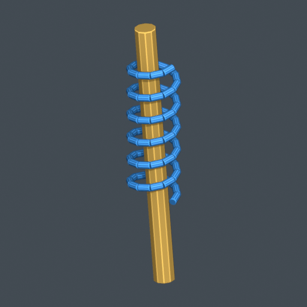</a><br><strong>Sport Coilover Fr</strong><br><sub>upgrade · 73 mesh components</sub></td>
<td align="center" width="33%"><a href="assets/modular_car_kit/previews/sport_coilover_rr.png"></a><br><strong>Sport Coilover Rr</strong><br><sub>upgrade · 73 mesh components</sub></td>
</tr>
</table>

</details>

<a id="category-17"></a>
<details>
<summary><strong>17 · Steering mechanism — 1 models</strong></summary>

<table>
<tr>
<td align="center" width="33%"><a href="assets/modular_car_kit/previews/steering_rack.png">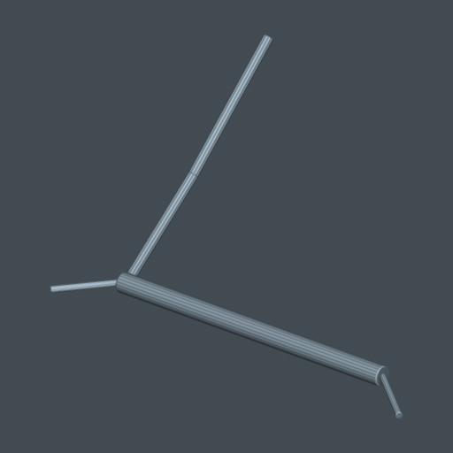</a><br><strong>Steering Rack</strong><br><sub>stock · 5 mesh components</sub></td>
</tr>
</table>

</details>

<a id="category-18"></a>
<details>
<summary><strong>18 · Engine blocks — 10 models</strong></summary>

<table>
<tr>
<td align="center" width="33%"><a href="assets/modular_car_kit/previews/i4_engine.png">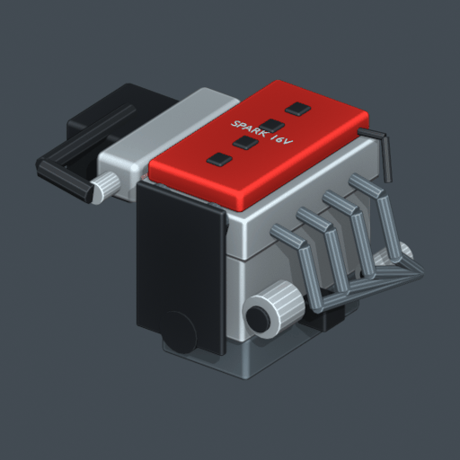</a><br><strong>I4 Engine</strong><br><sub>stock · 252 mesh components</sub></td>
<td align="center" width="33%"><a href="assets/modular_car_kit/previews/i4_block.png">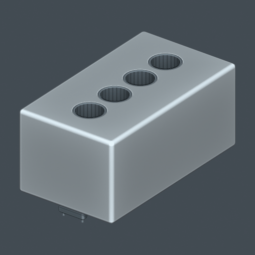</a><br><strong>I4 Block</strong><br><sub>stock · 20 mesh components</sub></td>
<td align="center" width="33%"><a href="assets/modular_car_kit/previews/engine_mount_-1.png">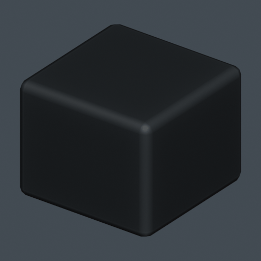</a><br><strong>Engine Mount -1</strong><br><sub>stock · 1 mesh components</sub></td>
</tr>
<tr>
<td align="center" width="33%"><a href="assets/modular_car_kit/previews/engine_mount_1.png"></a><br><strong>Engine Mount 1</strong><br><sub>stock · 1 mesh components</sub></td>
<td align="center" width="33%"><a href="assets/modular_car_kit/previews/v6_engine.png">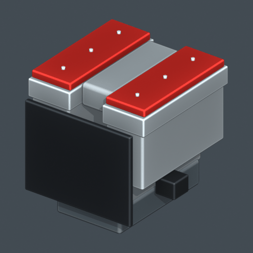</a><br><strong>V6 Engine</strong><br><sub>upgrade · 34 mesh components</sub></td>
<td align="center" width="33%"><a href="assets/modular_car_kit/previews/v6_bank_-1.png">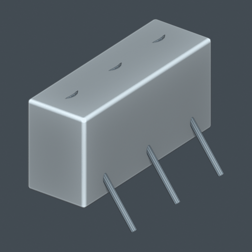</a><br><strong>V6 Bank -1</strong><br><sub>upgrade · 7 mesh components</sub></td>
</tr>
<tr>
<td align="center" width="33%"><a href="assets/modular_car_kit/previews/v6_bank_1.png">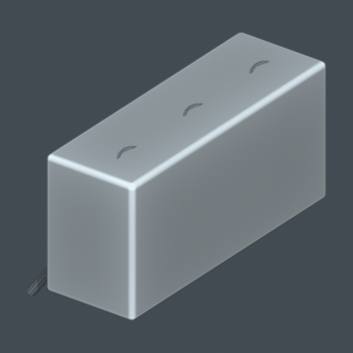</a><br><strong>V6 Bank 1</strong><br><sub>upgrade · 7 mesh components</sub></td>
<td align="center" width="33%"><a href="assets/modular_car_kit/previews/flat4_engine.png">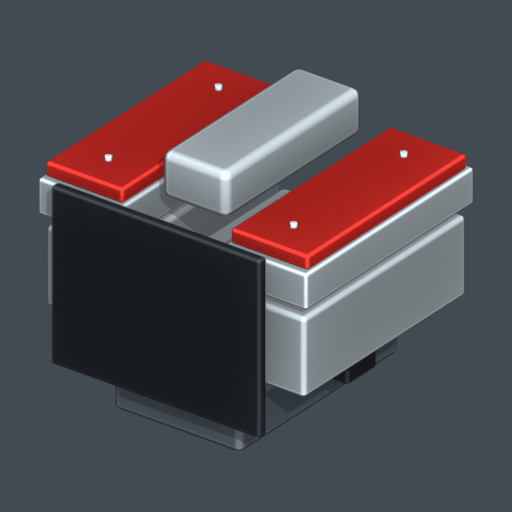</a><br><strong>Flat4 Engine</strong><br><sub>upgrade · 32 mesh components</sub></td>
<td align="center" width="33%"><a href="assets/modular_car_kit/previews/flat4_bank_-1.png">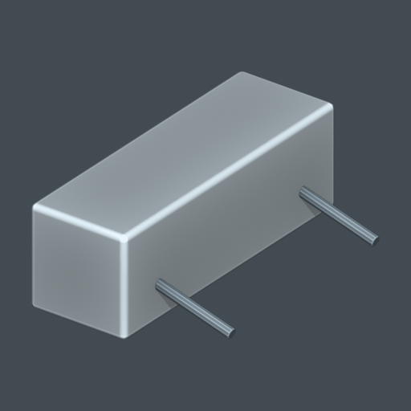</a><br><strong>Flat4 Bank -1</strong><br><sub>upgrade · 7 mesh components</sub></td>
</tr>
<tr>
<td align="center" width="33%"><a href="assets/modular_car_kit/previews/flat4_bank_1.png">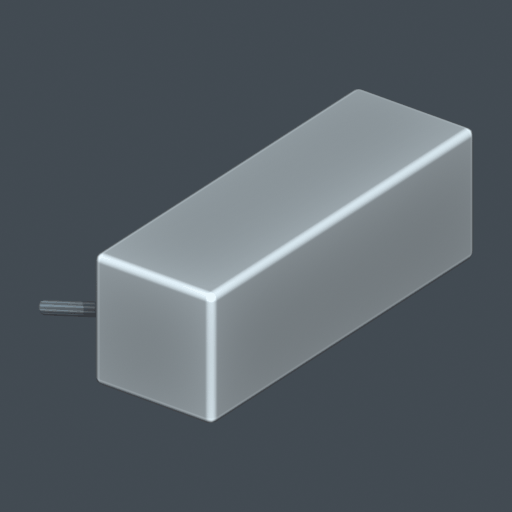</a><br><strong>Flat4 Bank 1</strong><br><sub>upgrade · 7 mesh components</sub></td>
</tr>
</table>

</details>

<a id="category-19"></a>
<details>
<summary><strong>19 · Engine top — 10 models</strong></summary>

<table>
<tr>
<td align="center" width="33%"><a href="assets/modular_car_kit/previews/cylinder_head_i4.png">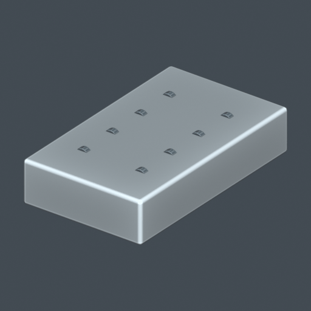</a><br><strong>Cylinder Head I4</strong><br><sub>stock · 111 mesh components</sub></td>
<td align="center" width="33%"><a href="assets/modular_car_kit/previews/valve_cover.png">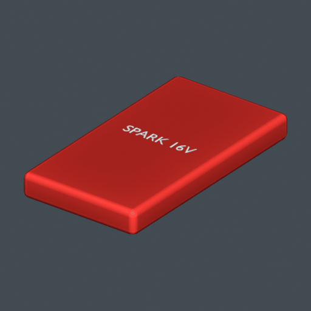</a><br><strong>Valve Cover</strong><br><sub>stock · 2 mesh components</sub></td>
<td align="center" width="33%"><a href="assets/modular_car_kit/previews/v6_head_-1.png">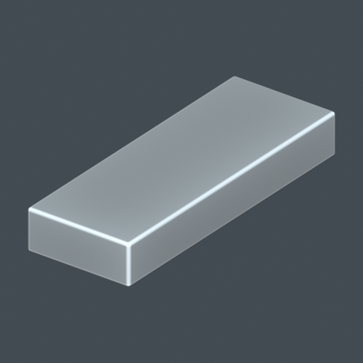</a><br><strong>V6 Head -1</strong><br><sub>upgrade · 2 mesh components</sub></td>
</tr>
<tr>
<td align="center" width="33%"><a href="assets/modular_car_kit/previews/v6_cover_-1.png"></a><br><strong>V6 Cover -1</strong><br><sub>upgrade · 4 mesh components</sub></td>
<td align="center" width="33%"><a href="assets/modular_car_kit/previews/v6_head_1.png"></a><br><strong>V6 Head 1</strong><br><sub>upgrade · 2 mesh components</sub></td>
<td align="center" width="33%"><a href="assets/modular_car_kit/previews/v6_cover_1.png">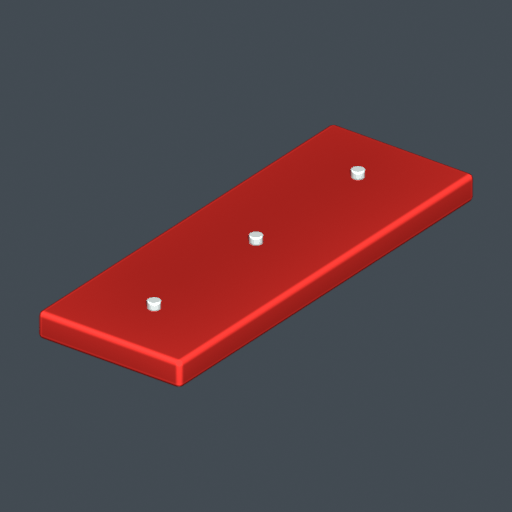</a><br><strong>V6 Cover 1</strong><br><sub>upgrade · 4 mesh components</sub></td>
</tr>
<tr>
<td align="center" width="33%"><a href="assets/modular_car_kit/previews/flat4_head_-1.png"></a><br><strong>Flat4 Head -1</strong><br><sub>upgrade · 2 mesh components</sub></td>
<td align="center" width="33%"><a href="assets/modular_car_kit/previews/flat4_cover_-1.png"></a><br><strong>Flat4 Cover -1</strong><br><sub>upgrade · 3 mesh components</sub></td>
<td align="center" width="33%"><a href="assets/modular_car_kit/previews/flat4_head_1.png"></a><br><strong>Flat4 Head 1</strong><br><sub>upgrade · 2 mesh components</sub></td>
</tr>
<tr>
<td align="center" width="33%"><a href="assets/modular_car_kit/previews/flat4_cover_1.png">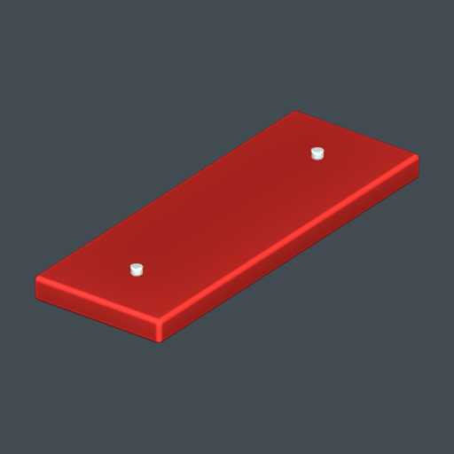</a><br><strong>Flat4 Cover 1</strong><br><sub>upgrade · 3 mesh components</sub></td>
</tr>
</table>

</details>

<a id="category-20"></a>
<details>
<summary><strong>20 · Rotating internals — 27 models</strong></summary>

<table>
<tr>
<td align="center" width="33%"><a href="assets/modular_car_kit/previews/crankshaft_i4.png">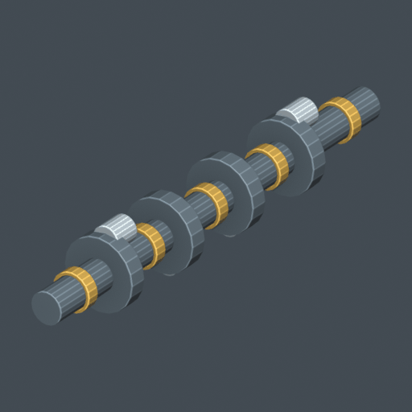</a><br><strong>Crankshaft I4</strong><br><sub>stock · 14 mesh components</sub></td>
<td align="center" width="33%"><a href="assets/modular_car_kit/previews/liner_0.png"></a><br><strong>Liner 0</strong><br><sub>stock · 1 mesh components</sub></td>
<td align="center" width="33%"><a href="assets/modular_car_kit/previews/piston_0.png"></a><br><strong>Piston 0</strong><br><sub>stock · 5 mesh components</sub></td>
</tr>
<tr>
<td align="center" width="33%"><a href="assets/modular_car_kit/previews/wrist_pin_0.png"></a><br><strong>Wrist Pin 0</strong><br><sub>stock · 1 mesh components</sub></td>
<td align="center" width="33%"><a href="assets/modular_car_kit/previews/connecting_rod_0.png"></a><br><strong>Connecting Rod 0</strong><br><sub>stock · 4 mesh components</sub></td>
<td align="center" width="33%"><a href="assets/modular_car_kit/previews/liner_1.png">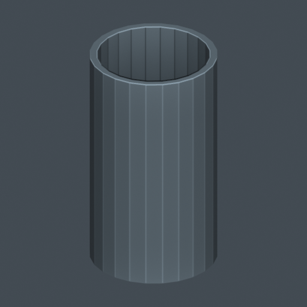</a><br><strong>Liner 1</strong><br><sub>stock · 1 mesh components</sub></td>
</tr>
<tr>
<td align="center" width="33%"><a href="assets/modular_car_kit/previews/piston_1.png"></a><br><strong>Piston 1</strong><br><sub>stock · 5 mesh components</sub></td>
<td align="center" width="33%"><a href="assets/modular_car_kit/previews/wrist_pin_1.png">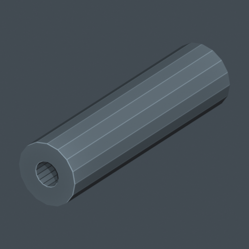</a><br><strong>Wrist Pin 1</strong><br><sub>stock · 1 mesh components</sub></td>
<td align="center" width="33%"><a href="assets/modular_car_kit/previews/connecting_rod_1.png">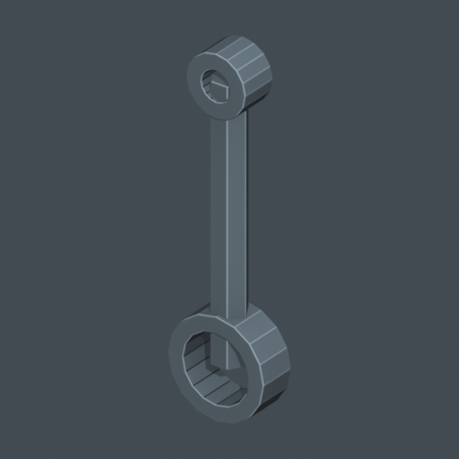</a><br><strong>Connecting Rod 1</strong><br><sub>stock · 4 mesh components</sub></td>
</tr>
<tr>
<td align="center" width="33%"><a href="assets/modular_car_kit/previews/liner_2.png"></a><br><strong>Liner 2</strong><br><sub>stock · 1 mesh components</sub></td>
<td align="center" width="33%"><a href="assets/modular_car_kit/previews/piston_2.png">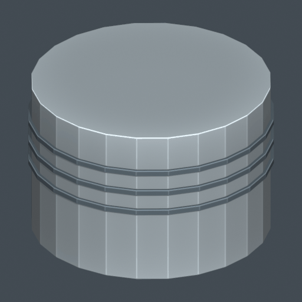</a><br><strong>Piston 2</strong><br><sub>stock · 5 mesh components</sub></td>
<td align="center" width="33%"><a href="assets/modular_car_kit/previews/wrist_pin_2.png"></a><br><strong>Wrist Pin 2</strong><br><sub>stock · 1 mesh components</sub></td>
</tr>
<tr>
<td align="center" width="33%"><a href="assets/modular_car_kit/previews/connecting_rod_2.png"></a><br><strong>Connecting Rod 2</strong><br><sub>stock · 4 mesh components</sub></td>
<td align="center" width="33%"><a href="assets/modular_car_kit/previews/liner_3.png"></a><br><strong>Liner 3</strong><br><sub>stock · 1 mesh components</sub></td>
<td align="center" width="33%"><a href="assets/modular_car_kit/previews/piston_3.png"></a><br><strong>Piston 3</strong><br><sub>stock · 5 mesh components</sub></td>
</tr>
<tr>
<td align="center" width="33%"><a href="assets/modular_car_kit/previews/wrist_pin_3.png"></a><br><strong>Wrist Pin 3</strong><br><sub>stock · 1 mesh components</sub></td>
<td align="center" width="33%"><a href="assets/modular_car_kit/previews/connecting_rod_3.png"></a><br><strong>Connecting Rod 3</strong><br><sub>stock · 4 mesh components</sub></td>
<td align="center" width="33%"><a href="assets/modular_car_kit/previews/v6_cylinder_-1_0.png">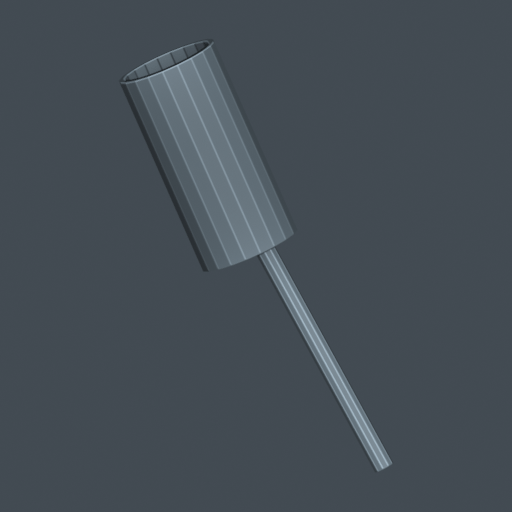</a><br><strong>V6 Cylinder -1 0</strong><br><sub>upgrade · 2 mesh components</sub></td>
</tr>
<tr>
<td align="center" width="33%"><a href="assets/modular_car_kit/previews/v6_cylinder_-1_1.png"></a><br><strong>V6 Cylinder -1 1</strong><br><sub>upgrade · 2 mesh components</sub></td>
<td align="center" width="33%"><a href="assets/modular_car_kit/previews/v6_cylinder_-1_2.png"></a><br><strong>V6 Cylinder -1 2</strong><br><sub>upgrade · 2 mesh components</sub></td>
<td align="center" width="33%"><a href="assets/modular_car_kit/previews/v6_cylinder_1_0.png"></a><br><strong>V6 Cylinder 1 0</strong><br><sub>upgrade · 2 mesh components</sub></td>
</tr>
<tr>
<td align="center" width="33%"><a href="assets/modular_car_kit/previews/v6_cylinder_1_1.png"></a><br><strong>V6 Cylinder 1 1</strong><br><sub>upgrade · 2 mesh components</sub></td>
<td align="center" width="33%"><a href="assets/modular_car_kit/previews/v6_cylinder_1_2.png">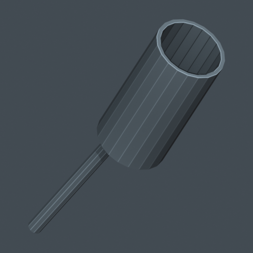</a><br><strong>V6 Cylinder 1 2</strong><br><sub>upgrade · 2 mesh components</sub></td>
<td align="center" width="33%"><a href="assets/modular_car_kit/previews/flat4_cylinder_-1_0.png">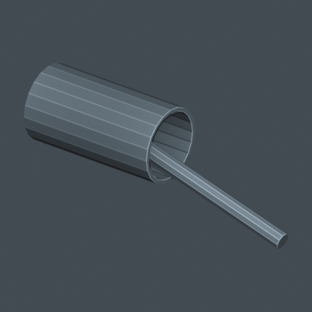</a><br><strong>Flat4 Cylinder -1 0</strong><br><sub>upgrade · 3 mesh components</sub></td>
</tr>
<tr>
<td align="center" width="33%"><a href="assets/modular_car_kit/previews/flat4_cylinder_-1_1.png"></a><br><strong>Flat4 Cylinder -1 1</strong><br><sub>upgrade · 3 mesh components</sub></td>
<td align="center" width="33%"><a href="assets/modular_car_kit/previews/flat4_cylinder_1_0.png">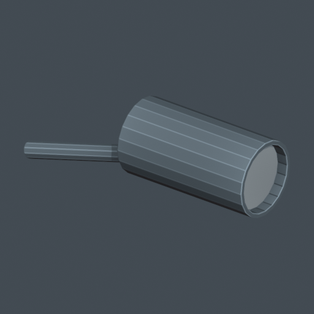</a><br><strong>Flat4 Cylinder 1 0</strong><br><sub>upgrade · 3 mesh components</sub></td>
<td align="center" width="33%"><a href="assets/modular_car_kit/previews/flat4_cylinder_1_1.png"></a><br><strong>Flat4 Cylinder 1 1</strong><br><sub>upgrade · 3 mesh components</sub></td>
</tr>
</table>

</details>

<a id="category-21"></a>
<details>
<summary><strong>21 · Bearings and small internals — 40 models</strong></summary>

<table>
<tr>
<td align="center" width="33%"><a href="assets/modular_car_kit/previews/piston_ring_0_0.png"></a><br><strong>Piston Ring 0 0</strong><br><sub>stock · 1 mesh components</sub></td>
<td align="center" width="33%"><a href="assets/modular_car_kit/previews/piston_ring_0_1.png"></a><br><strong>Piston Ring 0 1</strong><br><sub>stock · 1 mesh components</sub></td>
<td align="center" width="33%"><a href="assets/modular_car_kit/previews/piston_ring_0_2.png"></a><br><strong>Piston Ring 0 2</strong><br><sub>stock · 1 mesh components</sub></td>
</tr>
<tr>
<td align="center" width="33%"><a href="assets/modular_car_kit/previews/rod_bearing_0.png">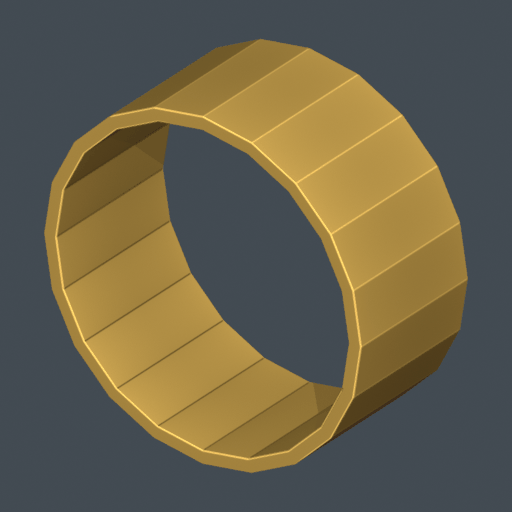</a><br><strong>Rod Bearing 0</strong><br><sub>stock · 1 mesh components</sub></td>
<td align="center" width="33%"><a href="assets/modular_car_kit/previews/oil_nozzle_0.png"></a><br><strong>Oil Nozzle 0</strong><br><sub>stock · 2 mesh components</sub></td>
<td align="center" width="33%"><a href="assets/modular_car_kit/previews/piston_ring_1_0.png"></a><br><strong>Piston Ring 1 0</strong><br><sub>stock · 1 mesh components</sub></td>
</tr>
<tr>
<td align="center" width="33%"><a href="assets/modular_car_kit/previews/piston_ring_1_1.png"></a><br><strong>Piston Ring 1 1</strong><br><sub>stock · 1 mesh components</sub></td>
<td align="center" width="33%"><a href="assets/modular_car_kit/previews/piston_ring_1_2.png">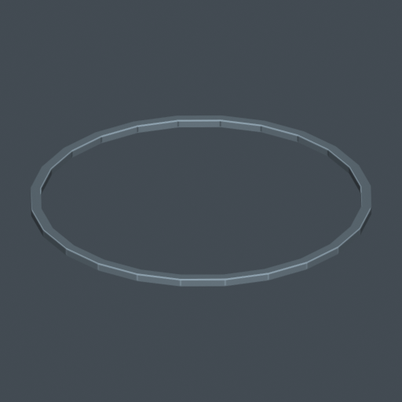</a><br><strong>Piston Ring 1 2</strong><br><sub>stock · 1 mesh components</sub></td>
<td align="center" width="33%"><a href="assets/modular_car_kit/previews/rod_bearing_1.png"></a><br><strong>Rod Bearing 1</strong><br><sub>stock · 1 mesh components</sub></td>
</tr>
<tr>
<td align="center" width="33%"><a href="assets/modular_car_kit/previews/oil_nozzle_1.png"></a><br><strong>Oil Nozzle 1</strong><br><sub>stock · 2 mesh components</sub></td>
<td align="center" width="33%"><a href="assets/modular_car_kit/previews/piston_ring_2_0.png">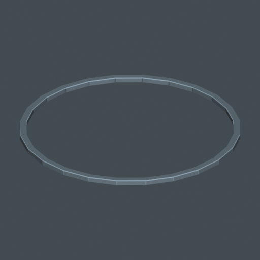</a><br><strong>Piston Ring 2 0</strong><br><sub>stock · 1 mesh components</sub></td>
<td align="center" width="33%"><a href="assets/modular_car_kit/previews/piston_ring_2_1.png">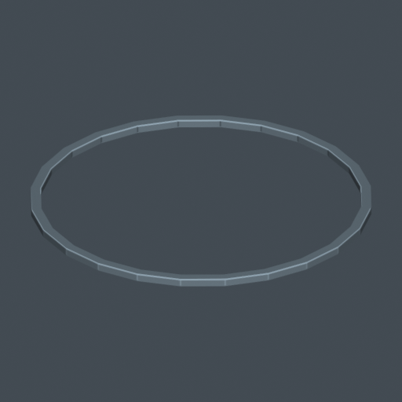</a><br><strong>Piston Ring 2 1</strong><br><sub>stock · 1 mesh components</sub></td>
</tr>
<tr>
<td align="center" width="33%"><a href="assets/modular_car_kit/previews/piston_ring_2_2.png"></a><br><strong>Piston Ring 2 2</strong><br><sub>stock · 1 mesh components</sub></td>
<td align="center" width="33%"><a href="assets/modular_car_kit/previews/rod_bearing_2.png"></a><br><strong>Rod Bearing 2</strong><br><sub>stock · 1 mesh components</sub></td>
<td align="center" width="33%"><a href="assets/modular_car_kit/previews/oil_nozzle_2.png">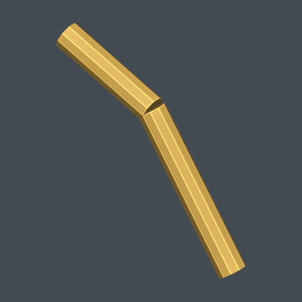</a><br><strong>Oil Nozzle 2</strong><br><sub>stock · 2 mesh components</sub></td>
</tr>
<tr>
<td align="center" width="33%"><a href="assets/modular_car_kit/previews/piston_ring_3_0.png"></a><br><strong>Piston Ring 3 0</strong><br><sub>stock · 1 mesh components</sub></td>
<td align="center" width="33%"><a href="assets/modular_car_kit/previews/piston_ring_3_1.png"></a><br><strong>Piston Ring 3 1</strong><br><sub>stock · 1 mesh components</sub></td>
<td align="center" width="33%"><a href="assets/modular_car_kit/previews/piston_ring_3_2.png"></a><br><strong>Piston Ring 3 2</strong><br><sub>stock · 1 mesh components</sub></td>
</tr>
<tr>
<td align="center" width="33%"><a href="assets/modular_car_kit/previews/rod_bearing_3.png"></a><br><strong>Rod Bearing 3</strong><br><sub>stock · 1 mesh components</sub></td>
<td align="center" width="33%"><a href="assets/modular_car_kit/previews/oil_nozzle_3.png"></a><br><strong>Oil Nozzle 3</strong><br><sub>stock · 2 mesh components</sub></td>
<td align="center" width="33%"><a href="assets/modular_car_kit/previews/main_bearing_0.png"></a><br><strong>Main Bearing 0</strong><br><sub>stock · 1 mesh components</sub></td>
</tr>
<tr>
<td align="center" width="33%"><a href="assets/modular_car_kit/previews/bearing_cap_0.png"></a><br><strong>Bearing Cap 0</strong><br><sub>stock · 3 mesh components</sub></td>
<td align="center" width="33%"><a href="assets/modular_car_kit/previews/main_bearing_1.png"></a><br><strong>Main Bearing 1</strong><br><sub>stock · 1 mesh components</sub></td>
<td align="center" width="33%"><a href="assets/modular_car_kit/previews/bearing_cap_1.png"></a><br><strong>Bearing Cap 1</strong><br><sub>stock · 3 mesh components</sub></td>
</tr>
<tr>
<td align="center" width="33%"><a href="assets/modular_car_kit/previews/main_bearing_2.png">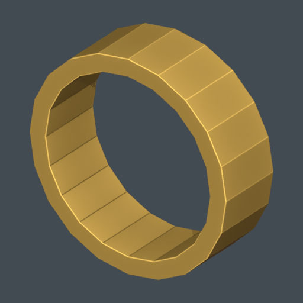</a><br><strong>Main Bearing 2</strong><br><sub>stock · 1 mesh components</sub></td>
<td align="center" width="33%"><a href="assets/modular_car_kit/previews/bearing_cap_2.png">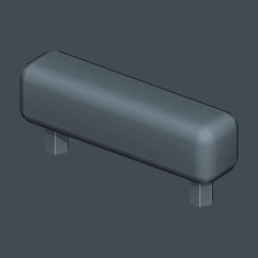</a><br><strong>Bearing Cap 2</strong><br><sub>stock · 3 mesh components</sub></td>
<td align="center" width="33%"><a href="assets/modular_car_kit/previews/main_bearing_3.png"></a><br><strong>Main Bearing 3</strong><br><sub>stock · 1 mesh components</sub></td>
</tr>
<tr>
<td align="center" width="33%"><a href="assets/modular_car_kit/previews/bearing_cap_3.png"></a><br><strong>Bearing Cap 3</strong><br><sub>stock · 3 mesh components</sub></td>
<td align="center" width="33%"><a href="assets/modular_car_kit/previews/main_bearing_4.png"></a><br><strong>Main Bearing 4</strong><br><sub>stock · 1 mesh components</sub></td>
<td align="center" width="33%"><a href="assets/modular_car_kit/previews/bearing_cap_4.png"></a><br><strong>Bearing Cap 4</strong><br><sub>stock · 3 mesh components</sub></td>
</tr>
<tr>
<td align="center" width="33%"><a href="assets/modular_car_kit/previews/head_bolt_-0.158_0.png"></a><br><strong>Head Bolt -0.158 0</strong><br><sub>stock · 2 mesh components</sub></td>
<td align="center" width="33%"><a href="assets/modular_car_kit/previews/head_bolt_-0.158_1.png"></a><br><strong>Head Bolt -0.158 1</strong><br><sub>stock · 2 mesh components</sub></td>
<td align="center" width="33%"><a href="assets/modular_car_kit/previews/head_bolt_-0.158_2.png"></a><br><strong>Head Bolt -0.158 2</strong><br><sub>stock · 2 mesh components</sub></td>
</tr>
<tr>
<td align="center" width="33%"><a href="assets/modular_car_kit/previews/head_bolt_-0.158_3.png">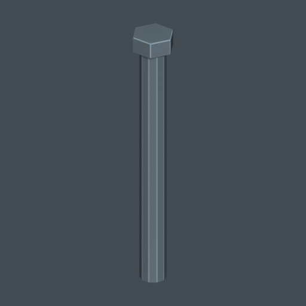</a><br><strong>Head Bolt -0.158 3</strong><br><sub>stock · 2 mesh components</sub></td>
<td align="center" width="33%"><a href="assets/modular_car_kit/previews/head_bolt_-0.158_4.png"></a><br><strong>Head Bolt -0.158 4</strong><br><sub>stock · 2 mesh components</sub></td>
<td align="center" width="33%"><a href="assets/modular_car_kit/previews/head_bolt_0.158_0.png"></a><br><strong>Head Bolt 0.158 0</strong><br><sub>stock · 2 mesh components</sub></td>
</tr>
<tr>
<td align="center" width="33%"><a href="assets/modular_car_kit/previews/head_bolt_0.158_1.png"></a><br><strong>Head Bolt 0.158 1</strong><br><sub>stock · 2 mesh components</sub></td>
<td align="center" width="33%"><a href="assets/modular_car_kit/previews/head_bolt_0.158_2.png"></a><br><strong>Head Bolt 0.158 2</strong><br><sub>stock · 2 mesh components</sub></td>
<td align="center" width="33%"><a href="assets/modular_car_kit/previews/head_bolt_0.158_3.png"></a><br><strong>Head Bolt 0.158 3</strong><br><sub>stock · 2 mesh components</sub></td>
</tr>
<tr>
<td align="center" width="33%"><a href="assets/modular_car_kit/previews/head_bolt_0.158_4.png"></a><br><strong>Head Bolt 0.158 4</strong><br><sub>stock · 2 mesh components</sub></td>
</tr>
</table>

</details>

<a id="category-22"></a>
<details>
<summary><strong>22 · Valvetrain — 71 models</strong></summary>

<table>
<tr>
<td align="center" width="33%"><a href="assets/modular_car_kit/previews/camshaft_-1.png">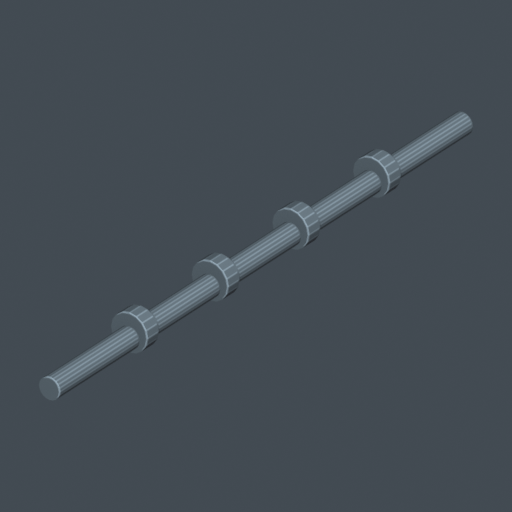</a><br><strong>Camshaft -1</strong><br><sub>stock · 5 mesh components</sub></td>
<td align="center" width="33%"><a href="assets/modular_car_kit/previews/valve_-1_-1.5575_-0.027.png"></a><br><strong>Valve -1 -1.5575 -0.027</strong><br><sub>stock · 5 mesh components</sub></td>
<td align="center" width="33%"><a href="assets/modular_car_kit/previews/valve_spring_160.png"></a><br><strong>Valve Spring 160</strong><br><sub>stock · 1 mesh components</sub></td>
</tr>
<tr>
<td align="center" width="33%"><a href="assets/modular_car_kit/previews/valve_seal_161.png">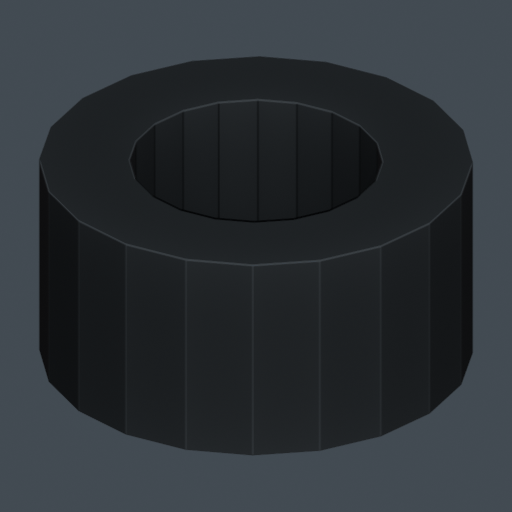</a><br><strong>Valve Seal 161</strong><br><sub>stock · 1 mesh components</sub></td>
<td align="center" width="33%"><a href="assets/modular_car_kit/previews/lifter_162.png"></a><br><strong>Lifter 162</strong><br><sub>stock · 1 mesh components</sub></td>
<td align="center" width="33%"><a href="assets/modular_car_kit/previews/valve_-1_-1.5575_0.027.png"></a><br><strong>Valve -1 -1.5575 0.027</strong><br><sub>stock · 5 mesh components</sub></td>
</tr>
<tr>
<td align="center" width="33%"><a href="assets/modular_car_kit/previews/valve_spring_164.png"></a><br><strong>Valve Spring 164</strong><br><sub>stock · 1 mesh components</sub></td>
<td align="center" width="33%"><a href="assets/modular_car_kit/previews/valve_seal_165.png"></a><br><strong>Valve Seal 165</strong><br><sub>stock · 1 mesh components</sub></td>
<td align="center" width="33%"><a href="assets/modular_car_kit/previews/lifter_166.png"></a><br><strong>Lifter 166</strong><br><sub>stock · 1 mesh components</sub></td>
</tr>
<tr>
<td align="center" width="33%"><a href="assets/modular_car_kit/previews/valve_-1_-1.4325_-0.027.png"></a><br><strong>Valve -1 -1.4325 -0.027</strong><br><sub>stock · 5 mesh components</sub></td>
<td align="center" width="33%"><a href="assets/modular_car_kit/previews/valve_spring_168.png"></a><br><strong>Valve Spring 168</strong><br><sub>stock · 1 mesh components</sub></td>
<td align="center" width="33%"><a href="assets/modular_car_kit/previews/valve_seal_169.png"></a><br><strong>Valve Seal 169</strong><br><sub>stock · 1 mesh components</sub></td>
</tr>
<tr>
<td align="center" width="33%"><a href="assets/modular_car_kit/previews/lifter_170.png"></a><br><strong>Lifter 170</strong><br><sub>stock · 1 mesh components</sub></td>
<td align="center" width="33%"><a href="assets/modular_car_kit/previews/valve_-1_-1.4325_0.027.png"></a><br><strong>Valve -1 -1.4325 0.027</strong><br><sub>stock · 5 mesh components</sub></td>
<td align="center" width="33%"><a href="assets/modular_car_kit/previews/valve_spring_172.png"></a><br><strong>Valve Spring 172</strong><br><sub>stock · 1 mesh components</sub></td>
</tr>
<tr>
<td align="center" width="33%"><a href="assets/modular_car_kit/previews/valve_seal_173.png"></a><br><strong>Valve Seal 173</strong><br><sub>stock · 1 mesh components</sub></td>
<td align="center" width="33%"><a href="assets/modular_car_kit/previews/lifter_174.png"></a><br><strong>Lifter 174</strong><br><sub>stock · 1 mesh components</sub></td>
<td align="center" width="33%"><a href="assets/modular_car_kit/previews/valve_-1_-1.3075_-0.027.png"></a><br><strong>Valve -1 -1.3075 -0.027</strong><br><sub>stock · 5 mesh components</sub></td>
</tr>
<tr>
<td align="center" width="33%"><a href="assets/modular_car_kit/previews/valve_spring_176.png"></a><br><strong>Valve Spring 176</strong><br><sub>stock · 1 mesh components</sub></td>
<td align="center" width="33%"><a href="assets/modular_car_kit/previews/valve_seal_177.png"></a><br><strong>Valve Seal 177</strong><br><sub>stock · 1 mesh components</sub></td>
<td align="center" width="33%"><a href="assets/modular_car_kit/previews/lifter_178.png"></a><br><strong>Lifter 178</strong><br><sub>stock · 1 mesh components</sub></td>
</tr>
<tr>
<td align="center" width="33%"><a href="assets/modular_car_kit/previews/valve_-1_-1.3075_0.027.png"></a><br><strong>Valve -1 -1.3075 0.027</strong><br><sub>stock · 5 mesh components</sub></td>
<td align="center" width="33%"><a href="assets/modular_car_kit/previews/valve_spring_180.png"></a><br><strong>Valve Spring 180</strong><br><sub>stock · 1 mesh components</sub></td>
<td align="center" width="33%"><a href="assets/modular_car_kit/previews/valve_seal_181.png"></a><br><strong>Valve Seal 181</strong><br><sub>stock · 1 mesh components</sub></td>
</tr>
<tr>
<td align="center" width="33%"><a href="assets/modular_car_kit/previews/lifter_182.png"></a><br><strong>Lifter 182</strong><br><sub>stock · 1 mesh components</sub></td>
<td align="center" width="33%"><a href="assets/modular_car_kit/previews/valve_-1_-1.1825_-0.027.png"></a><br><strong>Valve -1 -1.1825 -0.027</strong><br><sub>stock · 5 mesh components</sub></td>
<td align="center" width="33%"><a href="assets/modular_car_kit/previews/valve_spring_184.png"></a><br><strong>Valve Spring 184</strong><br><sub>stock · 1 mesh components</sub></td>
</tr>
<tr>
<td align="center" width="33%"><a href="assets/modular_car_kit/previews/valve_seal_185.png"></a><br><strong>Valve Seal 185</strong><br><sub>stock · 1 mesh components</sub></td>
<td align="center" width="33%"><a href="assets/modular_car_kit/previews/lifter_186.png"></a><br><strong>Lifter 186</strong><br><sub>stock · 1 mesh components</sub></td>
<td align="center" width="33%"><a href="assets/modular_car_kit/previews/valve_-1_-1.1825_0.027.png"></a><br><strong>Valve -1 -1.1825 0.027</strong><br><sub>stock · 5 mesh components</sub></td>
</tr>
<tr>
<td align="center" width="33%"><a href="assets/modular_car_kit/previews/valve_spring_188.png">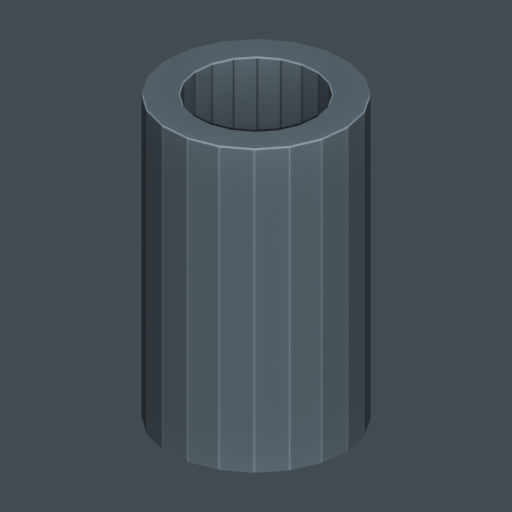</a><br><strong>Valve Spring 188</strong><br><sub>stock · 1 mesh components</sub></td>
<td align="center" width="33%"><a href="assets/modular_car_kit/previews/valve_seal_189.png"></a><br><strong>Valve Seal 189</strong><br><sub>stock · 1 mesh components</sub></td>
<td align="center" width="33%"><a href="assets/modular_car_kit/previews/lifter_190.png"></a><br><strong>Lifter 190</strong><br><sub>stock · 1 mesh components</sub></td>
</tr>
<tr>
<td align="center" width="33%"><a href="assets/modular_car_kit/previews/camshaft_1.png"></a><br><strong>Camshaft 1</strong><br><sub>stock · 5 mesh components</sub></td>
<td align="center" width="33%"><a href="assets/modular_car_kit/previews/valve_1_-1.5575_-0.027.png"></a><br><strong>Valve 1 -1.5575 -0.027</strong><br><sub>stock · 5 mesh components</sub></td>
<td align="center" width="33%"><a href="assets/modular_car_kit/previews/valve_spring_193.png"></a><br><strong>Valve Spring 193</strong><br><sub>stock · 1 mesh components</sub></td>
</tr>
<tr>
<td align="center" width="33%"><a href="assets/modular_car_kit/previews/valve_seal_194.png"></a><br><strong>Valve Seal 194</strong><br><sub>stock · 1 mesh components</sub></td>
<td align="center" width="33%"><a href="assets/modular_car_kit/previews/lifter_195.png"></a><br><strong>Lifter 195</strong><br><sub>stock · 1 mesh components</sub></td>
<td align="center" width="33%"><a href="assets/modular_car_kit/previews/valve_1_-1.5575_0.027.png">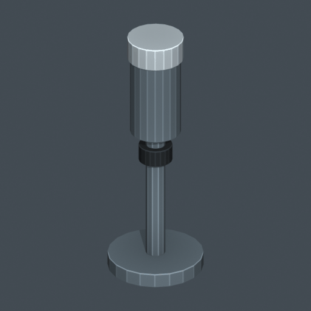</a><br><strong>Valve 1 -1.5575 0.027</strong><br><sub>stock · 5 mesh components</sub></td>
</tr>
<tr>
<td align="center" width="33%"><a href="assets/modular_car_kit/previews/valve_spring_197.png"></a><br><strong>Valve Spring 197</strong><br><sub>stock · 1 mesh components</sub></td>
<td align="center" width="33%"><a href="assets/modular_car_kit/previews/valve_seal_198.png"></a><br><strong>Valve Seal 198</strong><br><sub>stock · 1 mesh components</sub></td>
<td align="center" width="33%"><a href="assets/modular_car_kit/previews/lifter_199.png">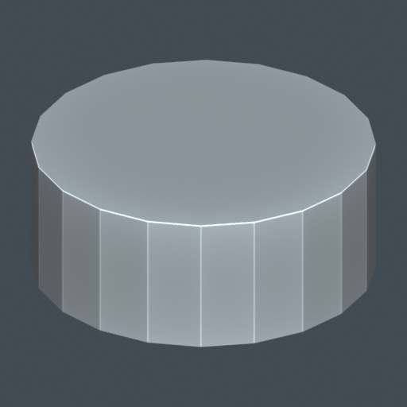</a><br><strong>Lifter 199</strong><br><sub>stock · 1 mesh components</sub></td>
</tr>
<tr>
<td align="center" width="33%"><a href="assets/modular_car_kit/previews/valve_1_-1.4325_-0.027.png"></a><br><strong>Valve 1 -1.4325 -0.027</strong><br><sub>stock · 5 mesh components</sub></td>
<td align="center" width="33%"><a href="assets/modular_car_kit/previews/valve_spring_201.png"></a><br><strong>Valve Spring 201</strong><br><sub>stock · 1 mesh components</sub></td>
<td align="center" width="33%"><a href="assets/modular_car_kit/previews/valve_seal_202.png"></a><br><strong>Valve Seal 202</strong><br><sub>stock · 1 mesh components</sub></td>
</tr>
<tr>
<td align="center" width="33%"><a href="assets/modular_car_kit/previews/lifter_203.png"></a><br><strong>Lifter 203</strong><br><sub>stock · 1 mesh components</sub></td>
<td align="center" width="33%"><a href="assets/modular_car_kit/previews/valve_1_-1.4325_0.027.png"></a><br><strong>Valve 1 -1.4325 0.027</strong><br><sub>stock · 5 mesh components</sub></td>
<td align="center" width="33%"><a href="assets/modular_car_kit/previews/valve_spring_205.png"></a><br><strong>Valve Spring 205</strong><br><sub>stock · 1 mesh components</sub></td>
</tr>
<tr>
<td align="center" width="33%"><a href="assets/modular_car_kit/previews/valve_seal_206.png"></a><br><strong>Valve Seal 206</strong><br><sub>stock · 1 mesh components</sub></td>
<td align="center" width="33%"><a href="assets/modular_car_kit/previews/lifter_207.png"></a><br><strong>Lifter 207</strong><br><sub>stock · 1 mesh components</sub></td>
<td align="center" width="33%"><a href="assets/modular_car_kit/previews/valve_1_-1.3075_-0.027.png"></a><br><strong>Valve 1 -1.3075 -0.027</strong><br><sub>stock · 5 mesh components</sub></td>
</tr>
<tr>
<td align="center" width="33%"><a href="assets/modular_car_kit/previews/valve_spring_209.png"></a><br><strong>Valve Spring 209</strong><br><sub>stock · 1 mesh components</sub></td>
<td align="center" width="33%"><a href="assets/modular_car_kit/previews/valve_seal_210.png">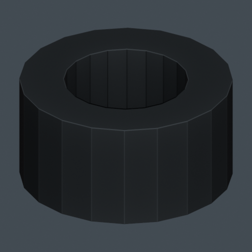</a><br><strong>Valve Seal 210</strong><br><sub>stock · 1 mesh components</sub></td>
<td align="center" width="33%"><a href="assets/modular_car_kit/previews/lifter_211.png"></a><br><strong>Lifter 211</strong><br><sub>stock · 1 mesh components</sub></td>
</tr>
<tr>
<td align="center" width="33%"><a href="assets/modular_car_kit/previews/valve_1_-1.3075_0.027.png"></a><br><strong>Valve 1 -1.3075 0.027</strong><br><sub>stock · 5 mesh components</sub></td>
<td align="center" width="33%"><a href="assets/modular_car_kit/previews/valve_spring_213.png"></a><br><strong>Valve Spring 213</strong><br><sub>stock · 1 mesh components</sub></td>
<td align="center" width="33%"><a href="assets/modular_car_kit/previews/valve_seal_214.png"></a><br><strong>Valve Seal 214</strong><br><sub>stock · 1 mesh components</sub></td>
</tr>
<tr>
<td align="center" width="33%"><a href="assets/modular_car_kit/previews/lifter_215.png"></a><br><strong>Lifter 215</strong><br><sub>stock · 1 mesh components</sub></td>
<td align="center" width="33%"><a href="assets/modular_car_kit/previews/valve_1_-1.1825_-0.027.png"></a><br><strong>Valve 1 -1.1825 -0.027</strong><br><sub>stock · 5 mesh components</sub></td>
<td align="center" width="33%"><a href="assets/modular_car_kit/previews/valve_spring_217.png"></a><br><strong>Valve Spring 217</strong><br><sub>stock · 1 mesh components</sub></td>
</tr>
<tr>
<td align="center" width="33%"><a href="assets/modular_car_kit/previews/valve_seal_218.png"></a><br><strong>Valve Seal 218</strong><br><sub>stock · 1 mesh components</sub></td>
<td align="center" width="33%"><a href="assets/modular_car_kit/previews/lifter_219.png"></a><br><strong>Lifter 219</strong><br><sub>stock · 1 mesh components</sub></td>
<td align="center" width="33%"><a href="assets/modular_car_kit/previews/valve_1_-1.1825_0.027.png"></a><br><strong>Valve 1 -1.1825 0.027</strong><br><sub>stock · 5 mesh components</sub></td>
</tr>
<tr>
<td align="center" width="33%"><a href="assets/modular_car_kit/previews/valve_spring_221.png"></a><br><strong>Valve Spring 221</strong><br><sub>stock · 1 mesh components</sub></td>
<td align="center" width="33%"><a href="assets/modular_car_kit/previews/valve_seal_222.png"></a><br><strong>Valve Seal 222</strong><br><sub>stock · 1 mesh components</sub></td>
<td align="center" width="33%"><a href="assets/modular_car_kit/previews/lifter_223.png">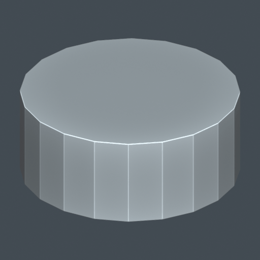</a><br><strong>Lifter 223</strong><br><sub>stock · 1 mesh components</sub></td>
</tr>
<tr>
<td align="center" width="33%"><a href="assets/modular_car_kit/previews/vtec_solenoid.png">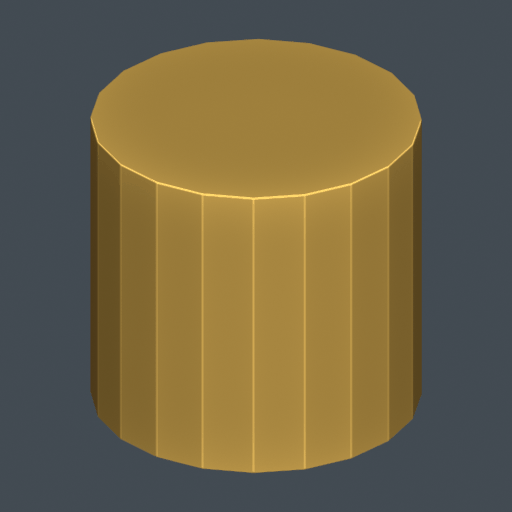</a><br><strong>Vtec Solenoid</strong><br><sub>upgrade · 1 mesh components</sub></td>
<td align="center" width="33%"><a href="assets/modular_car_kit/previews/v6_cam_-1.png"></a><br><strong>V6 Cam -1</strong><br><sub>upgrade · 1 mesh components</sub></td>
<td align="center" width="33%"><a href="assets/modular_car_kit/previews/v6_cam_1.png"></a><br><strong>V6 Cam 1</strong><br><sub>upgrade · 1 mesh components</sub></td>
</tr>
<tr>
<td align="center" width="33%"><a href="assets/modular_car_kit/previews/flat4_cam_-1.png"></a><br><strong>Flat4 Cam -1</strong><br><sub>upgrade · 1 mesh components</sub></td>
<td align="center" width="33%"><a href="assets/modular_car_kit/previews/flat4_cam_1.png">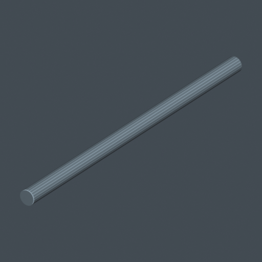</a><br><strong>Flat4 Cam 1</strong><br><sub>upgrade · 1 mesh components</sub></td>
</tr>
</table>

</details>

<a id="category-23"></a>
<details>
<summary><strong>23 · Gaskets — 1 models</strong></summary>

<table>
<tr>
<td align="center" width="33%"><a href="assets/modular_car_kit/previews/head_gasket.png">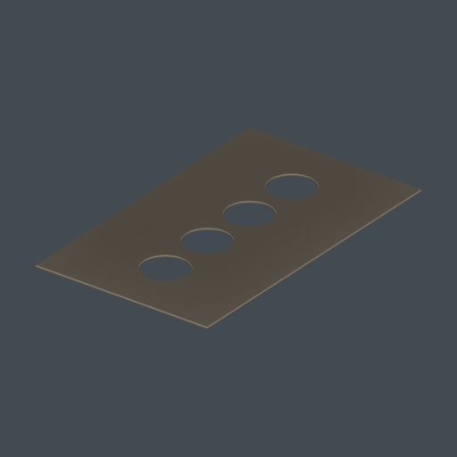</a><br><strong>Head Gasket</strong><br><sub>stock · 1 mesh components</sub></td>
</tr>
</table>

</details>

<a id="category-24"></a>
<details>
<summary><strong>24 · Timing system — 3 models</strong></summary>

<table>
<tr>
<td align="center" width="33%"><a href="assets/modular_car_kit/previews/timing_drive.png">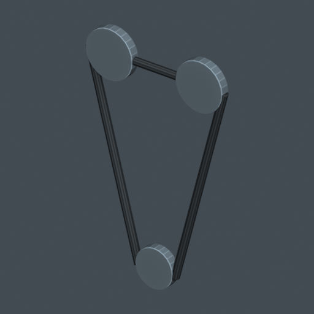</a><br><strong>Timing Drive</strong><br><sub>stock · 7 mesh components</sub></td>
<td align="center" width="33%"><a href="assets/modular_car_kit/previews/harmonic_damper.png">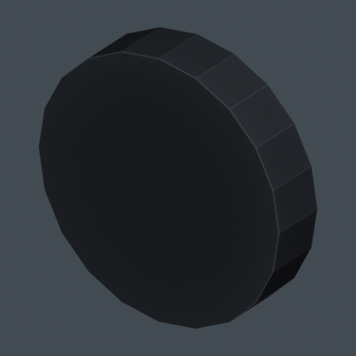</a><br><strong>Harmonic Damper</strong><br><sub>stock · 1 mesh components</sub></td>
<td align="center" width="33%"><a href="assets/modular_car_kit/previews/timing_cover.png"></a><br><strong>Timing Cover</strong><br><sub>stock · 1 mesh components</sub></td>
</tr>
</table>

</details>

<a id="category-25"></a>
<details>
<summary><strong>25 · Air intake — 4 models</strong></summary>

<table>
<tr>
<td align="center" width="33%"><a href="assets/modular_car_kit/previews/intake_manifold.png">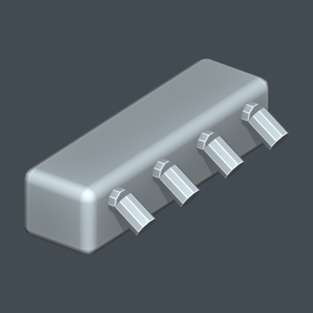</a><br><strong>Intake Manifold</strong><br><sub>stock · 9 mesh components</sub></td>
<td align="center" width="33%"><a href="assets/modular_car_kit/previews/throttle_body.png"></a><br><strong>Throttle Body</strong><br><sub>stock · 1 mesh components</sub></td>
<td align="center" width="33%"><a href="assets/modular_car_kit/previews/air_filter_airbox.png">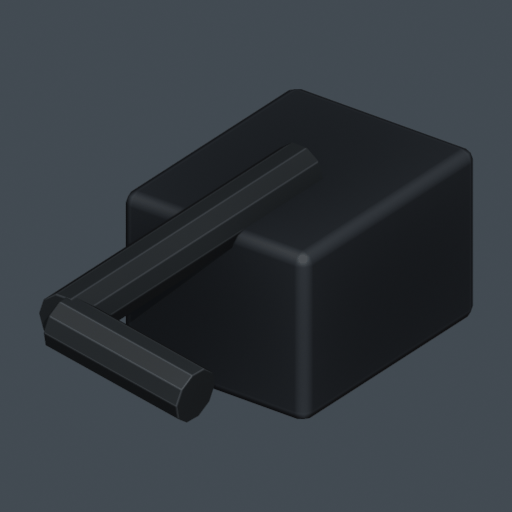</a><br><strong>Air Filter Airbox</strong><br><sub>stock · 3 mesh components</sub></td>
</tr>
<tr>
<td align="center" width="33%"><a href="assets/modular_car_kit/previews/carburetor_intake.png">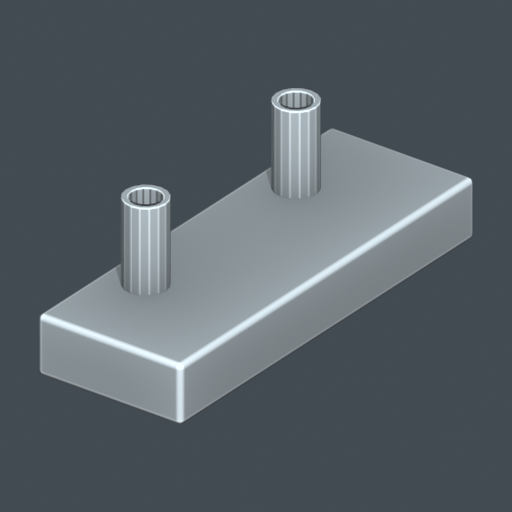</a><br><strong>Carburetor Intake</strong><br><sub>upgrade · 3 mesh components</sub></td>
</tr>
</table>

</details>

<a id="category-26"></a>
<details>
<summary><strong>26 · Fuel delivery — 8 models</strong></summary>

<table>
<tr>
<td align="center" width="33%"><a href="assets/modular_car_kit/previews/fuel_rail.png">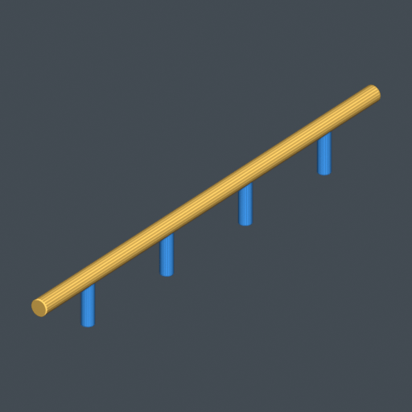</a><br><strong>Fuel Rail</strong><br><sub>stock · 5 mesh components</sub></td>
<td align="center" width="33%"><a href="assets/modular_car_kit/previews/injector_-1.5575.png">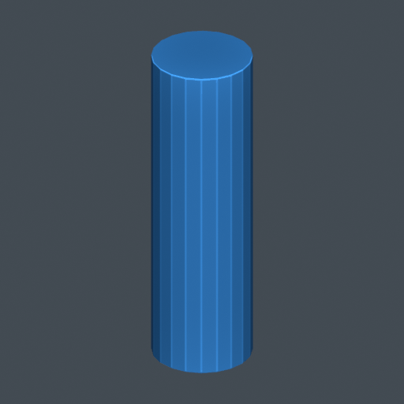</a><br><strong>Injector -1.5575</strong><br><sub>stock · 1 mesh components</sub></td>
<td align="center" width="33%"><a href="assets/modular_car_kit/previews/injector_-1.4325.png"></a><br><strong>Injector -1.4325</strong><br><sub>stock · 1 mesh components</sub></td>
</tr>
<tr>
<td align="center" width="33%"><a href="assets/modular_car_kit/previews/injector_-1.3075.png"></a><br><strong>Injector -1.3075</strong><br><sub>stock · 1 mesh components</sub></td>
<td align="center" width="33%"><a href="assets/modular_car_kit/previews/injector_-1.1825.png"></a><br><strong>Injector -1.1825</strong><br><sub>stock · 1 mesh components</sub></td>
<td align="center" width="33%"><a href="assets/modular_car_kit/previews/fuel_tank.png">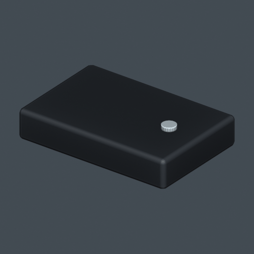</a><br><strong>Fuel Tank</strong><br><sub>stock · 2 mesh components</sub></td>
</tr>
<tr>
<td align="center" width="33%"><a href="assets/modular_car_kit/previews/fuel_pump.png">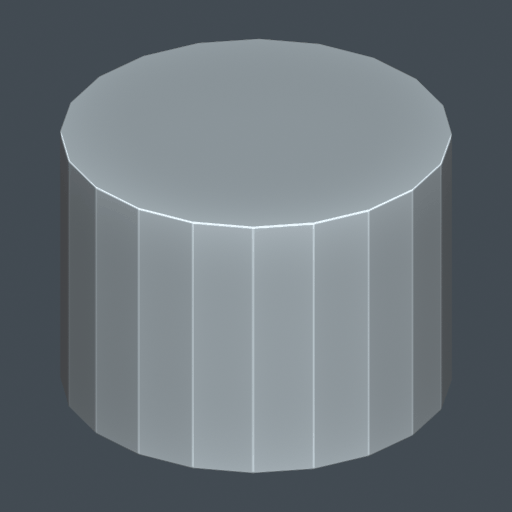</a><br><strong>Fuel Pump</strong><br><sub>stock · 1 mesh components</sub></td>
<td align="center" width="33%"><a href="assets/modular_car_kit/previews/fuel_lines.png">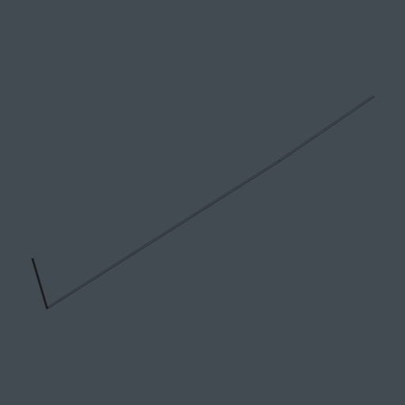</a><br><strong>Fuel Lines</strong><br><sub>stock · 3 mesh components</sub></td>
</tr>
</table>

</details>

<a id="category-27"></a>
<details>
<summary><strong>27 · Ignition and electrical — 12 models</strong></summary>

<table>
<tr>
<td align="center" width="33%"><a href="assets/modular_car_kit/previews/coil_-1.5575.png"></a><br><strong>Coil -1.5575</strong><br><sub>stock · 2 mesh components</sub></td>
<td align="center" width="33%"><a href="assets/modular_car_kit/previews/spark_plug_-1.5575.png"></a><br><strong>Spark Plug -1.5575</strong><br><sub>stock · 1 mesh components</sub></td>
<td align="center" width="33%"><a href="assets/modular_car_kit/previews/coil_-1.4325.png"></a><br><strong>Coil -1.4325</strong><br><sub>stock · 2 mesh components</sub></td>
</tr>
<tr>
<td align="center" width="33%"><a href="assets/modular_car_kit/previews/spark_plug_-1.4325.png"></a><br><strong>Spark Plug -1.4325</strong><br><sub>stock · 1 mesh components</sub></td>
<td align="center" width="33%"><a href="assets/modular_car_kit/previews/coil_-1.3075.png">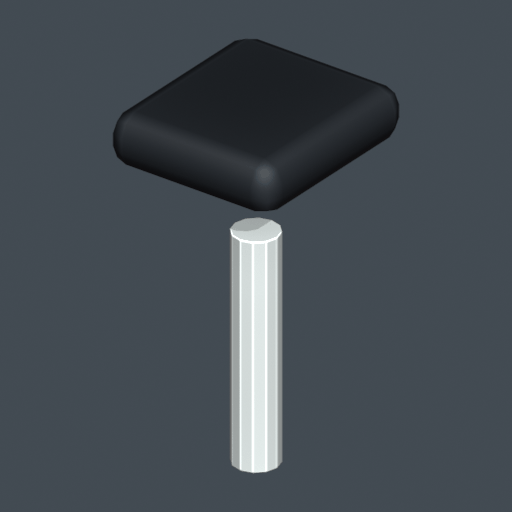</a><br><strong>Coil -1.3075</strong><br><sub>stock · 2 mesh components</sub></td>
<td align="center" width="33%"><a href="assets/modular_car_kit/previews/spark_plug_-1.3075.png"></a><br><strong>Spark Plug -1.3075</strong><br><sub>stock · 1 mesh components</sub></td>
</tr>
<tr>
<td align="center" width="33%"><a href="assets/modular_car_kit/previews/coil_-1.1825.png"></a><br><strong>Coil -1.1825</strong><br><sub>stock · 2 mesh components</sub></td>
<td align="center" width="33%"><a href="assets/modular_car_kit/previews/spark_plug_-1.1825.png">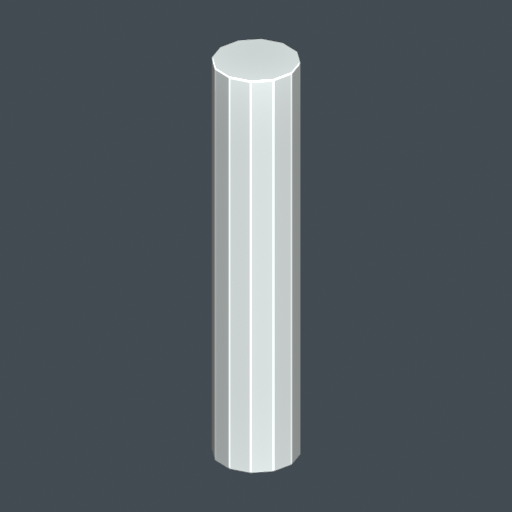</a><br><strong>Spark Plug -1.1825</strong><br><sub>stock · 1 mesh components</sub></td>
<td align="center" width="33%"><a href="assets/modular_car_kit/previews/alternator.png">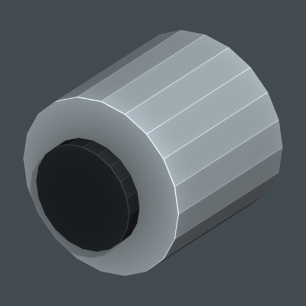</a><br><strong>Alternator</strong><br><sub>stock · 2 mesh components</sub></td>
</tr>
<tr>
<td align="center" width="33%"><a href="assets/modular_car_kit/previews/starter.png">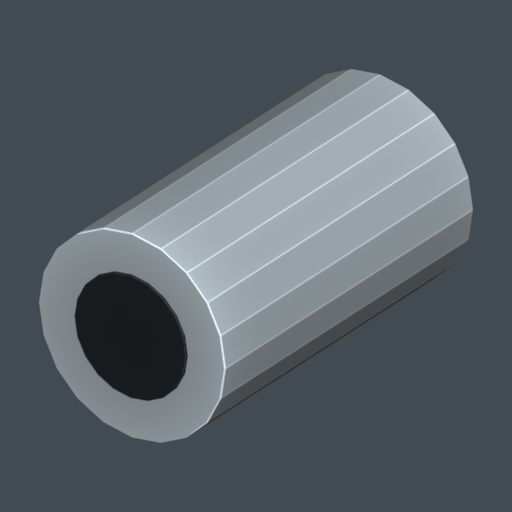</a><br><strong>Starter</strong><br><sub>stock · 2 mesh components</sub></td>
<td align="center" width="33%"><a href="assets/modular_car_kit/previews/battery.png">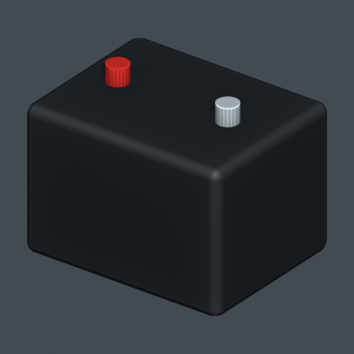</a><br><strong>Battery</strong><br><sub>stock · 3 mesh components</sub></td>
<td align="center" width="33%"><a href="assets/modular_car_kit/previews/wiring_harness.png">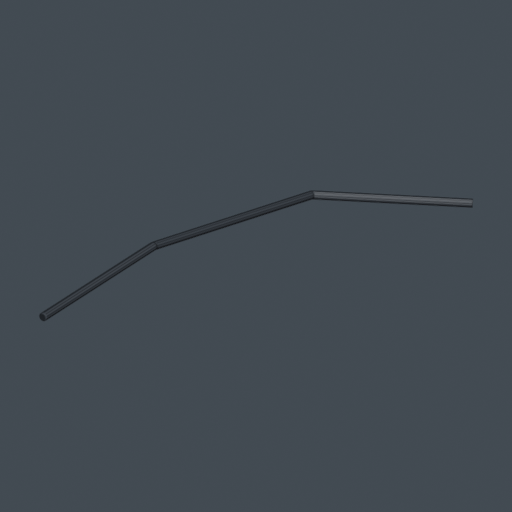</a><br><strong>Wiring Harness</strong><br><sub>stock · 3 mesh components</sub></td>
</tr>
</table>

</details>

<a id="category-28"></a>
<details>
<summary><strong>28 · Lubrication — 4 models</strong></summary>

<table>
<tr>
<td align="center" width="33%"><a href="assets/modular_car_kit/previews/oil_pan.png">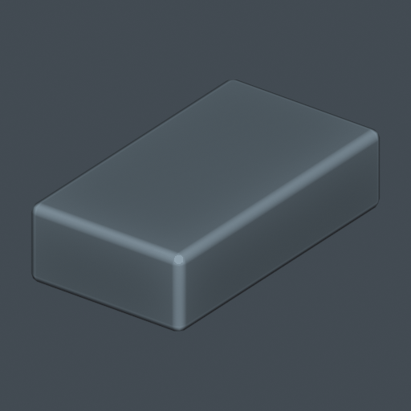</a><br><strong>Oil Pan</strong><br><sub>stock · 1 mesh components</sub></td>
<td align="center" width="33%"><a href="assets/modular_car_kit/previews/oil_pump.png">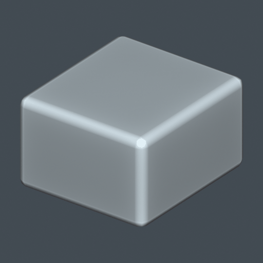</a><br><strong>Oil Pump</strong><br><sub>stock · 1 mesh components</sub></td>
<td align="center" width="33%"><a href="assets/modular_car_kit/previews/oil_filter.png">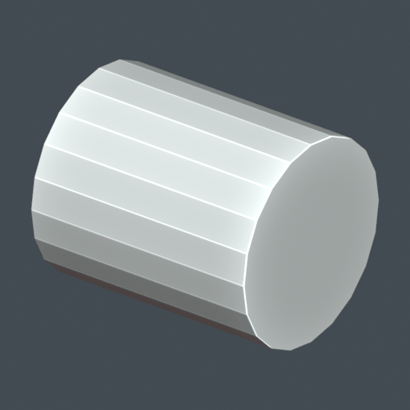</a><br><strong>Oil Filter</strong><br><sub>stock · 1 mesh components</sub></td>
</tr>
<tr>
<td align="center" width="33%"><a href="assets/modular_car_kit/previews/crankcase_vent.png">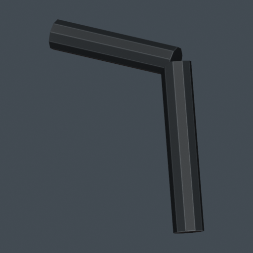</a><br><strong>Crankcase Vent</strong><br><sub>stock · 2 mesh components</sub></td>
</tr>
</table>

</details>

<a id="category-29"></a>
<details>
<summary><strong>29 · Cooling — 6 models</strong></summary>

<table>
<tr>
<td align="center" width="33%"><a href="assets/modular_car_kit/previews/water_pump.png">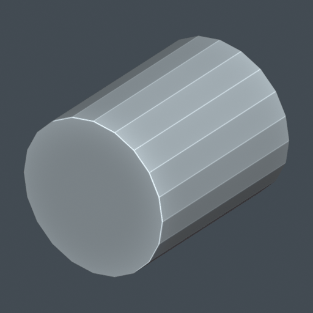</a><br><strong>Water Pump</strong><br><sub>stock · 1 mesh components</sub></td>
<td align="center" width="33%"><a href="assets/modular_car_kit/previews/thermostat.png">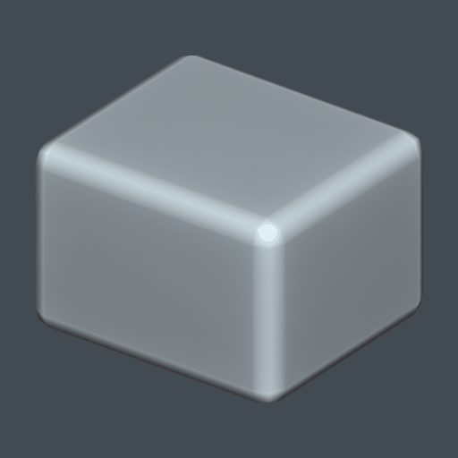</a><br><strong>Thermostat</strong><br><sub>stock · 1 mesh components</sub></td>
<td align="center" width="33%"><a href="assets/modular_car_kit/previews/radiator.png">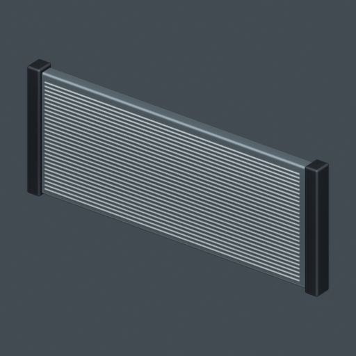</a><br><strong>Radiator</strong><br><sub>stock · 39 mesh components</sub></td>
</tr>
<tr>
<td align="center" width="33%"><a href="assets/modular_car_kit/previews/radiator_fan.png">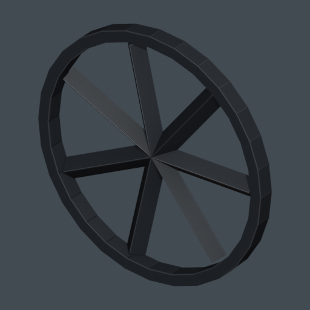</a><br><strong>Radiator Fan</strong><br><sub>stock · 8 mesh components</sub></td>
<td align="center" width="33%"><a href="assets/modular_car_kit/previews/coolant_hoses.png">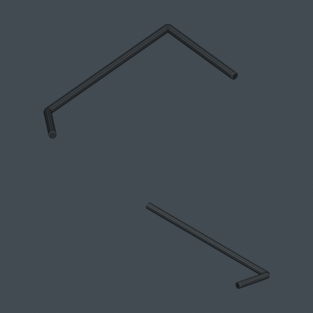</a><br><strong>Coolant Hoses</strong><br><sub>stock · 5 mesh components</sub></td>
<td align="center" width="33%"><a href="assets/modular_car_kit/previews/coolant_reservoir.png">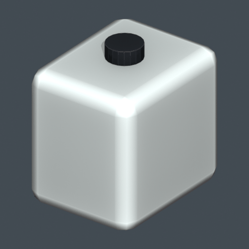</a><br><strong>Coolant Reservoir</strong><br><sub>stock · 2 mesh components</sub></td>
</tr>
</table>

</details>

<a id="category-30"></a>
<details>
<summary><strong>30 · Exhaust — 4 models</strong></summary>

<table>
<tr>
<td align="center" width="33%"><a href="assets/modular_car_kit/previews/exhaust_header.png">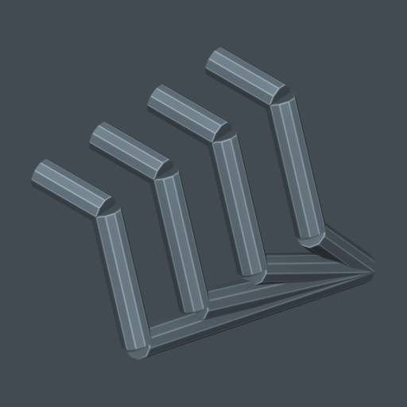</a><br><strong>Exhaust Header</strong><br><sub>stock · 12 mesh components</sub></td>
<td align="center" width="33%"><a href="assets/modular_car_kit/previews/exhaust_system.png">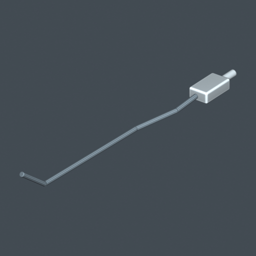</a><br><strong>Exhaust System</strong><br><sub>stock · 6 mesh components</sub></td>
<td align="center" width="33%"><a href="assets/modular_car_kit/previews/muffler.png">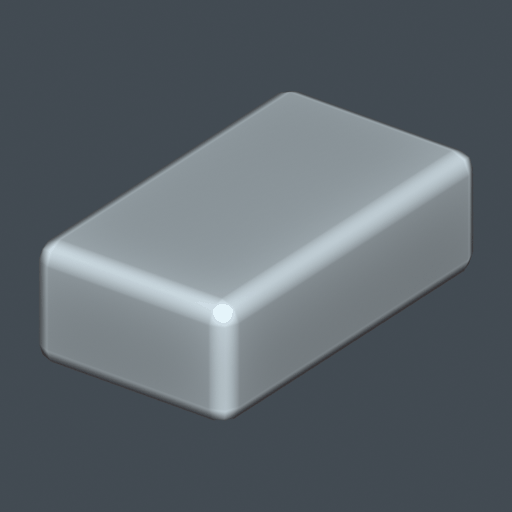</a><br><strong>Muffler</strong><br><sub>stock · 1 mesh components</sub></td>
</tr>
<tr>
<td align="center" width="33%"><a href="assets/modular_car_kit/previews/exhaust_tip.png">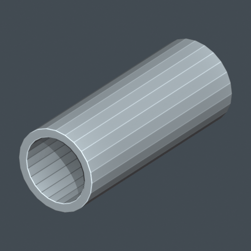</a><br><strong>Exhaust Tip</strong><br><sub>stock · 1 mesh components</sub></td>
</tr>
</table>

</details>

<a id="category-31"></a>
<details>
<summary><strong>31 · Turbo system — 6 models</strong></summary>

<table>
<tr>
<td align="center" width="33%"><a href="assets/modular_car_kit/previews/turbocharger.png">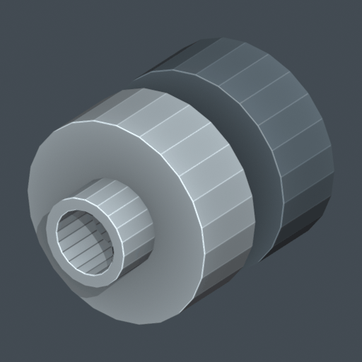</a><br><strong>Turbocharger</strong><br><sub>upgrade · 3 mesh components</sub></td>
<td align="center" width="33%"><a href="assets/modular_car_kit/previews/turbo_exhaust_manifold.png">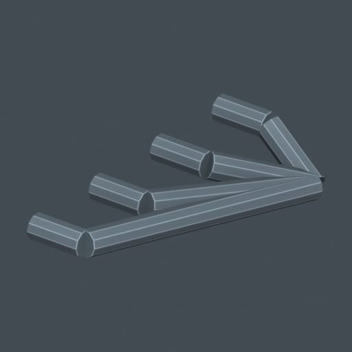</a><br><strong>Turbo Exhaust Manifold</strong><br><sub>upgrade · 8 mesh components</sub></td>
<td align="center" width="33%"><a href="assets/modular_car_kit/previews/wastegate.png">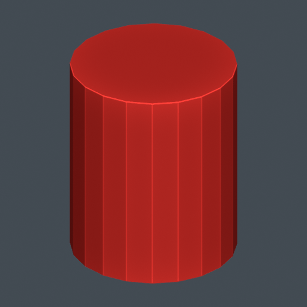</a><br><strong>Wastegate</strong><br><sub>upgrade · 1 mesh components</sub></td>
</tr>
<tr>
<td align="center" width="33%"><a href="assets/modular_car_kit/previews/blowoff_valve.png">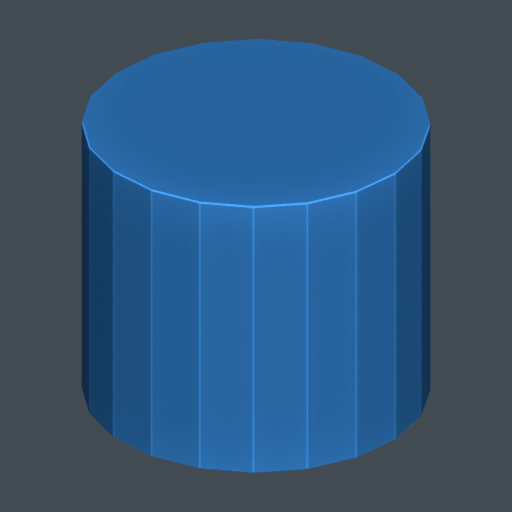</a><br><strong>Blowoff Valve</strong><br><sub>upgrade · 1 mesh components</sub></td>
<td align="center" width="33%"><a href="assets/modular_car_kit/previews/intercooler.png">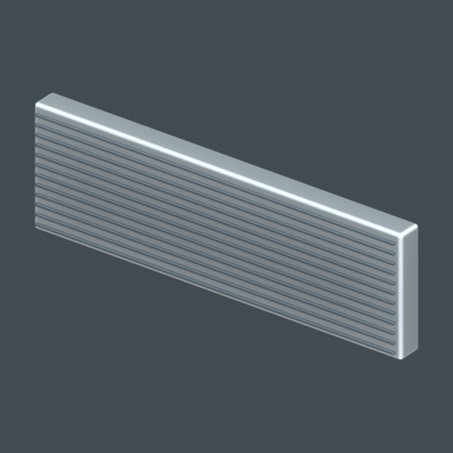</a><br><strong>Intercooler</strong><br><sub>upgrade · 13 mesh components</sub></td>
<td align="center" width="33%"><a href="assets/modular_car_kit/previews/charge_pipes.png">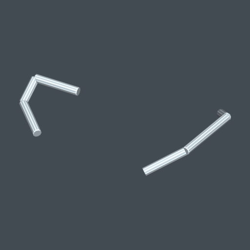</a><br><strong>Charge Pipes</strong><br><sub>upgrade · 6 mesh components</sub></td>
</tr>
</table>

</details>

<a id="category-32"></a>
<details>
<summary><strong>32 · Supercharger — 1 models</strong></summary>

<table>
<tr>
<td align="center" width="33%"><a href="assets/modular_car_kit/previews/centrifugal_supercharger.png">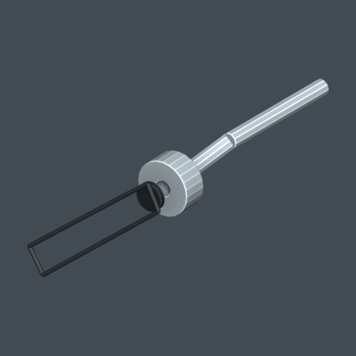</a><br><strong>Centrifugal Supercharger</strong><br><sub>upgrade · 8 mesh components</sub></td>
</tr>
</table>

</details>

<a id="category-33"></a>
<details>
<summary><strong>33 · Nitrous — 1 models</strong></summary>

<table>
<tr>
<td align="center" width="33%"><a href="assets/modular_car_kit/previews/nitrous_kit.png">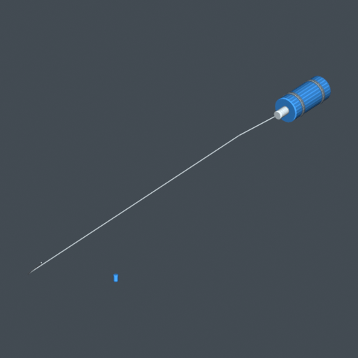</a><br><strong>Nitrous Kit</strong><br><sub>upgrade · 8 mesh components</sub></td>
</tr>
</table>

</details>

<a id="category-34"></a>
<details>
<summary><strong>34 · Water-meth — 1 models</strong></summary>

<table>
<tr>
<td align="center" width="33%"><a href="assets/modular_car_kit/previews/water_meth_kit.png">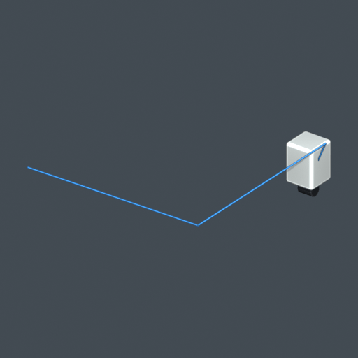</a><br><strong>Water Meth Kit</strong><br><sub>upgrade · 5 mesh components</sub></td>
</tr>
</table>

</details>

<a id="category-35"></a>
<details>
<summary><strong>35 · Clutch and flywheel — 3 models</strong></summary>

<table>
<tr>
<td align="center" width="33%"><a href="assets/modular_car_kit/previews/flywheel.png">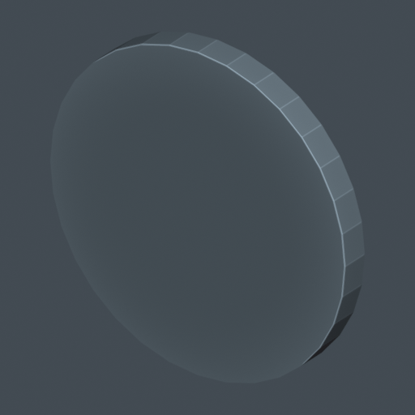</a><br><strong>Flywheel</strong><br><sub>stock · 1 mesh components</sub></td>
<td align="center" width="33%"><a href="assets/modular_car_kit/previews/clutch_disc.png">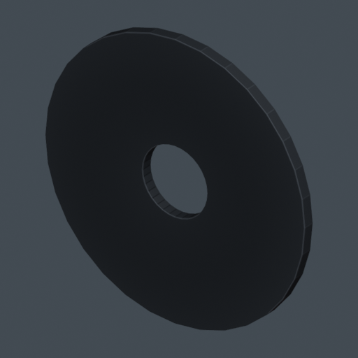</a><br><strong>Clutch Disc</strong><br><sub>stock · 1 mesh components</sub></td>
<td align="center" width="33%"><a href="assets/modular_car_kit/previews/pressure_plate.png">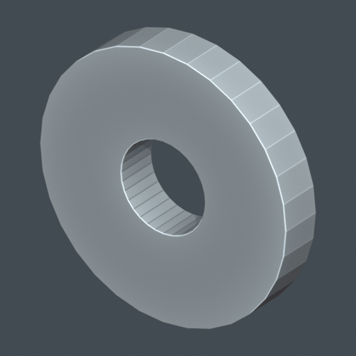</a><br><strong>Pressure Plate</strong><br><sub>stock · 1 mesh components</sub></td>
</tr>
</table>

</details>

<a id="category-36"></a>
<details>
<summary><strong>36 · Transmission — 11 models</strong></summary>

<table>
<tr>
<td align="center" width="33%"><a href="assets/modular_car_kit/previews/manual_5speed.png">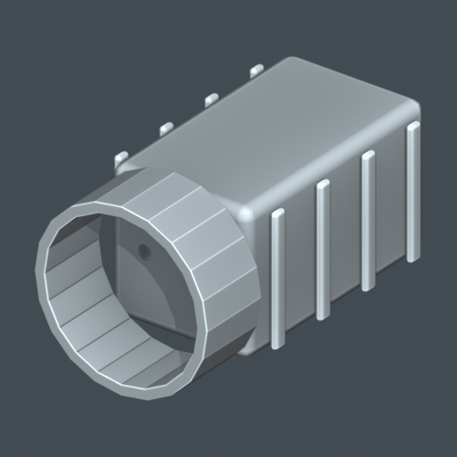</a><br><strong>Manual 5Speed</strong><br><sub>stock · 22 mesh components</sub></td>
<td align="center" width="33%"><a href="assets/modular_car_kit/previews/gearbox_shafts.png">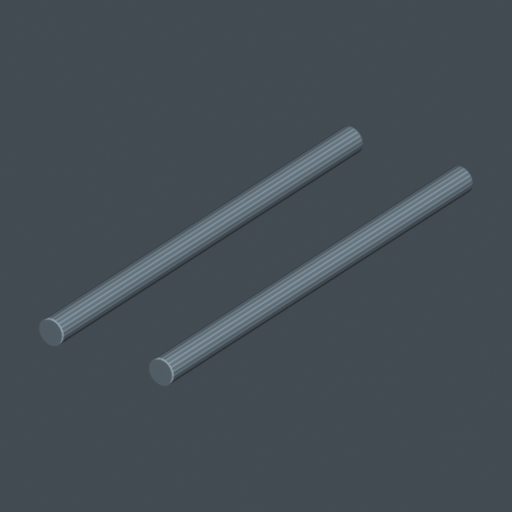</a><br><strong>Gearbox Shafts</strong><br><sub>stock · 2 mesh components</sub></td>
<td align="center" width="33%"><a href="assets/modular_car_kit/previews/gear_set_0.png">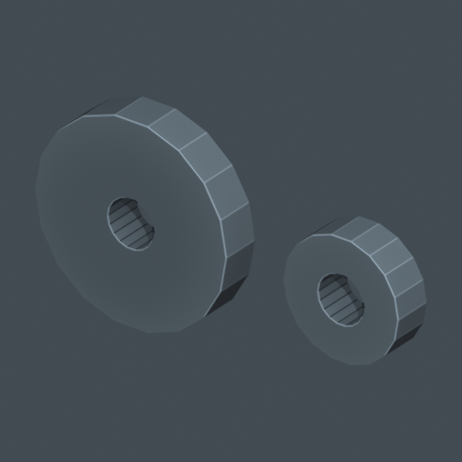</a><br><strong>Gear Set 0</strong><br><sub>stock · 2 mesh components</sub></td>
</tr>
<tr>
<td align="center" width="33%"><a href="assets/modular_car_kit/previews/gear_set_1.png">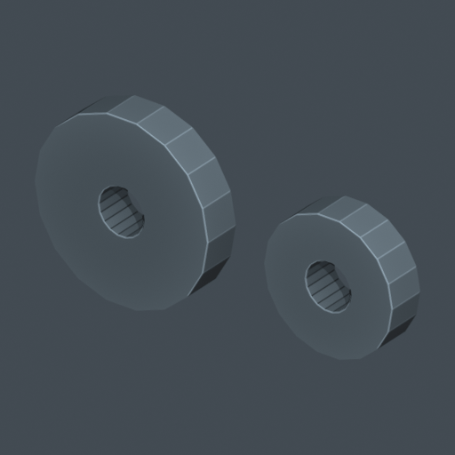</a><br><strong>Gear Set 1</strong><br><sub>stock · 2 mesh components</sub></td>
<td align="center" width="33%"><a href="assets/modular_car_kit/previews/gear_set_2.png">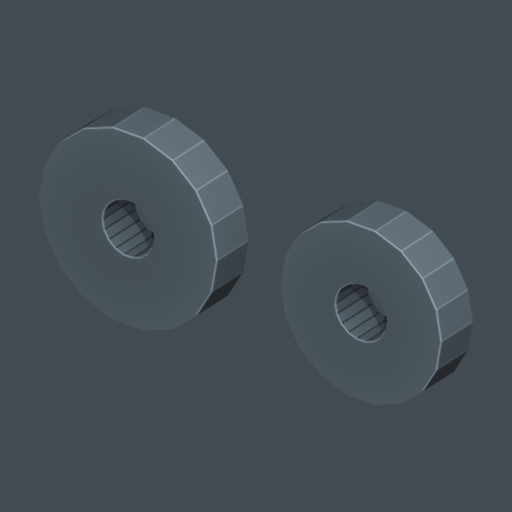</a><br><strong>Gear Set 2</strong><br><sub>stock · 2 mesh components</sub></td>
<td align="center" width="33%"><a href="assets/modular_car_kit/previews/gear_set_3.png">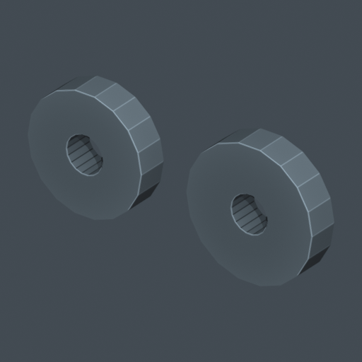</a><br><strong>Gear Set 3</strong><br><sub>stock · 2 mesh components</sub></td>
</tr>
<tr>
<td align="center" width="33%"><a href="assets/modular_car_kit/previews/gear_set_4.png">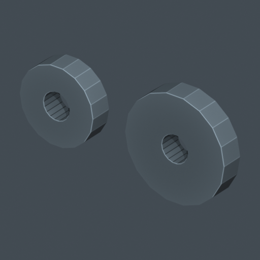</a><br><strong>Gear Set 4</strong><br><sub>stock · 2 mesh components</sub></td>
<td align="center" width="33%"><a href="assets/modular_car_kit/previews/sequential_gearbox.png">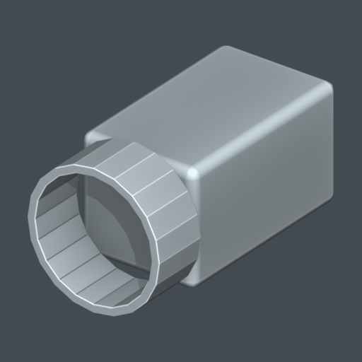</a><br><strong>Sequential Gearbox</strong><br><sub>upgrade · 2 mesh components</sub></td>
<td align="center" width="33%"><a href="assets/modular_car_kit/previews/automatic_gearbox.png">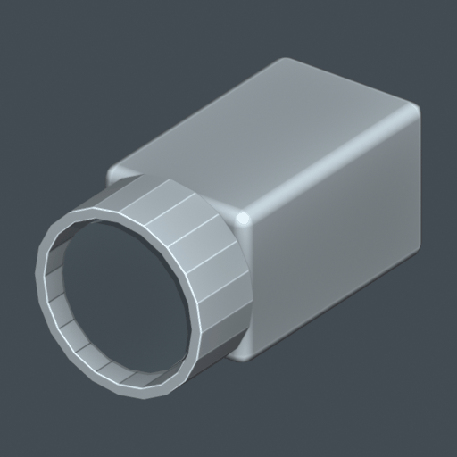</a><br><strong>Automatic Gearbox</strong><br><sub>upgrade · 3 mesh components</sub></td>
</tr>
<tr>
<td align="center" width="33%"><a href="assets/modular_car_kit/previews/dct_gearbox.png">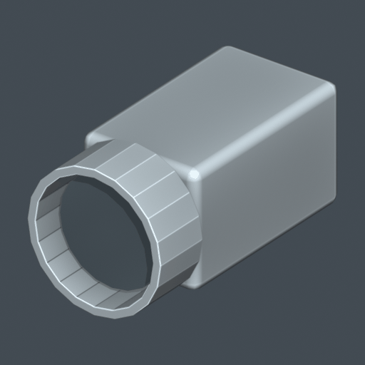</a><br><strong>Dct Gearbox</strong><br><sub>upgrade · 4 mesh components</sub></td>
<td align="center" width="33%"><a href="assets/modular_car_kit/previews/cvt_gearbox.png"></a><br><strong>Cvt Gearbox</strong><br><sub>upgrade · 8 mesh components</sub></td>
</tr>
</table>

</details>

<a id="category-37"></a>
<details>
<summary><strong>37 · Driveline — 10 models</strong></summary>

<table>
<tr>
<td align="center" width="33%"><a href="assets/modular_car_kit/previews/rear_differential.png">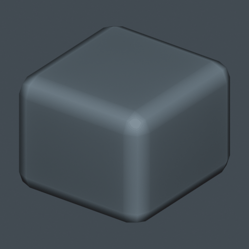</a><br><strong>Rear Differential</strong><br><sub>stock · 2 mesh components</sub></td>
<td align="center" width="33%"><a href="assets/modular_car_kit/previews/final_drive.png">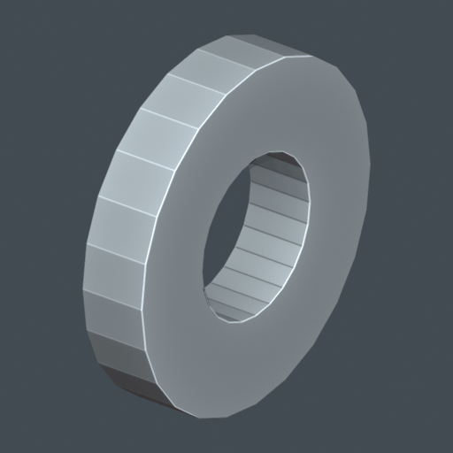</a><br><strong>Final Drive</strong><br><sub>stock · 1 mesh components</sub></td>
<td align="center" width="33%"><a href="assets/modular_car_kit/previews/driveshaft.png">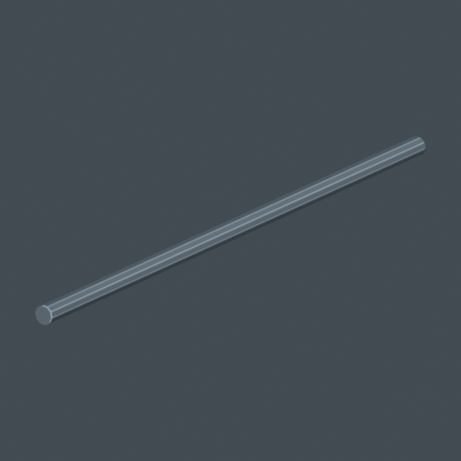</a><br><strong>Driveshaft</strong><br><sub>stock · 1 mesh components</sub></td>
</tr>
<tr>
<td align="center" width="33%"><a href="assets/modular_car_kit/previews/rear_cv_axle_-1.png">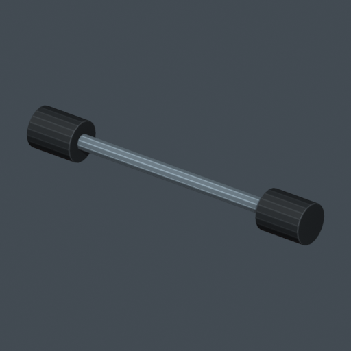</a><br><strong>Rear Cv Axle -1</strong><br><sub>stock · 3 mesh components</sub></td>
<td align="center" width="33%"><a href="assets/modular_car_kit/previews/rear_cv_axle_1.png">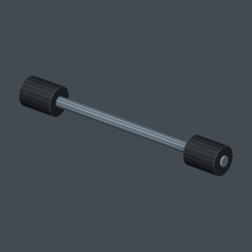</a><br><strong>Rear Cv Axle 1</strong><br><sub>stock · 3 mesh components</sub></td>
<td align="center" width="33%"><a href="assets/modular_car_kit/previews/lsd_differential.png"></a><br><strong>Lsd Differential</strong><br><sub>upgrade · 2 mesh components</sub></td>
</tr>
<tr>
<td align="center" width="33%"><a href="assets/modular_car_kit/previews/locked_differential.png"></a><br><strong>Locked Differential</strong><br><sub>upgrade · 2 mesh components</sub></td>
<td align="center" width="33%"><a href="assets/modular_car_kit/previews/torsen_differential.png">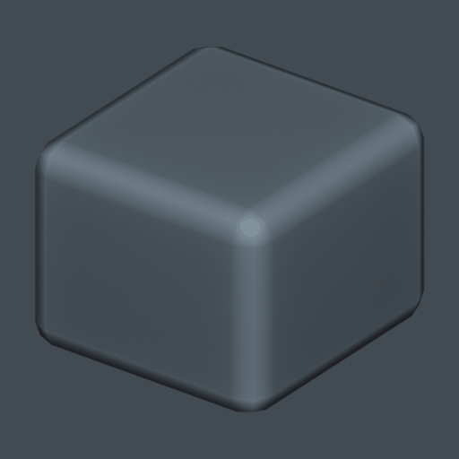</a><br><strong>Torsen Differential</strong><br><sub>upgrade · 2 mesh components</sub></td>
<td align="center" width="33%"><a href="assets/modular_car_kit/previews/welded_differential.png"></a><br><strong>Welded Differential</strong><br><sub>upgrade · 2 mesh components</sub></td>
</tr>
<tr>
<td align="center" width="33%"><a href="assets/modular_car_kit/previews/awd_transfer_kit.png">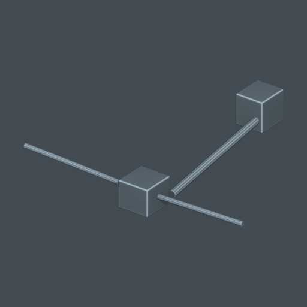</a><br><strong>Awd Transfer Kit</strong><br><sub>upgrade · 5 mesh components</sub></td>
</tr>
</table>

</details>

<a id="category-38"></a>
<details>
<summary><strong>38 · Rotary engines — 94 models</strong></summary>

<table>
<tr>
<td align="center" width="33%"><a href="assets/modular_car_kit/previews/rotary_1rotor.png">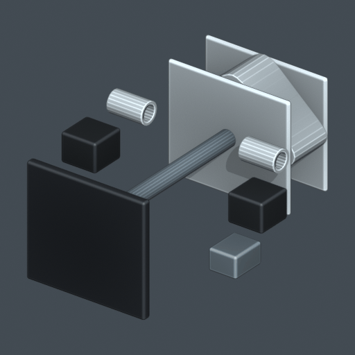</a><br><strong>Rotary 1Rotor</strong><br><sub>upgrade · 16 mesh components</sub></td>
<td align="center" width="33%"><a href="assets/modular_car_kit/previews/eccentric_shaft_1r.png"></a><br><strong>Eccentric Shaft 1R</strong><br><sub>upgrade · 1 mesh components</sub></td>
<td align="center" width="33%"><a href="assets/modular_car_kit/previews/rotor_housing_1r_0.png"></a><br><strong>Rotor Housing 1R 0</strong><br><sub>upgrade · 1 mesh components</sub></td>
</tr>
<tr>
<td align="center" width="33%"><a href="assets/modular_car_kit/previews/rotor_1r_0.png"></a><br><strong>Rotor 1R 0</strong><br><sub>upgrade · 4 mesh components</sub></td>
<td align="center" width="33%"><a href="assets/modular_car_kit/previews/apex_seal_1r_0_0.png"></a><br><strong>Apex Seal 1R 0 0</strong><br><sub>upgrade · 1 mesh components</sub></td>
<td align="center" width="33%"><a href="assets/modular_car_kit/previews/apex_seal_1r_0_1.png"></a><br><strong>Apex Seal 1R 0 1</strong><br><sub>upgrade · 1 mesh components</sub></td>
</tr>
<tr>
<td align="center" width="33%"><a href="assets/modular_car_kit/previews/apex_seal_1r_0_2.png"></a><br><strong>Apex Seal 1R 0 2</strong><br><sub>upgrade · 1 mesh components</sub></td>
<td align="center" width="33%"><a href="assets/modular_car_kit/previews/stationary_gear_1r_0.png"></a><br><strong>Stationary Gear 1R 0</strong><br><sub>upgrade · 1 mesh components</sub></td>
<td align="center" width="33%"><a href="assets/modular_car_kit/previews/side_housing_1r_0.png"></a><br><strong>Side Housing 1R 0</strong><br><sub>upgrade · 1 mesh components</sub></td>
</tr>
<tr>
<td align="center" width="33%"><a href="assets/modular_car_kit/previews/side_housing_1r_1.png"></a><br><strong>Side Housing 1R 1</strong><br><sub>upgrade · 1 mesh components</sub></td>
<td align="center" width="33%"><a href="assets/modular_car_kit/previews/intake_port_1r.png"></a><br><strong>Intake Port 1R</strong><br><sub>upgrade · 1 mesh components</sub></td>
<td align="center" width="33%"><a href="assets/modular_car_kit/previews/exhaust_port_1r.png"></a><br><strong>Exhaust Port 1R</strong><br><sub>upgrade · 1 mesh components</sub></td>
</tr>
<tr>
<td align="center" width="33%"><a href="assets/modular_car_kit/previews/oil_metering_pump_1r.png"></a><br><strong>Oil Metering Pump 1R</strong><br><sub>upgrade · 1 mesh components</sub></td>
<td align="center" width="33%"><a href="assets/modular_car_kit/previews/rotary_2rotor.png">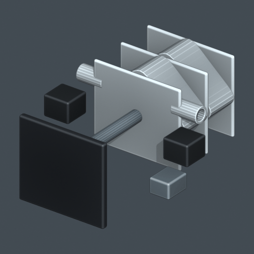</a><br><strong>Rotary 2Rotor</strong><br><sub>upgrade · 23 mesh components</sub></td>
<td align="center" width="33%"><a href="assets/modular_car_kit/previews/eccentric_shaft_2r.png">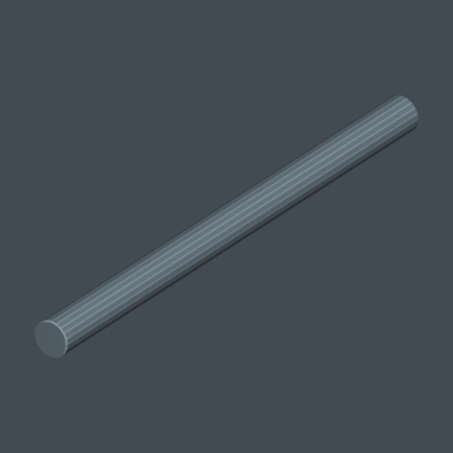</a><br><strong>Eccentric Shaft 2R</strong><br><sub>upgrade · 1 mesh components</sub></td>
</tr>
<tr>
<td align="center" width="33%"><a href="assets/modular_car_kit/previews/rotor_housing_2r_0.png"></a><br><strong>Rotor Housing 2R 0</strong><br><sub>upgrade · 1 mesh components</sub></td>
<td align="center" width="33%"><a href="assets/modular_car_kit/previews/rotor_2r_0.png"></a><br><strong>Rotor 2R 0</strong><br><sub>upgrade · 4 mesh components</sub></td>
<td align="center" width="33%"><a href="assets/modular_car_kit/previews/apex_seal_2r_0_0.png"></a><br><strong>Apex Seal 2R 0 0</strong><br><sub>upgrade · 1 mesh components</sub></td>
</tr>
<tr>
<td align="center" width="33%"><a href="assets/modular_car_kit/previews/apex_seal_2r_0_1.png"></a><br><strong>Apex Seal 2R 0 1</strong><br><sub>upgrade · 1 mesh components</sub></td>
<td align="center" width="33%"><a href="assets/modular_car_kit/previews/apex_seal_2r_0_2.png"></a><br><strong>Apex Seal 2R 0 2</strong><br><sub>upgrade · 1 mesh components</sub></td>
<td align="center" width="33%"><a href="assets/modular_car_kit/previews/stationary_gear_2r_0.png"></a><br><strong>Stationary Gear 2R 0</strong><br><sub>upgrade · 1 mesh components</sub></td>
</tr>
<tr>
<td align="center" width="33%"><a href="assets/modular_car_kit/previews/rotor_housing_2r_1.png"></a><br><strong>Rotor Housing 2R 1</strong><br><sub>upgrade · 1 mesh components</sub></td>
<td align="center" width="33%"><a href="assets/modular_car_kit/previews/rotor_2r_1.png"></a><br><strong>Rotor 2R 1</strong><br><sub>upgrade · 4 mesh components</sub></td>
<td align="center" width="33%"><a href="assets/modular_car_kit/previews/apex_seal_2r_1_0.png"></a><br><strong>Apex Seal 2R 1 0</strong><br><sub>upgrade · 1 mesh components</sub></td>
</tr>
<tr>
<td align="center" width="33%"><a href="assets/modular_car_kit/previews/apex_seal_2r_1_1.png"></a><br><strong>Apex Seal 2R 1 1</strong><br><sub>upgrade · 1 mesh components</sub></td>
<td align="center" width="33%"><a href="assets/modular_car_kit/previews/apex_seal_2r_1_2.png"></a><br><strong>Apex Seal 2R 1 2</strong><br><sub>upgrade · 1 mesh components</sub></td>
<td align="center" width="33%"><a href="assets/modular_car_kit/previews/stationary_gear_2r_1.png"></a><br><strong>Stationary Gear 2R 1</strong><br><sub>upgrade · 1 mesh components</sub></td>
</tr>
<tr>
<td align="center" width="33%"><a href="assets/modular_car_kit/previews/side_housing_2r_0.png"></a><br><strong>Side Housing 2R 0</strong><br><sub>upgrade · 1 mesh components</sub></td>
<td align="center" width="33%"><a href="assets/modular_car_kit/previews/side_housing_2r_1.png"></a><br><strong>Side Housing 2R 1</strong><br><sub>upgrade · 1 mesh components</sub></td>
<td align="center" width="33%"><a href="assets/modular_car_kit/previews/side_housing_2r_2.png"></a><br><strong>Side Housing 2R 2</strong><br><sub>upgrade · 1 mesh components</sub></td>
</tr>
<tr>
<td align="center" width="33%"><a href="assets/modular_car_kit/previews/intake_port_2r.png">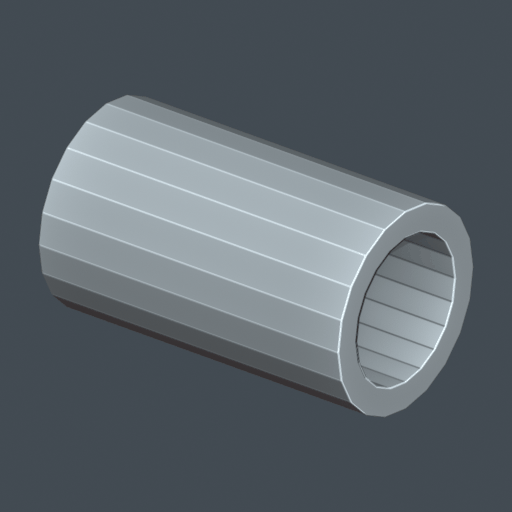</a><br><strong>Intake Port 2R</strong><br><sub>upgrade · 1 mesh components</sub></td>
<td align="center" width="33%"><a href="assets/modular_car_kit/previews/exhaust_port_2r.png"></a><br><strong>Exhaust Port 2R</strong><br><sub>upgrade · 1 mesh components</sub></td>
<td align="center" width="33%"><a href="assets/modular_car_kit/previews/oil_metering_pump_2r.png"></a><br><strong>Oil Metering Pump 2R</strong><br><sub>upgrade · 1 mesh components</sub></td>
</tr>
<tr>
<td align="center" width="33%"><a href="assets/modular_car_kit/previews/rotary_3rotor.png">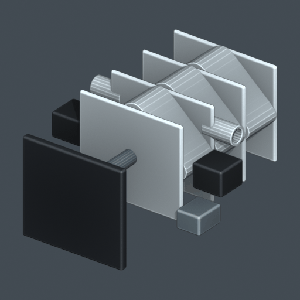</a><br><strong>Rotary 3Rotor</strong><br><sub>upgrade · 30 mesh components</sub></td>
<td align="center" width="33%"><a href="assets/modular_car_kit/previews/eccentric_shaft_3r.png"></a><br><strong>Eccentric Shaft 3R</strong><br><sub>upgrade · 1 mesh components</sub></td>
<td align="center" width="33%"><a href="assets/modular_car_kit/previews/rotor_housing_3r_0.png"></a><br><strong>Rotor Housing 3R 0</strong><br><sub>upgrade · 1 mesh components</sub></td>
</tr>
<tr>
<td align="center" width="33%"><a href="assets/modular_car_kit/previews/rotor_3r_0.png"></a><br><strong>Rotor 3R 0</strong><br><sub>upgrade · 4 mesh components</sub></td>
<td align="center" width="33%"><a href="assets/modular_car_kit/previews/apex_seal_3r_0_0.png"></a><br><strong>Apex Seal 3R 0 0</strong><br><sub>upgrade · 1 mesh components</sub></td>
<td align="center" width="33%"><a href="assets/modular_car_kit/previews/apex_seal_3r_0_1.png"></a><br><strong>Apex Seal 3R 0 1</strong><br><sub>upgrade · 1 mesh components</sub></td>
</tr>
<tr>
<td align="center" width="33%"><a href="assets/modular_car_kit/previews/apex_seal_3r_0_2.png"></a><br><strong>Apex Seal 3R 0 2</strong><br><sub>upgrade · 1 mesh components</sub></td>
<td align="center" width="33%"><a href="assets/modular_car_kit/previews/stationary_gear_3r_0.png"></a><br><strong>Stationary Gear 3R 0</strong><br><sub>upgrade · 1 mesh components</sub></td>
<td align="center" width="33%"><a href="assets/modular_car_kit/previews/rotor_housing_3r_1.png"></a><br><strong>Rotor Housing 3R 1</strong><br><sub>upgrade · 1 mesh components</sub></td>
</tr>
<tr>
<td align="center" width="33%"><a href="assets/modular_car_kit/previews/rotor_3r_1.png"></a><br><strong>Rotor 3R 1</strong><br><sub>upgrade · 4 mesh components</sub></td>
<td align="center" width="33%"><a href="assets/modular_car_kit/previews/apex_seal_3r_1_0.png"></a><br><strong>Apex Seal 3R 1 0</strong><br><sub>upgrade · 1 mesh components</sub></td>
<td align="center" width="33%"><a href="assets/modular_car_kit/previews/apex_seal_3r_1_1.png"></a><br><strong>Apex Seal 3R 1 1</strong><br><sub>upgrade · 1 mesh components</sub></td>
</tr>
<tr>
<td align="center" width="33%"><a href="assets/modular_car_kit/previews/apex_seal_3r_1_2.png"></a><br><strong>Apex Seal 3R 1 2</strong><br><sub>upgrade · 1 mesh components</sub></td>
<td align="center" width="33%"><a href="assets/modular_car_kit/previews/stationary_gear_3r_1.png"></a><br><strong>Stationary Gear 3R 1</strong><br><sub>upgrade · 1 mesh components</sub></td>
<td align="center" width="33%"><a href="assets/modular_car_kit/previews/rotor_housing_3r_2.png"></a><br><strong>Rotor Housing 3R 2</strong><br><sub>upgrade · 1 mesh components</sub></td>
</tr>
<tr>
<td align="center" width="33%"><a href="assets/modular_car_kit/previews/rotor_3r_2.png">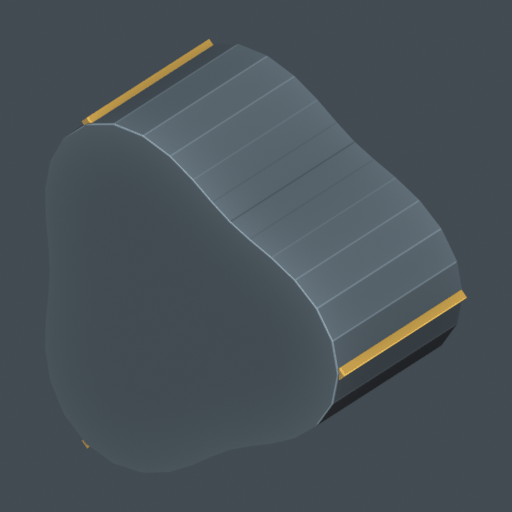</a><br><strong>Rotor 3R 2</strong><br><sub>upgrade · 4 mesh components</sub></td>
<td align="center" width="33%"><a href="assets/modular_car_kit/previews/apex_seal_3r_2_0.png"></a><br><strong>Apex Seal 3R 2 0</strong><br><sub>upgrade · 1 mesh components</sub></td>
<td align="center" width="33%"><a href="assets/modular_car_kit/previews/apex_seal_3r_2_1.png"></a><br><strong>Apex Seal 3R 2 1</strong><br><sub>upgrade · 1 mesh components</sub></td>
</tr>
<tr>
<td align="center" width="33%"><a href="assets/modular_car_kit/previews/apex_seal_3r_2_2.png"></a><br><strong>Apex Seal 3R 2 2</strong><br><sub>upgrade · 1 mesh components</sub></td>
<td align="center" width="33%"><a href="assets/modular_car_kit/previews/stationary_gear_3r_2.png"></a><br><strong>Stationary Gear 3R 2</strong><br><sub>upgrade · 1 mesh components</sub></td>
<td align="center" width="33%"><a href="assets/modular_car_kit/previews/side_housing_3r_0.png"></a><br><strong>Side Housing 3R 0</strong><br><sub>upgrade · 1 mesh components</sub></td>
</tr>
<tr>
<td align="center" width="33%"><a href="assets/modular_car_kit/previews/side_housing_3r_1.png"></a><br><strong>Side Housing 3R 1</strong><br><sub>upgrade · 1 mesh components</sub></td>
<td align="center" width="33%"><a href="assets/modular_car_kit/previews/side_housing_3r_2.png"></a><br><strong>Side Housing 3R 2</strong><br><sub>upgrade · 1 mesh components</sub></td>
<td align="center" width="33%"><a href="assets/modular_car_kit/previews/side_housing_3r_3.png"></a><br><strong>Side Housing 3R 3</strong><br><sub>upgrade · 1 mesh components</sub></td>
</tr>
<tr>
<td align="center" width="33%"><a href="assets/modular_car_kit/previews/intake_port_3r.png"></a><br><strong>Intake Port 3R</strong><br><sub>upgrade · 1 mesh components</sub></td>
<td align="center" width="33%"><a href="assets/modular_car_kit/previews/exhaust_port_3r.png"></a><br><strong>Exhaust Port 3R</strong><br><sub>upgrade · 1 mesh components</sub></td>
<td align="center" width="33%"><a href="assets/modular_car_kit/previews/oil_metering_pump_3r.png"></a><br><strong>Oil Metering Pump 3R</strong><br><sub>upgrade · 1 mesh components</sub></td>
</tr>
<tr>
<td align="center" width="33%"><a href="assets/modular_car_kit/previews/rotary_4rotor.png">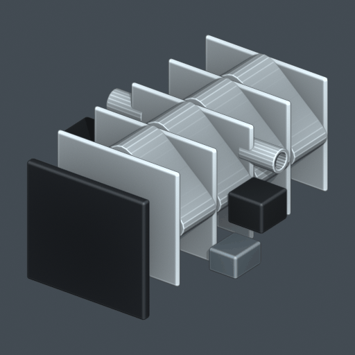</a><br><strong>Rotary 4Rotor</strong><br><sub>upgrade · 37 mesh components</sub></td>
<td align="center" width="33%"><a href="assets/modular_car_kit/previews/eccentric_shaft_4r.png"></a><br><strong>Eccentric Shaft 4R</strong><br><sub>upgrade · 1 mesh components</sub></td>
<td align="center" width="33%"><a href="assets/modular_car_kit/previews/rotor_housing_4r_0.png"></a><br><strong>Rotor Housing 4R 0</strong><br><sub>upgrade · 1 mesh components</sub></td>
</tr>
<tr>
<td align="center" width="33%"><a href="assets/modular_car_kit/previews/rotor_4r_0.png"></a><br><strong>Rotor 4R 0</strong><br><sub>upgrade · 4 mesh components</sub></td>
<td align="center" width="33%"><a href="assets/modular_car_kit/previews/apex_seal_4r_0_0.png"></a><br><strong>Apex Seal 4R 0 0</strong><br><sub>upgrade · 1 mesh components</sub></td>
<td align="center" width="33%"><a href="assets/modular_car_kit/previews/apex_seal_4r_0_1.png"></a><br><strong>Apex Seal 4R 0 1</strong><br><sub>upgrade · 1 mesh components</sub></td>
</tr>
<tr>
<td align="center" width="33%"><a href="assets/modular_car_kit/previews/apex_seal_4r_0_2.png"></a><br><strong>Apex Seal 4R 0 2</strong><br><sub>upgrade · 1 mesh components</sub></td>
<td align="center" width="33%"><a href="assets/modular_car_kit/previews/stationary_gear_4r_0.png"></a><br><strong>Stationary Gear 4R 0</strong><br><sub>upgrade · 1 mesh components</sub></td>
<td align="center" width="33%"><a href="assets/modular_car_kit/previews/rotor_housing_4r_1.png"></a><br><strong>Rotor Housing 4R 1</strong><br><sub>upgrade · 1 mesh components</sub></td>
</tr>
<tr>
<td align="center" width="33%"><a href="assets/modular_car_kit/previews/rotor_4r_1.png"></a><br><strong>Rotor 4R 1</strong><br><sub>upgrade · 4 mesh components</sub></td>
<td align="center" width="33%"><a href="assets/modular_car_kit/previews/apex_seal_4r_1_0.png"></a><br><strong>Apex Seal 4R 1 0</strong><br><sub>upgrade · 1 mesh components</sub></td>
<td align="center" width="33%"><a href="assets/modular_car_kit/previews/apex_seal_4r_1_1.png"></a><br><strong>Apex Seal 4R 1 1</strong><br><sub>upgrade · 1 mesh components</sub></td>
</tr>
<tr>
<td align="center" width="33%"><a href="assets/modular_car_kit/previews/apex_seal_4r_1_2.png"></a><br><strong>Apex Seal 4R 1 2</strong><br><sub>upgrade · 1 mesh components</sub></td>
<td align="center" width="33%"><a href="assets/modular_car_kit/previews/stationary_gear_4r_1.png"></a><br><strong>Stationary Gear 4R 1</strong><br><sub>upgrade · 1 mesh components</sub></td>
<td align="center" width="33%"><a href="assets/modular_car_kit/previews/rotor_housing_4r_2.png"></a><br><strong>Rotor Housing 4R 2</strong><br><sub>upgrade · 1 mesh components</sub></td>
</tr>
<tr>
<td align="center" width="33%"><a href="assets/modular_car_kit/previews/rotor_4r_2.png"></a><br><strong>Rotor 4R 2</strong><br><sub>upgrade · 4 mesh components</sub></td>
<td align="center" width="33%"><a href="assets/modular_car_kit/previews/apex_seal_4r_2_0.png"></a><br><strong>Apex Seal 4R 2 0</strong><br><sub>upgrade · 1 mesh components</sub></td>
<td align="center" width="33%"><a href="assets/modular_car_kit/previews/apex_seal_4r_2_1.png"></a><br><strong>Apex Seal 4R 2 1</strong><br><sub>upgrade · 1 mesh components</sub></td>
</tr>
<tr>
<td align="center" width="33%"><a href="assets/modular_car_kit/previews/apex_seal_4r_2_2.png"></a><br><strong>Apex Seal 4R 2 2</strong><br><sub>upgrade · 1 mesh components</sub></td>
<td align="center" width="33%"><a href="assets/modular_car_kit/previews/stationary_gear_4r_2.png"></a><br><strong>Stationary Gear 4R 2</strong><br><sub>upgrade · 1 mesh components</sub></td>
<td align="center" width="33%"><a href="assets/modular_car_kit/previews/rotor_housing_4r_3.png">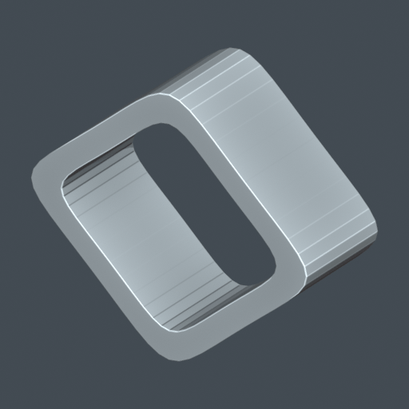</a><br><strong>Rotor Housing 4R 3</strong><br><sub>upgrade · 1 mesh components</sub></td>
</tr>
<tr>
<td align="center" width="33%"><a href="assets/modular_car_kit/previews/rotor_4r_3.png"></a><br><strong>Rotor 4R 3</strong><br><sub>upgrade · 4 mesh components</sub></td>
<td align="center" width="33%"><a href="assets/modular_car_kit/previews/apex_seal_4r_3_0.png"></a><br><strong>Apex Seal 4R 3 0</strong><br><sub>upgrade · 1 mesh components</sub></td>
<td align="center" width="33%"><a href="assets/modular_car_kit/previews/apex_seal_4r_3_1.png"></a><br><strong>Apex Seal 4R 3 1</strong><br><sub>upgrade · 1 mesh components</sub></td>
</tr>
<tr>
<td align="center" width="33%"><a href="assets/modular_car_kit/previews/apex_seal_4r_3_2.png"></a><br><strong>Apex Seal 4R 3 2</strong><br><sub>upgrade · 1 mesh components</sub></td>
<td align="center" width="33%"><a href="assets/modular_car_kit/previews/stationary_gear_4r_3.png">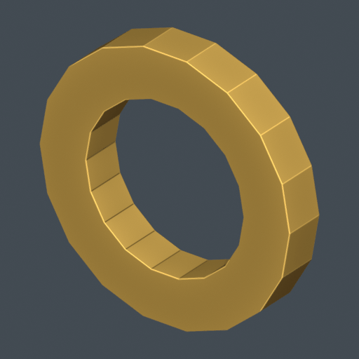</a><br><strong>Stationary Gear 4R 3</strong><br><sub>upgrade · 1 mesh components</sub></td>
<td align="center" width="33%"><a href="assets/modular_car_kit/previews/side_housing_4r_0.png"></a><br><strong>Side Housing 4R 0</strong><br><sub>upgrade · 1 mesh components</sub></td>
</tr>
<tr>
<td align="center" width="33%"><a href="assets/modular_car_kit/previews/side_housing_4r_1.png"></a><br><strong>Side Housing 4R 1</strong><br><sub>upgrade · 1 mesh components</sub></td>
<td align="center" width="33%"><a href="assets/modular_car_kit/previews/side_housing_4r_2.png"></a><br><strong>Side Housing 4R 2</strong><br><sub>upgrade · 1 mesh components</sub></td>
<td align="center" width="33%"><a href="assets/modular_car_kit/previews/side_housing_4r_3.png"></a><br><strong>Side Housing 4R 3</strong><br><sub>upgrade · 1 mesh components</sub></td>
</tr>
<tr>
<td align="center" width="33%"><a href="assets/modular_car_kit/previews/side_housing_4r_4.png">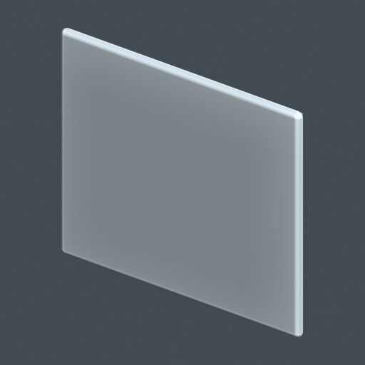</a><br><strong>Side Housing 4R 4</strong><br><sub>upgrade · 1 mesh components</sub></td>
<td align="center" width="33%"><a href="assets/modular_car_kit/previews/intake_port_4r.png"></a><br><strong>Intake Port 4R</strong><br><sub>upgrade · 1 mesh components</sub></td>
<td align="center" width="33%"><a href="assets/modular_car_kit/previews/exhaust_port_4r.png"></a><br><strong>Exhaust Port 4R</strong><br><sub>upgrade · 1 mesh components</sub></td>
</tr>
<tr>
<td align="center" width="33%"><a href="assets/modular_car_kit/previews/oil_metering_pump_4r.png">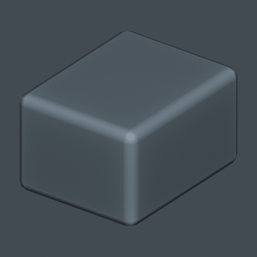</a><br><strong>Oil Metering Pump 4R</strong><br><sub>upgrade · 1 mesh components</sub></td>
</tr>
</table>

</details>

<a id="category-39"></a>
<details>
<summary><strong>39 · ECU and tuning — 5 models</strong></summary>

<table>
<tr>
<td align="center" width="33%"><a href="assets/modular_car_kit/previews/ecu.png">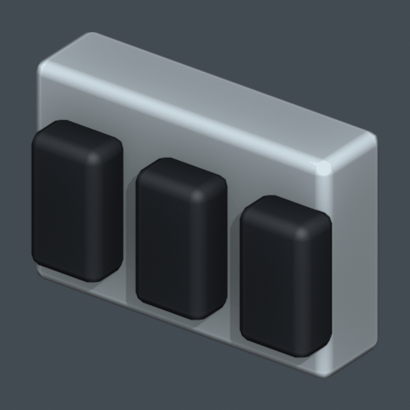</a><br><strong>Ecu</strong><br><sub>stock · 4 mesh components</sub></td>
<td align="center" width="33%"><a href="assets/modular_car_kit/previews/obd_port.png">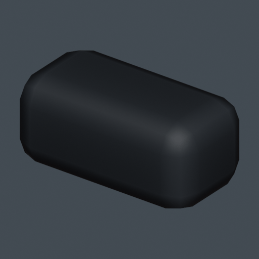</a><br><strong>Obd Port</strong><br><sub>stock · 1 mesh components</sub></td>
<td align="center" width="33%"><a href="assets/modular_car_kit/previews/obd_dongle.png">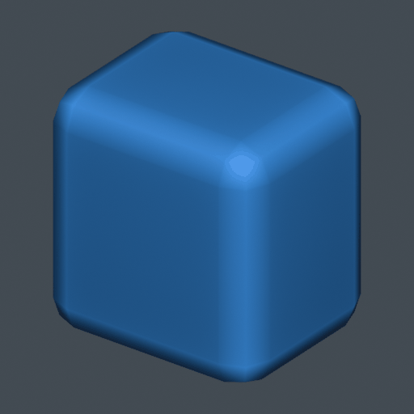</a><br><strong>Obd Dongle</strong><br><sub>upgrade · 1 mesh components</sub></td>
</tr>
<tr>
<td align="center" width="33%"><a href="assets/modular_car_kit/previews/two_step_module.png">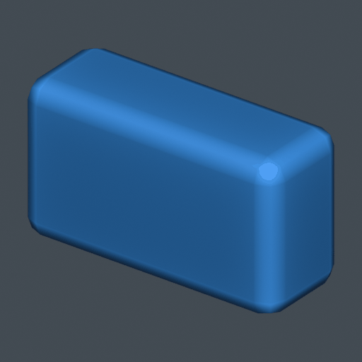</a><br><strong>Two Step Module</strong><br><sub>upgrade · 1 mesh components</sub></td>
<td align="center" width="33%"><a href="assets/modular_car_kit/previews/tuning_laptop.png"></a><br><strong>Tuning Laptop</strong><br><sub>workshop · 43 mesh components</sub></td>
</tr>
</table>

</details>

<a id="category-40"></a>
<details>
<summary><strong>40 · Garage equipment — 4 models</strong></summary>

<table>
<tr>
<td align="center" width="33%"><a href="assets/modular_car_kit/previews/garage_lift.png">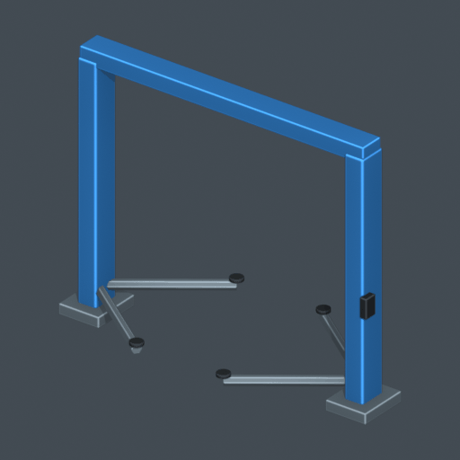</a><br><strong>Garage Lift</strong><br><sub>workshop · 14 mesh components</sub></td>
<td align="center" width="33%"><a href="assets/modular_car_kit/previews/machining_bench.png">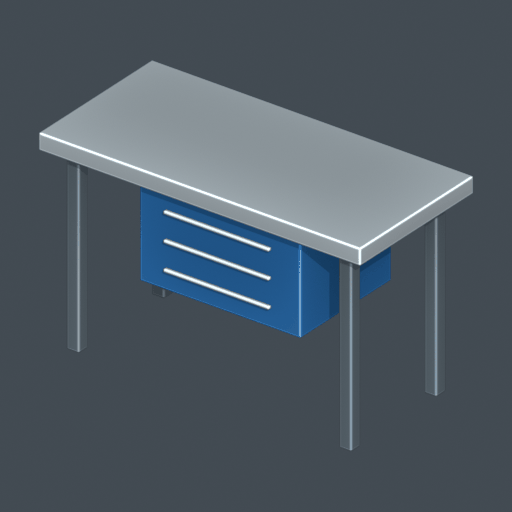</a><br><strong>Machining Bench</strong><br><sub>workshop · 9 mesh components</sub></td>
<td align="center" width="33%"><a href="assets/modular_car_kit/previews/bench_vise.png">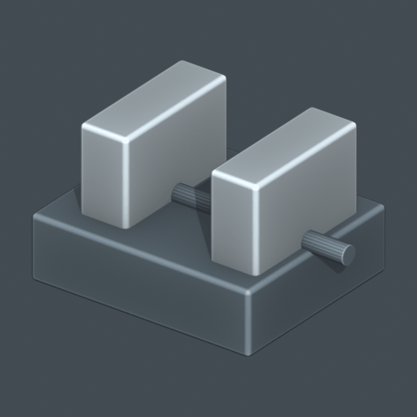</a><br><strong>Bench Vise</strong><br><sub>workshop · 4 mesh components</sub></td>
</tr>
<tr>
<td align="center" width="33%"><a href="assets/modular_car_kit/previews/floor_jack.png">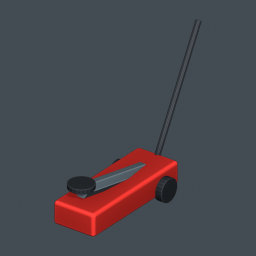</a><br><strong>Floor Jack</strong><br><sub>workshop · 6 mesh components</sub></td>
</tr>
</table>

</details>

<a id="category-41"></a>
<details>
<summary><strong>41 · Testing and servicing — 5 models</strong></summary>

<table>
<tr>
<td align="center" width="33%"><a href="assets/modular_car_kit/previews/fuel_pump_block.png">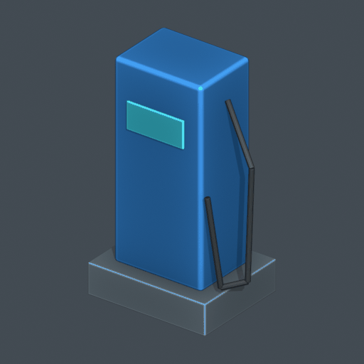</a><br><strong>Fuel Pump Block</strong><br><sub>workshop · 7 mesh components</sub></td>
<td align="center" width="33%"><a href="assets/modular_car_kit/previews/fuel_nozzle.png">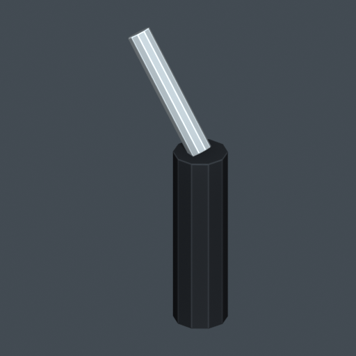</a><br><strong>Fuel Nozzle</strong><br><sub>workshop · 2 mesh components</sub></td>
<td align="center" width="33%"><a href="assets/modular_car_kit/previews/dyno_roller_bed.png">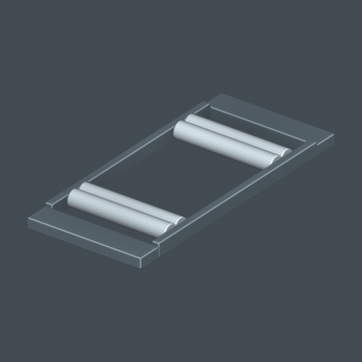</a><br><strong>Dyno Roller Bed</strong><br><sub>workshop · 10 mesh components</sub></td>
</tr>
<tr>
<td align="center" width="33%"><a href="assets/modular_car_kit/previews/dyno_console.png">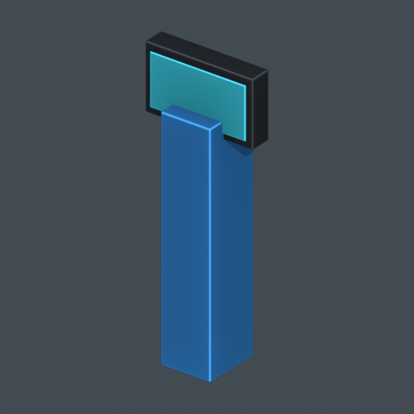</a><br><strong>Dyno Console</strong><br><sub>workshop · 3 mesh components</sub></td>
<td align="center" width="33%"><a href="assets/modular_car_kit/previews/paint_booth.png">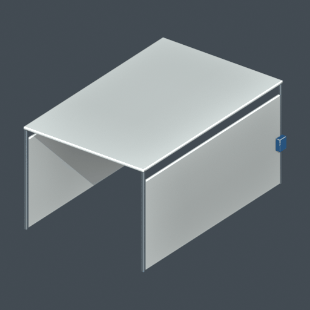</a><br><strong>Paint Booth</strong><br><sub>workshop · 10 mesh components</sub></td>
</tr>
</table>

</details>

<a id="category-42"></a>
<details>
<summary><strong>42 · Fluid containers — 4 models</strong></summary>

<table>
<tr>
<td align="center" width="33%"><a href="assets/modular_car_kit/previews/jerry_can.png">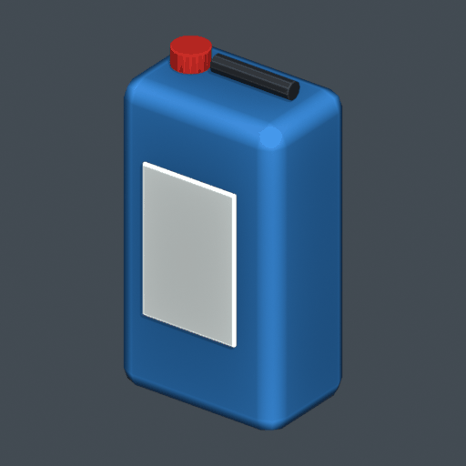</a><br><strong>Jerry Can</strong><br><sub>workshop · 4 mesh components</sub></td>
<td align="center" width="33%"><a href="assets/modular_car_kit/previews/oil_container.png">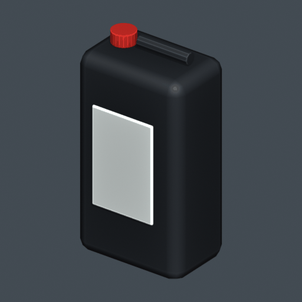</a><br><strong>Oil Container</strong><br><sub>workshop · 4 mesh components</sub></td>
<td align="center" width="33%"><a href="assets/modular_car_kit/previews/coolant_container.png"></a><br><strong>Coolant Container</strong><br><sub>workshop · 4 mesh components</sub></td>
</tr>
<tr>
<td align="center" width="33%"><a href="assets/modular_car_kit/previews/water_meth_container.png">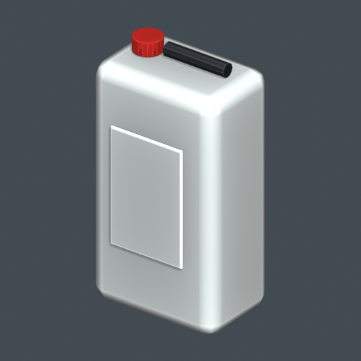</a><br><strong>Water Meth Container</strong><br><sub>workshop · 4 mesh components</sub></td>
</tr>
</table>

</details>

<a id="category-43"></a>
<details>
<summary><strong>43 · Damage variant — 1 models</strong></summary>

<table>
<tr>
<td align="center" width="33%"><a href="assets/modular_car_kit/previews/damaged_front_bumper.png">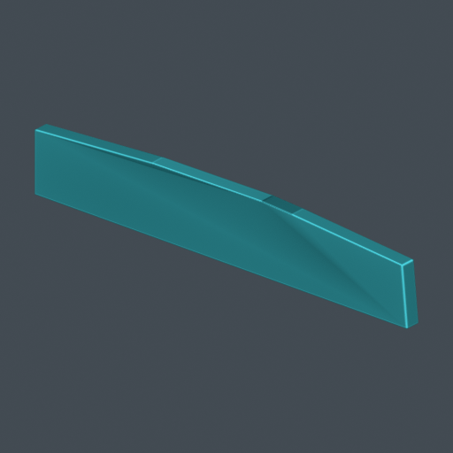</a><br><strong>Damaged Front Bumper</strong><br><sub>upgrade · 1 mesh components</sub></td>
</tr>
</table>

</details>
