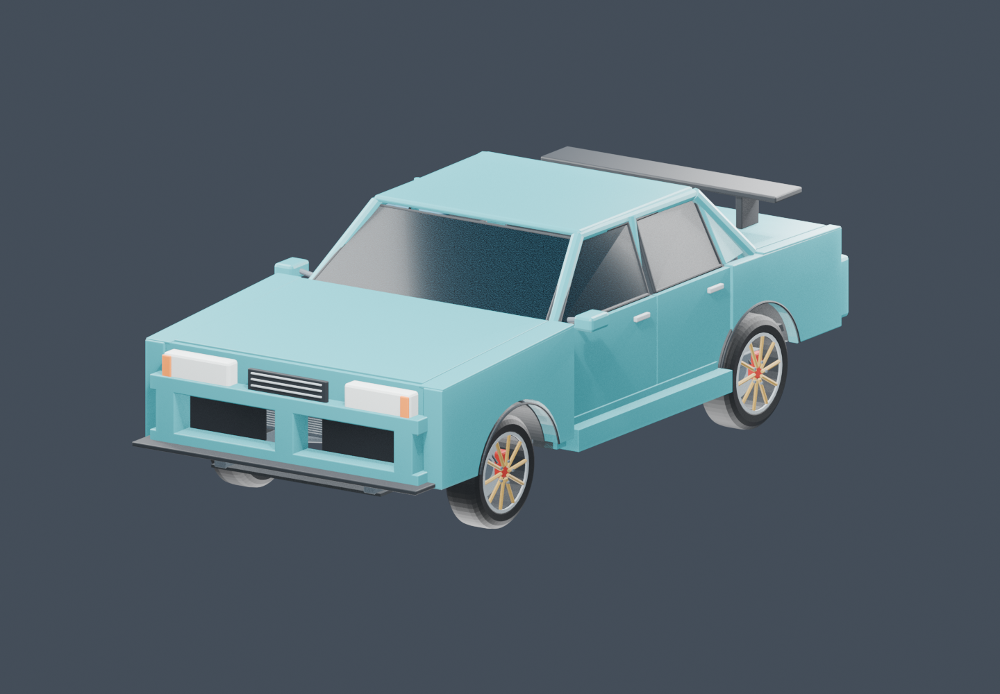
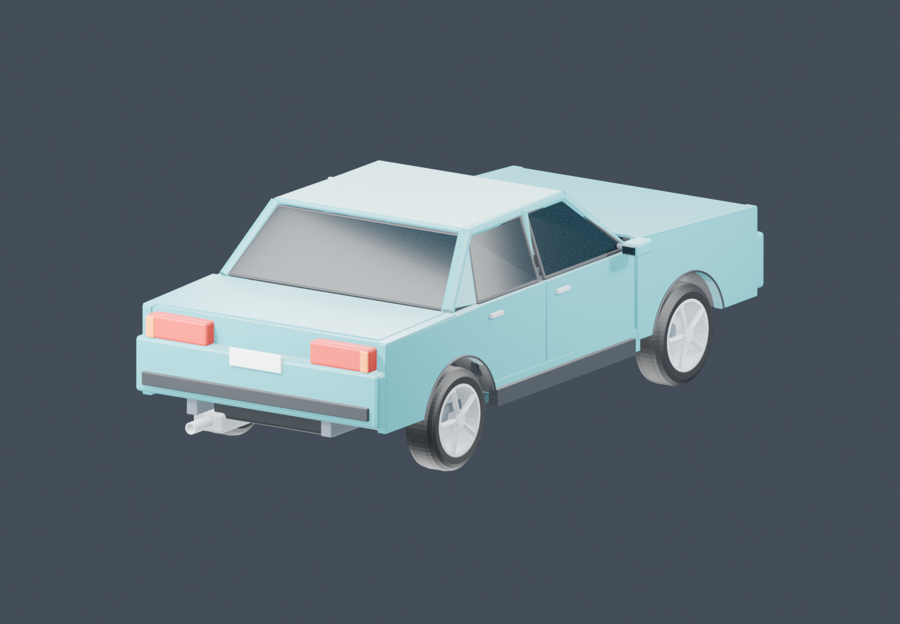
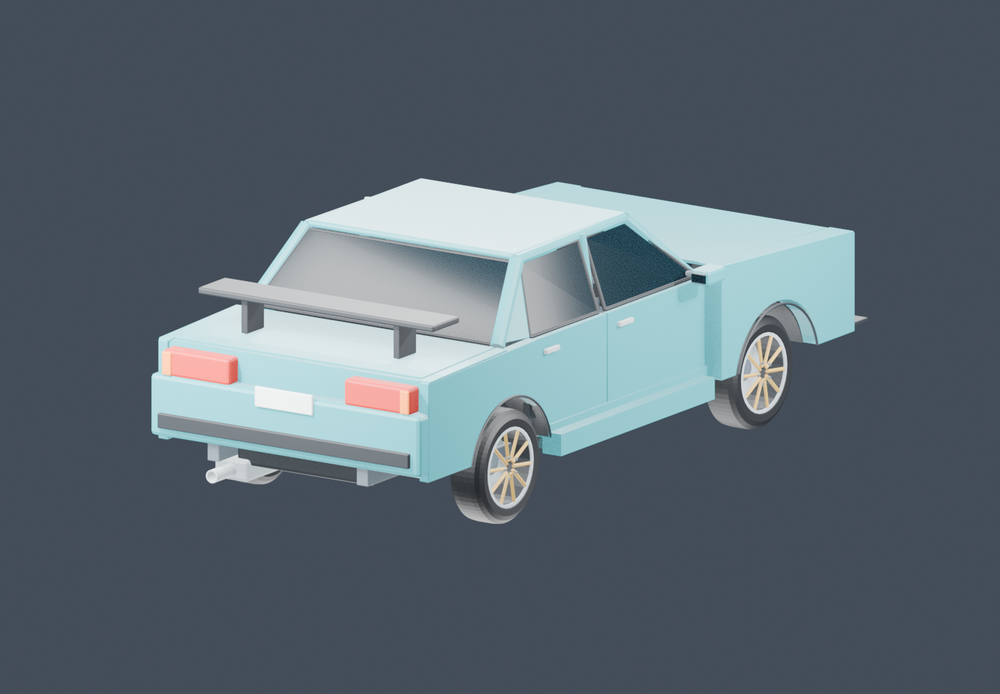
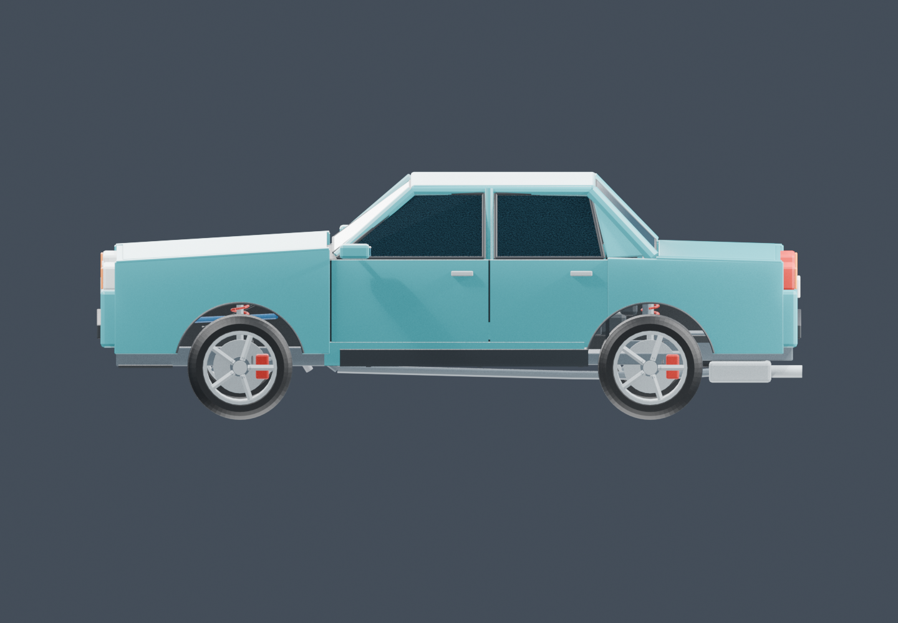
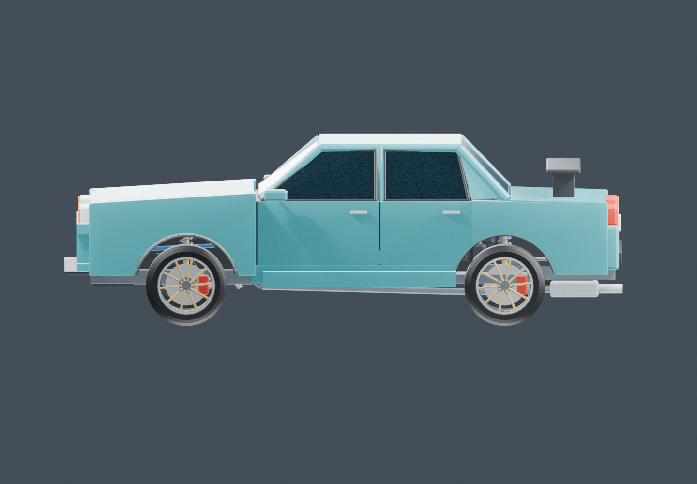
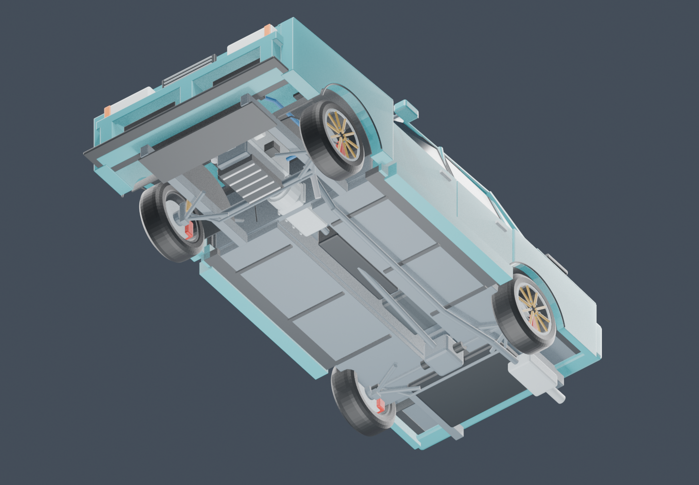

# Body fit and collision changes — 0.6.1

The sedan retains its original dimensions, engine bay, hinges, item identities and save data. This revision fixes fit and articulation errors in the shared body used by combustion, hybrid and electric cars.

## Model repairs

- Continuous front fascia and rear lamp backing close visible gaps around the lamps and grille.
- Floor-to-sill returns, door rebates and lower skins close open joins. Rear doors follow the tire opening rather than crossing it.
- Rockers and both skirts terminate before the rear tires. Exact triangle checks caught intersections in the original pieces and in the first revision; the final check includes the chassis skin as well as detachable panels.
- Inner wheel tubs and continuous arch lips replace the open wells and dangling trim ends.
- Rounded, closed 64-segment tire carcasses seat against the existing rim lips. Wheel fasteners add detail without changing the service assembly identity.
- Discs and hubs spin; calipers, pads and uprights steer and travel with the same wheel. Springs, dampers, control arms, brake hoses, tie rods and rear CV shafts keep their inboard attachments while their wheel ends move. Low-pressure tire flattening stays vertical while the tread rotates.
- The suspension rests at the model's tire/road plane. The previous extra 14 cm shell offset made the wheel openings appear oversized. Cosmetic pitch and roll are limited by the current corner compression clearance; unsprung assemblies remain in their road-contact frame.

## Collision and heading

`CarGeometry` defines the shared corner coordinates and compound collision proxies. `VehicleCollision` sweeps oriented boxes against the collision boxes supplied by Minecraft blocks and other solid entities. A separate yaw sweep checks the rotation arc. Body, bumpers, cabin, mirrors and tire envelopes leave empty space above the hood and outside the angled body.

Impacts apply a passive normal/friction impulse at the contact. Their local contact position selects front, rear or a wheel corner. The strongest impact is processed once per server tick, with the existing impact cooldown. Sliding tangent motion is retained. The attempted simulation heading and accepted collision heading use explicit body/world velocity transforms, and client/server yaw is rebased without a discontinuous render interpolation.

The ordinary axis-aligned entity box remains a broad-phase/query envelope, so Minecraft's generic F3+B outline still shows that larger box. This is not triangle-accurate collision, a soft-body model or full rollover physics. Open doors and mirrors do not have independent break-away physics. Other vehicles are treated as solid obstacles during each substep, rather than a coupled two-vehicle crash solver. The tire-ground spring/contact rays handle road support separately from side/ceiling collision proxies.

A healthy car must regain straight driving after braking to a stop. Normal transient drift still carries sideways momentum, and damaged tires/links can still impair handling; a repair is not silently applied to hide those faults.

## Rebuild and test

The authoring sources are the original [modular kit](../assets/modular_car_kit/sparkmotors_modular.blend), [runtime exporter](../tools/export_engine_runtime.py) and [body builder](../tools/build_body_geometry.py). Run `tools/export_runtime_mesh.py` through Blender MCP with the original kit open. It leaves that source file intact and writes the game mesh. [body_workshop.blend](../assets/body_workshop.blend) is an editable, derived stock/sport snapshot, not the source of engine or gameplay state.

```powershell
.\gradlew.bat -PwithGameTests build :sim:test runGameTestServer
.\gradlew.bat -PwithGameTests runClientHandling
blender --background --factory-startup --python-exit-code 1 --python tools/validate_body_geometry.py
blender --background --factory-startup --python-exit-code 1 --python tools/validate_engine_geometry.py
blender --background --factory-startup --python-exit-code 1 --python tools/render_body_review.py
```

Required checks include 74 simulation tests, at least 41 standalone dedicated GameTests, all 294 combustion and 12 electrified drive/brake combinations, three native drift/relaunch scenarios, airborne landing, and the existing GUI, resource, multiplayer and ElectricalAge suites. The body validator checks 20 surface-coverage rays and 48 stock/sport tire poses across full steering and the permitted bump/droop travel. The geometry report describes intended internal mating surfaces excluded from its outer-body intersection test. Engine hood/fit checks remain separate. Fresh CI artifacts are the evidence for each published commit; the presence of a rendered picture alone does not establish a passing client test.

## Current exported body renders

| View | Stock | Sport |
|---|---|---|
| Front |  |  |
| Rear |  |  |
| Side |  |  |
| Underneath |  |  |
