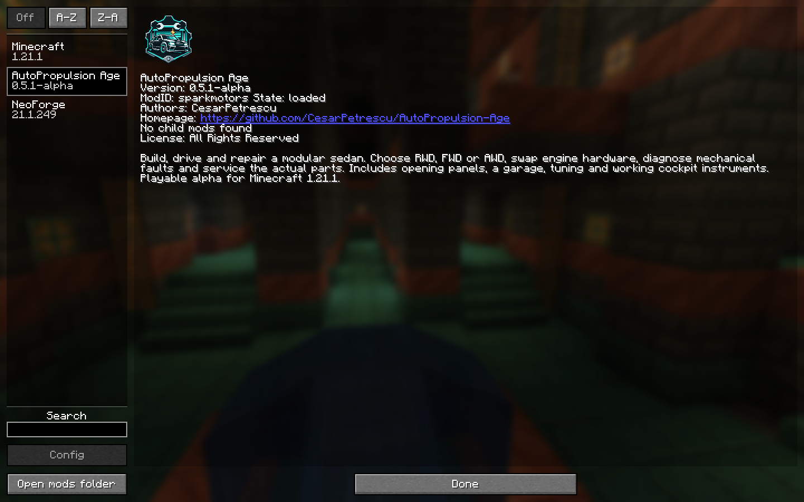

# AutoPropulsion Age identity

The charcoal sedan, teal mechanical badge, wrench and amber spark connect driving with workshop repairs. The wordmark is plain text beside or below the emblem so it remains readable and accessible.

The canonical production asset is [autopropulsion-age.png](../src/main/resources/autopropulsion-age.png). It is a 1254 × 1254 RGBA PNG with a transparent surround. The README references this same file; Gradle packages it at the JAR root. NeoForge's `logoFile` metadata displays it in the Mods screen with linear filtering. This does not change Windows' shared Java file association icon.

For Java packaging, see [NeoForge's 1.21.1 mod-file documentation](https://docs.neoforged.net/docs/1.21.1/gettingstarted/modfiles/). Keep the PNG and `logoFile` path consistent. `python tools/ci/documentation.py` validates the image, documentation links and complete gallery coverage; the release gate also checks that the declared logo is inside the actual JAR.



## Generation record

Created September 8, 2026 using Codex's built-in image generation. No reference images were supplied. The generated image was inspected and copied unchanged into the repository; the delivered dimensions differ from the requested 1024 px. No separate API key or external image-generation CLI was used.

Prompt:

```text
Use case: logo-brand.
Asset type: final square PNG mod icon for NeoForge's Minecraft Mods list and the README of the existing game mod "AutoPropulsion Age".
Primary request: design one distinctive, polished automotive workshop emblem. A bold, angular front-three-quarter silhouette of a compact modular sedan, with its hood line, two bright headlights and chunky wheels, integrated into a simple chamfered mechanical badge. One small spark accent connects the garage and propulsion idea. Make it feel like a thoughtfully designed independent game logo, with block-friendly geometry and crisp vector-like edges.
Color palette: the game's existing charcoal #101B25, bright teal #42D2C6 and off-white #E7F0F4, with a very restrained warm amber spark.
Composition: one centered self-contained icon, strong silhouette readable at 64 pixels, generous transparent padding around the badge, clean flat shapes with at most subtle two-tone bevels. Square 1024 by 1024 PNG, genuinely transparent outside the badge.
Constraints: no lettering, no words, no watermark, no presentation sheet, no alternate variants, no photorealistic vehicle, no existing car manufacturer logo, no Minecraft wordmark or imitation of another game's logo. Keep the emblem simple enough to recognize as a tiny mod-list icon. This is the final production image, not a mockup.
```
