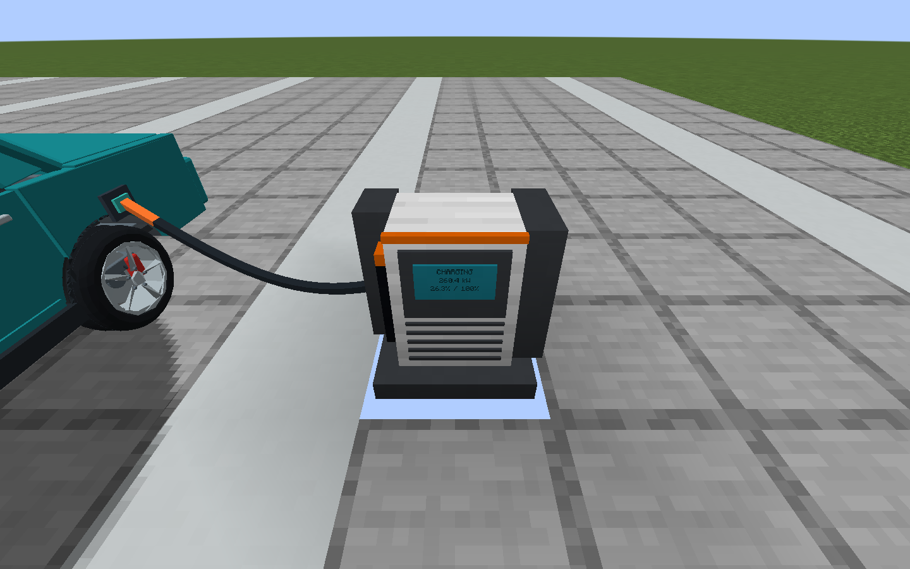
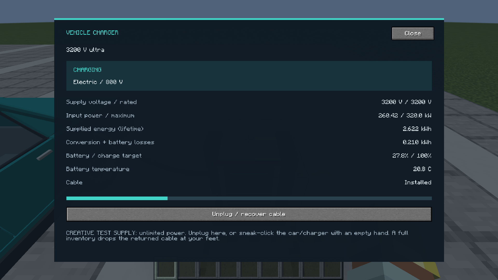

# Charger screen and recoverable cable — 0.8.1

Right-click a charger with an empty hand to open its live status screen. It shows measured input voltage, input power, lifetime supplied energy and losses, vehicle charge/target and pack temperature. The layout fits the window independently of Minecraft's GUI-scale setting. The block's existing front display also shows status, kW and charge percentage. Input power is measured at the supply; it includes conversion/battery losses and is not the same as energy stored in the pack.

## Connect and recover

1. Hold a **Vehicle Charging Cable**, click the charger, then click your parked EV or plug-in hybrid within six blocks. READY must be off. A successful connection installs one actual cable item; unsuccessful attempts keep it in your hand.
2. To disconnect, use **Unplug / recover cable** in the charger screen, or sneak-right-click either the car or charger with an empty hand. The owner receives the stored cable. Its custom name/data survive; its old pairing selection is cleared.
3. If the inventory is full, the cable drops at the player's feet in both Survival and Creative. Breaking the charger drops the stored cable once and releases the car.
4. Unloading either endpoint or removing/moving the car ends the connection. The physical cable remains stored in the charger, including across save/reload. Open its screen and recover it before pairing again. No chunk tickets or automatic reconnection are added.

Older connections did not consume a cable: the old pairing tool remained in the inventory. Unplugging such a connection creates no extra item. The grid-side ElectricalAge wire and the vehicle charging cable are separate items/systems; this update changes AutoPropulsion's charger-to-car cable.

Screen actions are checked on the server for ownership, loaded location and distance. Repeated unplug requests cannot return multiple cables. Nearby block telemetry is rounded and synchronized at most four times per second during normal ticks, only when displayed readings change. Connection/removal updates are immediate.

Use matching **0.8.1-alpha client and server JARs** (network protocol 10).

## Verification

Nine dedicated charger regressions cover actual cable-item pairing, car-end removal, item metadata, failed/repeated connections, Survival and Creative inventory overflow, block removal, endpoint loss, save/reload, unauthorized/remote recovery and legacy no-item connections. The native electric client suite additionally checks all four charger tiers at four window/GUI-scale combinations (16 cases), live block synchronization and a real scaled recovery-button packet returning one cable. Screenshots above are from that native Minecraft run.

CI requires all 56 dedicated GameTests and those 16 charger-screen cases alongside the existing simulation, driving, workshop, graphics, multiplayer, resource and ElectricalAge compatibility gates before publishing. Each release contains its own fresh logs and screenshots in `test-evidence.zip`; a screenshot alone is not the test result.
