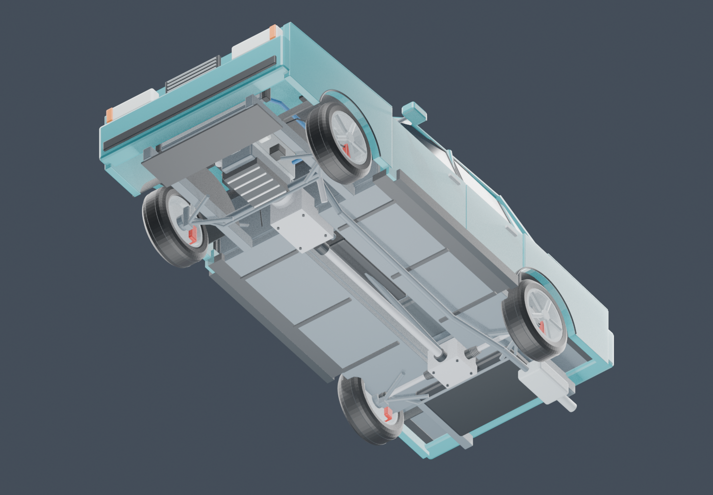
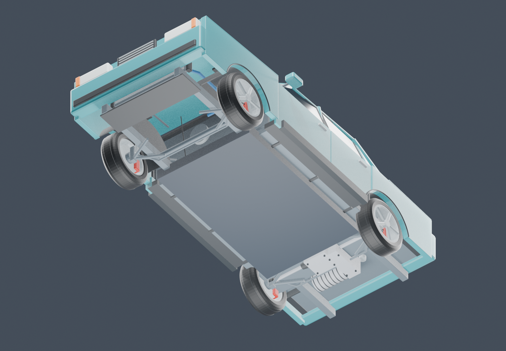
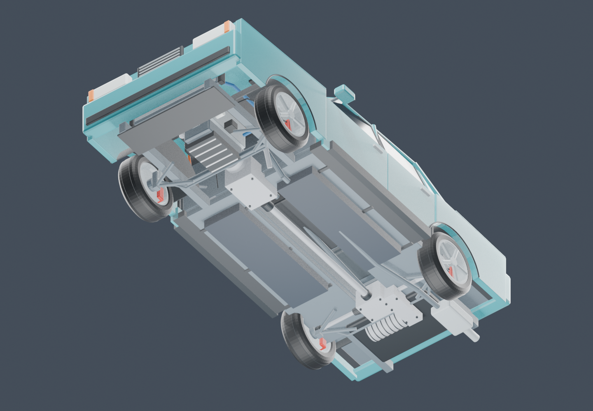
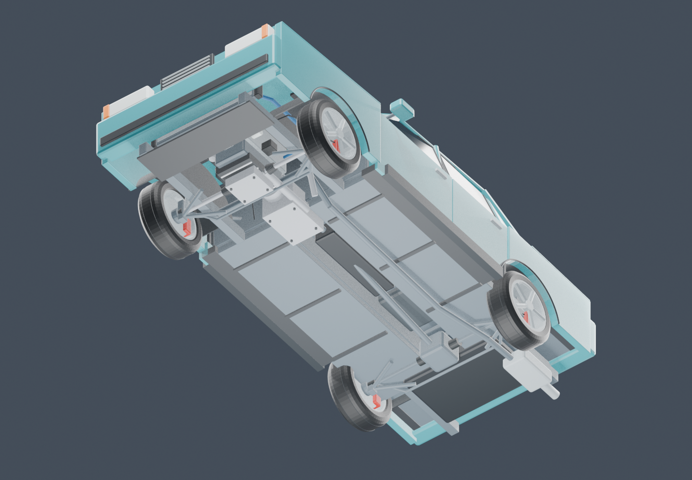
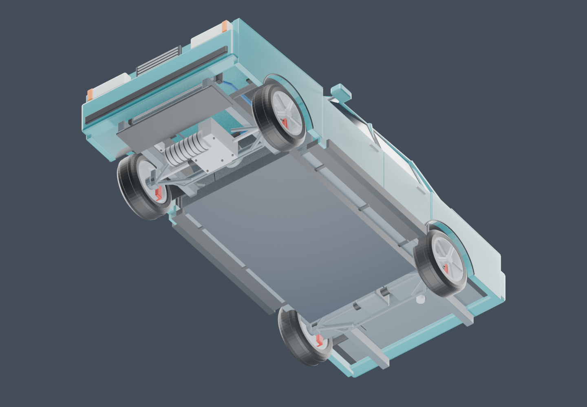
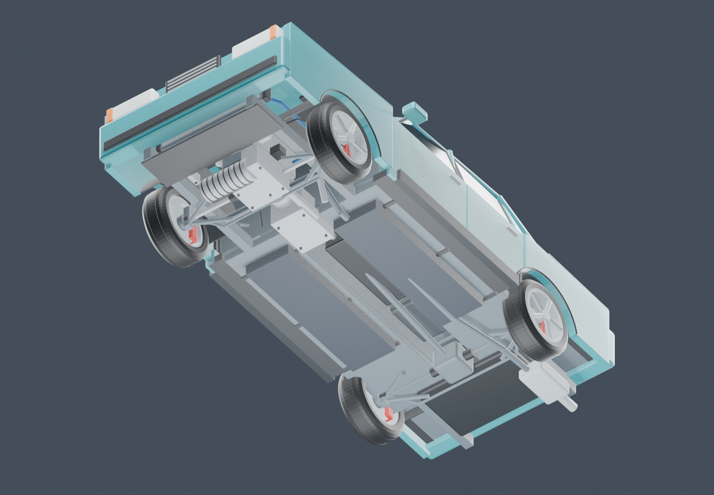
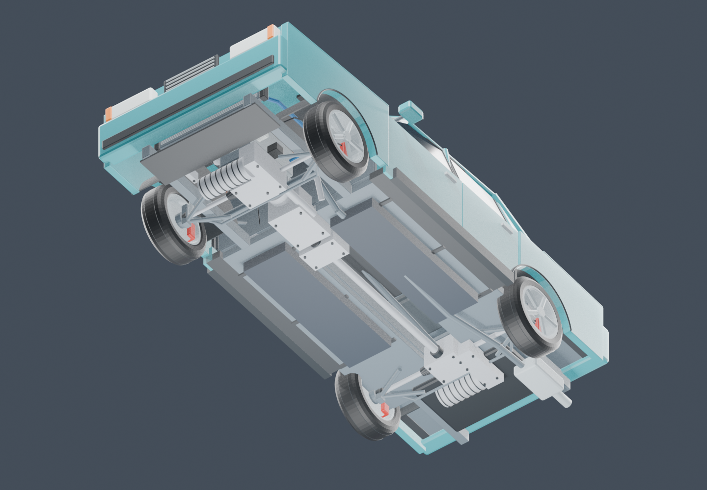

# Configured powertrains — 0.8.0

The same immutable `MechanicalState` drives torque routing, compression, heat, service inventory and renderer visibility. The car has 136 possible service paths; only the installed powertrain/family/layout paths are active. Catalog positions and old item IDs remain stable. This is a component simulation with calibrated values, not an OEM mechanical model.

## Driving and converting

Use **G → Drive**. Park, switch off, exit and raise the service jack. Hover a layout to see the required parts. Survival conversions consume eight iron ingots and the actual components for mounts introduced by the new layout. Removed components return to inventory with their identities and condition. Shared missing mounts remain missing; repair the current torque path first. The server stages the whole inventory transaction before applying it. Repeating the installed preset costs nothing; AWD 20–80% center-split tuning is free while stopped.

| Path | RWD | FWD | AWD |
|---|---|---|---|
| Combustion | Clutch, gearbox, propeller shaft, rear differential and rear CVs | Clutch, front transaxle/final drive and front CVs | Gearbox, transfer, propeller shaft, both differentials and all CVs |
| Electric motor path (EV and hybrid) | Rear motor, inverter, reduction, differential and CVs | Front motor, inverter, reduction, differential and CVs | Separate drive units on both axles; same total rated vehicle torque/power |

Open differentials lose axle drive with a broken output. Limited slip has bounded bias; locked diffs can retain the other connected output. Missing front EV components do not turn off the rear drive unit. Failed shared HV wiring/contactors interrupt both. The differential mode remains a vehicle-wide workshop setting. This does not model every planetary gear or individual differential tooth.

Service crafting patterns are unique even when mirrored horizontally, so the workbench resolves the intended component. Existing item IDs are retained.

## Actual engine repairs

**G → Service → Parts** lists applicable mounts and any stored legacy spares. Open the hood for internals. Select a part, use **Focus part** and **Cutaway view**, then remove/install it. Selected internal geometry remains visible through the cutaway. Removed items preserve serial, wear, damage, faults and temperature. Each cylinder has separate piston, rings, bearing and valves; each rotor has housing/rotor assembly, seals and bearing. Rotary engines use an eccentric shaft instead of piston/cam failures.

Use the compression tester with the engine stopped, hood open and a working starter supply. Each cylinder/rotor reports its own compression. Oil starvation wears actual bearings; severe starvation can seize them. A new bearing does not repair the oil pump/feed, refill oil, or clear history. Individual repairs restore the affected contribution. The existing internal rebuild consumes materials and repairs installed internal pieces; it does not create missing pieces or repair an external cause.

The Engine tab removes an internal kit as a bundle containing its actual child parts. Crafting an upgrade preserves those children and updates the kit specification. Converting a **used** whole engine into a different family preserves the original component instances as reusable spares; newly required family mounts can be empty and must be fitted. Fresh unversioned engines receive a complete family-appropriate set when first installed. Service access is currently grouped at the hood/jack level; an expert fastener/engine-stand procedure remains future work.

## Electric and hybrid service

Craft the appropriate vehicle crate; **G → Electric** shows the rated motor curve, pack state and each installed axle's motor/inverter temperature. **Service parts** opens the actual removable components. The battery EV radiator is serviced directly in the Parts view; open the hood, and carry the next radiator variant to use **Fit next radiator**. Raise the jack and switch READY off for drive-unit work; disconnect the charge cable before HV service.

Regen requires a working motor/inverter/output path, wheel contact, rotation and battery acceptance. Missing friction pads or brake fluid does not disable healthy regeneration. Airborne wheels do not recover energy; the handbrake excludes rear regen. Friction braking remains necessary for the final stop and when regeneration is unavailable.

Motor copper/conversion losses heat the individual motor and inverter; cooling uses coolant quantity and pump capability, with heat transferred into the radiator circuit. Thermal limits reduce that unit's output. The 12 V converter can recharge the accessory battery only when the traction system paid for available accessory power. Missing contactor/HV harness blocks READY and charging before the charger debits energy. Coolant, fuel, batteries and used parts are not refilled by storage or reinstallation.

Hybrids combine the combustion and electric paths in the table. The engine drives through a serviceable clutch, gearbox and the selected FWD/RWD/AWD hardware. Electric axles assist at low speed and recover braking energy; generator load takes spare crank torque to recharge. Each engine retains its own torque curve, inertia and clutch slip. Parked charging uses family-dependent governed RPM targets. See [hybrid control and performance](HYBRID_AND_PERFORMANCE.md) for modes, reserve bands and limits.

## Migration and evidence

Network protocol **9**, vehicle save schema **7**, mechanical item schema **3**. Matching client/server builds are required. Version 1 components migrate once: old identities remain intact and new children receive deterministic identities with inherited condition. The v2-to-v3 hybrid migration adds only the previously absent engine-drive clutch, gearbox, shaft and transfer mounts, derived from the installed generator with its wear, damage and faults. Existing parts remain unchanged; a missing generator supplies no new mounts. Missing v3 slots stay missing on subsequent migration, item placement or reload. Inactive old parts remain recoverable spares. Vehicle conversion recipes manufacture only newly introduced topology from their ingredients and preserve shared missing/used mounts.

Required CI runs the simulation suite, actual dedicated GameTests, native UI/matrix/handling/electric/mechanics clients, two-client trading, ElectricalAge compatibility, the independent energy audit and regeneration/geometry checks. Downloaded releases include their fresh logs, screenshots, provenance and checksums. See [CI](CI.md) for the gate and [Windows development](../DEVELOPMENT.md) for commands. The QA branch's older failures are historical evidence, not a claim that the current build failed those same tests.

The geometry check uses exact exported triangles for all configured paths, outer body clearance, seven family bindings and hybrid engine/drive-unit clearance. Native renderer checks remove each detailed component and require its geometry to disappear across 105 type/layout/family combinations. Intended shaft/housing joints are excluded from non-mating intersection checks. Physics is rigid-body/contact-patch based; there is no soft-body deformation, full rollover or OEM acoustics/efficiency model. Listening quality, other modpacks and remote network conditions still need separate playtesting.

## Blender renders

These views show the exported runtime drive-unit geometry and the principal battery envelope, with the stock body. They are Blender inspections, not gameplay screenshots. The editable derived scene is [drivetrain_workshop.blend](../assets/drivetrain_workshop.blend). The original modular kit is preserved.

| Layout | Combustion | Battery electric | Plug-in parallel hybrid |
|---|---|---|---|
| RWD |  |  |  |
| FWD |  |  |  |
| AWD |  |  |  |
