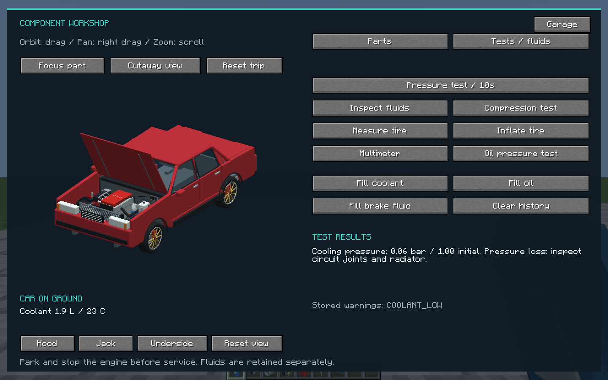
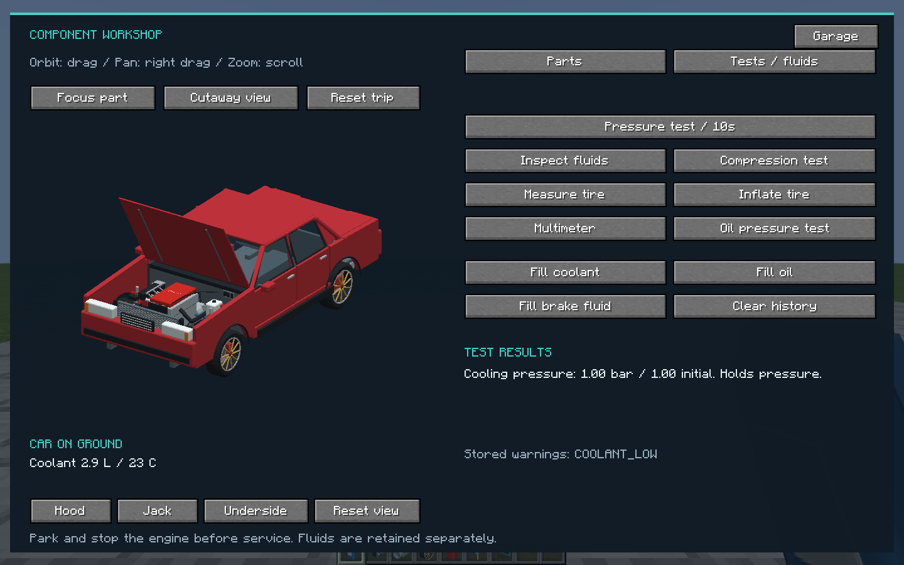

# Playing AutoPropulsion Age 0.7.1-alpha

Minecraft Java **1.21.1**, **NeoForge 21.1.249**, **Java 21**. Put [the latest tested mod JAR](https://github.com/CesarPetrescu/AutoPropulsion-Age/releases/latest/download/autopropulsion-age-latest.jar) in your instance's `mods` folder, replacing the older AutoPropulsion JAR. Install the same version on clients and servers. No Blender or separate simulation mod is needed. Keep a backup when upgrading an existing world.

The alpha provides a drivable sedan, seven engine families, 42 engine hardware choices, individual mechanical components, fluids, diagnosis and targeted repair. The [milestone report](mechanical-milestones.md) distinguishes verified behavior from the remaining roadmap.

## First drive

Take a **Sedan Crate** from the **AutoPropulsion Age** Creative tab and place it on wide, flat ground. With cheats, use `/give @s sparkmotors:sedan_crate`. A new car includes stock components and fuel. Right-click with an empty hand, press **R**, wait for the starter to catch, then hold **W**. Stop with **S** before selecting reverse with **Z**.

| Input | Action |
|---|---|
| W / S | Accelerator / service brake |
| A / D | Steering |
| Space | Rear-wheel handbrake, separate from hydraulic service brakes |
| C / C + W | Disengage clutch / free-rev |
| Z while stopped | Forward / reverse |
| R | Start / stop engine |
| G | Garage, while seated or looking at the car |
| Shift + right-click / Garage Wrench | Garage from outside |
| H / B | Lamps / horn |
| O while stopped | Doors, hood and trunk |
| V | Optional performance instruments |
| Left Shift / F5 | Exit / camera view |

Keys can be rebound in Minecraft Controls. The normal HUD stays compact. Look down in first person to see the dashboard needles, gear and odometer. Coolant/oil sender failures remove their readings and produce a sender warning. The garage **Live** page is explicitly labeled assisted telemetry and can show values unavailable to a failed instrument.

Garage screens fit themselves to the available window, including high/Auto GUI scales, without changing your global setting. The driving HUD remains compact.

## Drive layouts and drifting

**A turns left and D turns right.** Sliding backward after a drift does not select reverse or kick down a forward ratio. Only **Z while stopped** changes direction.

The car keeps sideways momentum and turns from independent tire forces. Too much power, braking or steering can use up grip. Ice and loose ground, pressure loss, worn tires and individual corner damage change the result. A short **Space** pull while turning initiates rear slip; release it, lift and countersteer promptly. Holding the handbrake can spin the car. Use **S** for a normal stop.

Open **G → Drive** to choose RWD, FWD or AWD. Exit, park with the engine off and raise the car on a **Service Jack** before converting. Survival requires **eight iron ingots plus the components for new mounts** for each layout/differential conversion and retains all installed part identities and condition. A repeated current preset costs nothing. Lower the jack before starting.

| Preset | Power routing | Differential |
|---|---|---|
| RWD | Rear wheels | Limited slip |
| FWD | Front wheels | Open |
| AWD | 40% front / 60% rear | Limited slip |

You can also select open, limited-slip or locked axle differentials. AWD front torque adjusts from 20–80% while parked with the engine off; this adjustment is free. FWD tires share propulsion and steering grip. RWD power can break rear traction. AWD improves traction but still slides when all tire grip is used. The Drive diagram shows actual installed routing and synchronized wheel contact/slip.

Springs support the chassis, and gravity acts when road contact is lost. Steering and braking in the air do not create tire-road forces. Current handling has planar yaw/lateral motion and vertical spring movement; it does not simulate full rollovers or soft-body deformation. [Development architecture and reproducible tests](../DEVELOPMENT.md#handling-and-drivetrain-work).

0.6.1 fits the resting shell to its wheel openings and uses oriented body collision shapes. Angled cars can pass beside blocks occupying the empty corners of their enclosing rectangle. Brake to a complete stop after a spin, then accelerate to resume driving along the nose. If a damaged tire or steering link still causes poor handling, inspect and repair that corner. [Body fit, collision scope and renders](BODY_AND_COLLISION.md).

## Complete a coolant-leak repair

1. Park and stop the engine. Open **G → Service**, then **Hood**. Allow hot coolant to cool below 60 C before pressure testing or opening the circuit.
2. Carry a **Pressure Tester**. On **Tests / fluids**, run **Pressure test / 10s**. The server measures pressure retention over ten seconds; a leak produces pressure loss.
3. On **Parts**, select the upper or lower coolant hose and use **Focus part**. Wet residue is an observation of that component's leak, not a universal diagnosis of the radiator. Drag to orbit, right-drag to pan, and scroll over the preview to zoom.
4. Carry the matching replacement hose and press **Install part**. In Survival this consumes one incoming part and returns the actual old hose, retaining its serial, wear, damage and fault. You can remove first if preferred.
5. Replacing the hose stops that leak; it does **not** refill coolant or repair any overheated internals. Carry **Coolant Bottles** and use **Fill coolant**. Each bottle holds 1 L; a partially used bottle retains its remainder. The reservoir holds 8 L.
6. Repeat the ten-second pressure test. Check the fluid level, restart and verify temperature under load. Other leaks, a failed pump, fan, belt, oil supply or existing internal damage require their own work.

Creative mode bypasses item/tool costs for experimenting. Survival requires the corresponding tools and parts. A new healthy car should hold pressure; naturally occurring impacts and neglected fluids provide faults. Dropping or trading a used part does not repair it.

## Corner, underside and electrical work

Carry a **Service Jack**, park, stop the engine and press **Jack** in Service. The car physically rises and a jack becomes visible. Individual tire, rim, bearing, pad, disc, caliper, hydraulic hose, spring, damper and link mounts are independent at all four corners. Corner and driveline/exhaust work requires the raised service position. Lower the car before driving.

Select a corner before **Measure tire** or **Inflate tire**. These need a **Tire Gauge** or **Tire Pump**. Inflation changes pressure but does not seal a puncture. Service braking uses each corner's installed hardware, temperature and contact. Handbraking uses the rear hardware; airborne braking slows free wheel rotation without braking the chassis.

**Inspect fluids** needs the garage wrench. **Multimeter**, **Oil pressure test** and **Compression test** need their named tools. Compression is an explicitly grouped assembly estimate, with chamber/seal/port vocabulary for rotaries. The oil circuit holds 5 L and the brake reservoir 1 L. Oil/coolant bottles conserve their unused remainder. Clearing warning history never repairs an active cause; the condition is logged again.

A worn or overheated clutch transmits less torque and can slip while the engine revs. The speed difference generates heat, and sustained overheating wears the actual installed clutch. Hold **C** to disengage it; **G → Live** displays slip RPM, plate temperature, transmitted torque and engagement. Replace the clutch through raised underside service; an engine rebuild does not repair it. A broken gearbox, differential or shaft can interrupt drive while the car coasts. Oil-pump/feed faults cause measured pressure loss and internal/compressor wear. A failed alternator or belt discharges the battery, and a flat battery cannot crank. Replacing the affected part preserves damage elsewhere.

## Engine builds, sound and appearance

Use **G → Engine** for families, base grades and the ten engine hardware slots. See [the engine guide](ENGINE-WORKSHOP.md) and the README's full model galleries. Compatible installations require a stopped engine and open hood. The tuner adjusts limiter, final drive and boost target.

The independently fitted stock/sport/missing muffler changes the exhaust layer without automatically adding power. Engine sound follows family, RPM and load; turbo sound follows spool, blow-off events require a fitted valve and pressure transition, and blower types have their own drive layers. Road sound follows wheel contact and remains while coasting with the engine off. These are original synthesized game sounds; subjective listening acceptance remains pending.

The Service cutaway hides covers only in the preview. It does not remove inventory parts or satisfy physical access requirements. Wheel travel, tire pressure/deformation, steering/pedals, instruments, hoses and the electric fan follow component state. Lamps are emissive; they do not project light onto the road.

**Rebuild engine** consumes twelve iron ingots to restore the internal assembly's wear, structural damage and faults. It does not fix external oil/cooling/electrical causes or refill fluids. The four-ingot body repair only repairs body panels. Mechanical capability is independent of the old car-wide cosmetic condition value.

## Persistence and current limits

Existing 0.1–0.4 cars and engine items migrate once. Individual identities, wear, damage, faults, pressure/charge, temperatures and applicable fluid quantities survive supported service, item, crafting, crate and save conversions. Reloaded cars start with the engine off. Owners/operators, proximity, access and Survival inventory transactions remain server-validated.

There are 122 mod items/recipes and 81 stable component mounts (80 installed on a stock naturally aspirated car). This is a component simulation with useful service assemblies, not an individual fastener/cylinder or soft-body simulator. Not every logical component has its own unique detailed mesh. Expert fasteners, engine-stand procedures, a full body/glass/latch service tree, dynamic headlights, LODs and large-fleet tuning remain future work. The local two-client test passed; separate-machine latency, other modpacks and long-duration worlds remain untested.

## Hybrid modes

Park, press **R** to switch READY off, then open **G → Electric → Hybrid mode**. The button cycles **Auto → Electric Only → Charge Sustain**. Press **R** again to drive. Auto combines engine drive with electric assistance and protects a propulsion reserve (35% HEV, 12% PHEV). Charge Sustain uses a higher 45% reserve. Electric Only keeps the engine off and limits propulsion near 4%; recharge or select Auto before that. Electric assistance tapers out between 50 and 80 km/h in Auto/Sustain; spare engine output can charge while driving. See [hybrid behavior](HYBRID_AND_PERFORMANCE.md) for charging, failures and limits.
