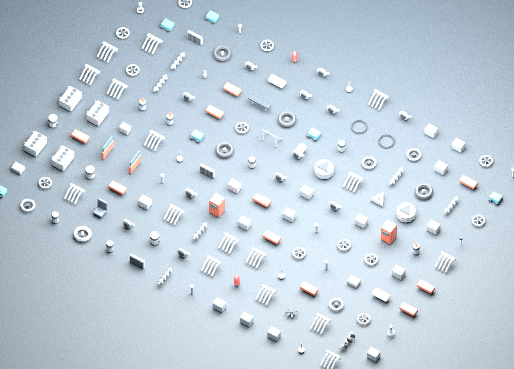

# Asset pipeline and visual review

## Outputs and provenance

`assets/blender/build_assets.py` creates the H1 hatchback and 140 component exports from original primitive-based category geometry. `assets/blender/finalize_assets.py` then applies checked engine clearance and complete preview framing. Reuse and proxy shapes are alpha shortcuts, not 140 individually hand-sculpted production models.

Editable sources are `assets/source/h1-hatchback.blend` and `assets/source/component-catalogue.blend`; the car also has a GLB preview export. Minecraft consumes `models/vehicle/hatchback.mesh.json` and NeoForge OBJ/MTL component models. The car has 4,232 triangles in seven groups. `assets/manifest.json` records counts, Blender version, source provenance and quality-pass checks.

`engine-loop.wav` is a one-second synthetic harmonic loop created by `scripts/generate-content.py`, encoded to OGG with FFmpeg. It is not a recording of a particular vehicle.

## Rebuild

Use the tested Blender 4.0.2 authoring baseline, Python/NumPy and FFmpeg. Blender is not needed for `./gradlew build` when generated resources are present.

```bash
python3 scripts/generate-content.py
blender -b --python-exit-code 1 --python assets/blender/build_assets.py
blender -b --python-exit-code 1 --python assets/blender/finalize_assets.py
ffmpeg -y -i assets/source/engine-loop.wav -c:a libvorbis -q:a 4 \
  mod/src/main/resources/assets/autopropulsion/sounds/engine_loop.ogg
python3 scripts/validate-content.py --assets
```

Do not omit `--python-exit-code 1`; a Blender script exception must fail automation. Commit generator changes with their generated runtime resources. Do not commit `.blend1`/`.blend2` backups. The read-only asset-regeneration workflow runs both stages and rejects stale committed runtime models. The separate, explicitly named maintenance workflow publishes only to the foundation feature branch and never force-pushes.

## Conventions

Authoring uses metres. Export maps Blender `(x,y,z)` to Minecraft `(x,z,-y)`, with vehicle forward `+Z`. Named groups preserve wheel and body pivots; item geometry is normalized into a display volume. Palette textures are original flat colours. Current glass is opaque tinted geometry, not a validated translucent pass.

Final previews use CPU Cycles, 96 samples, AgX and no optional denoising dependency. A preview is not expected to match Minecraft's flat palette lighting pixel-for-pixel; the mesh/export pipeline, not a beauty render, is the game asset.

## Observed defects and corrections

The first successfully generated previews were opened and inspected. Engine geometry protruded above the closed hood, and the catalogue contact sheet cropped edge parts with over-bright lighting. These were visual defects despite a successful process exit.

The finalizer lowered the engine-bay group 0.18 m in both the editable scene and runtime mesh to establish **0.03 m hood clearance**, then regenerated the GLB. A local inspection of exported mesh vertices independently confirmed that clearance. The camera fitter checks every projected mesh bound against a **5.5% margin**, so the complete catalogue remains in frame. The replacement PNGs were downloaded and inspected after [successful generation](https://github.com/CesarPetrescu/AutoPropulsion-Age/actions/runs/34146458685).




Actual game screenshots are preserved with the [dated verification report](test-report-2026-09-07.md). That review additionally corrected garage text blur, a loading-screen capture and head/roof overlap. See [ADR 0002](decisions/0002-visual-validation.md).

## Remaining acceptance work

Coarse silhouettes, large panel gaps, shared category meshes, flat palette textures, opaque windows, incomplete interior/passenger alignment, no finished door/hood animation or livery pipeline, and a synthetic sound loop remain alpha limitations. No screenshot should be presented as final-production art.

Before release, inspect every side, wheel pivot, item GUI/hand/ground view, first-person camera, resource reload and hardware-GPU output. A complete contact sheet provides coverage but not useful close-up inspection of every part. Headless Blender rendering is an authoring check; game screenshots are needed for runtime rendering.
